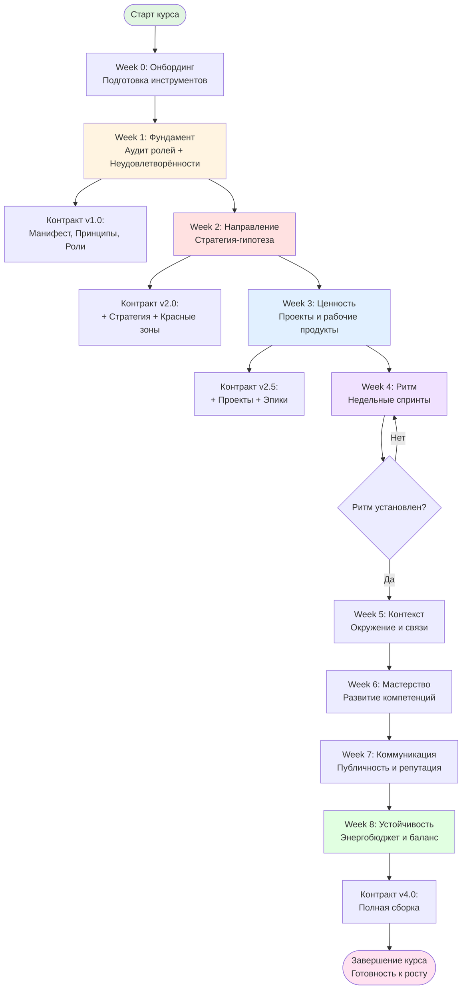
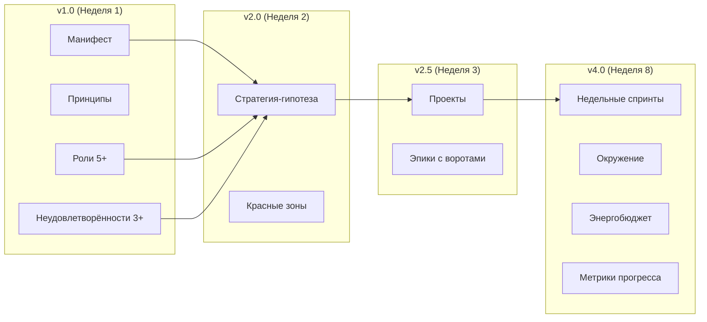
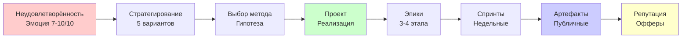
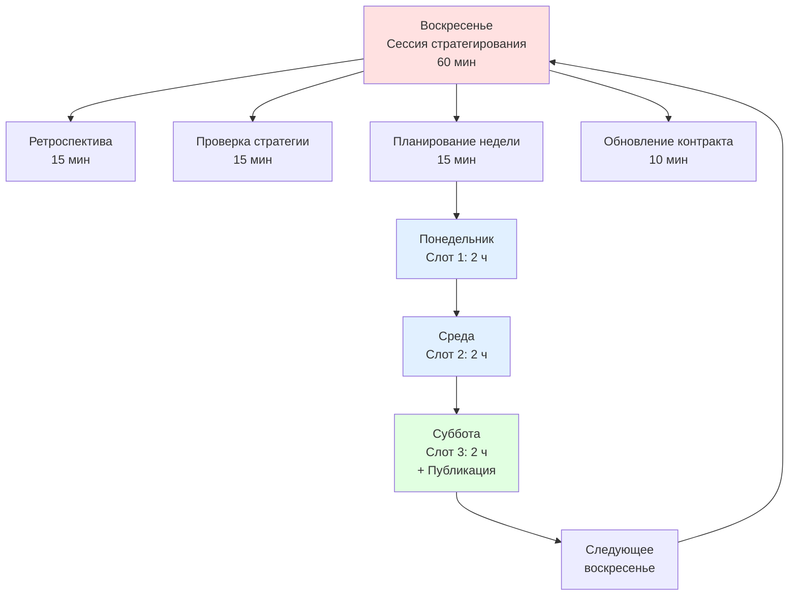
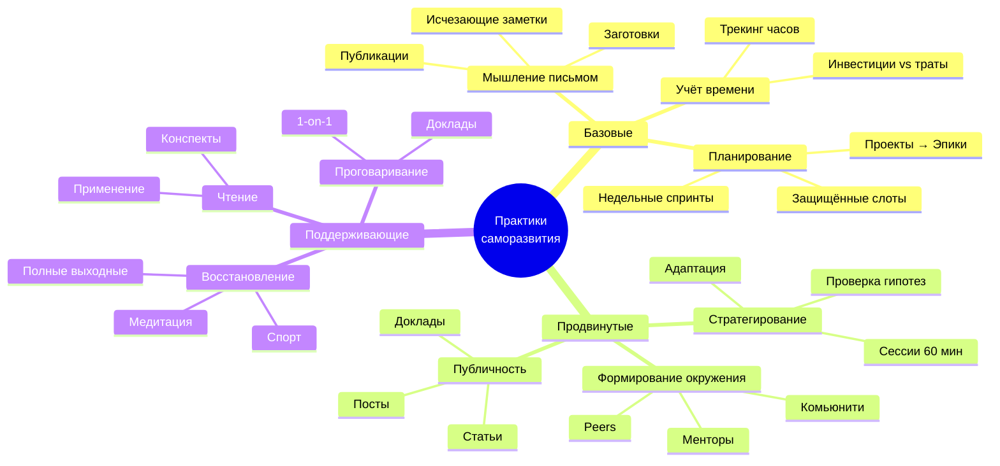
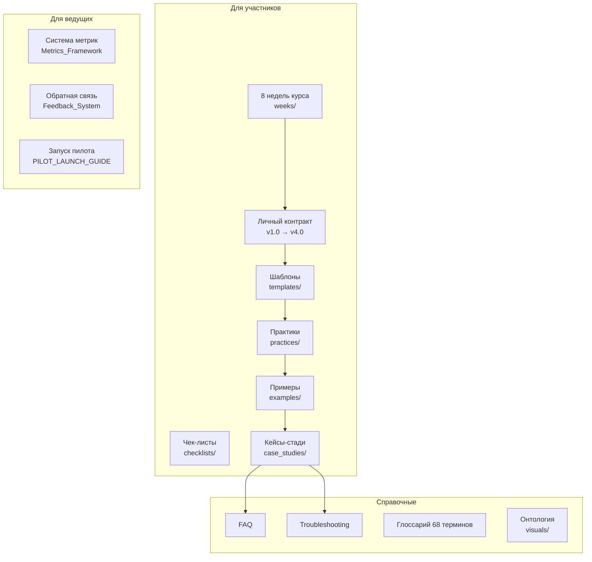
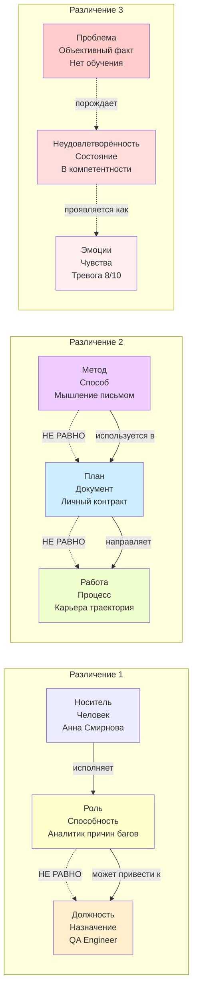
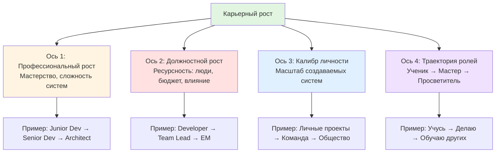

# Визуальная карта фреймворка «Системная карьера»

**Назначение:** Обзор структуры курса, взаимосвязей между элементами и пути участника от Недели 0 до Недели 8.

**Дата:** 08.10.2025  
**Версия:** 1.0

---

## 🗺️ Путь участника (8 недель)

---

## 🧩 Структура Личного контракта (инкрементальная)

---

## 🎯 Ключевые цепочки концептов

### Цепочка 1: От неудовлетворённости к артефакту

---

### Цепочка 2: Недельный ритм

---

### Цепочка 3: Практики саморазвития

---

## 📚 Структура материалов курса

---

## 🎓 Критические различения (визуально)

---

## 📊 4 оси карьерного роста

---

## 🔗 Связанные материалы

- [Глоссарий](docs/development/Glossary.md) — 68 концептов с определениями
- [Онтология](visuals/ontology.mmd) — детальная диаграмма связей
- [Недели курса](weeks/) — детальные программы
- [Кейсы-стади](case_studies/INDEX.md) — реальные примеры путей

---

*Дата создания: 08.10.2025*  
*Версия: 1.0*

