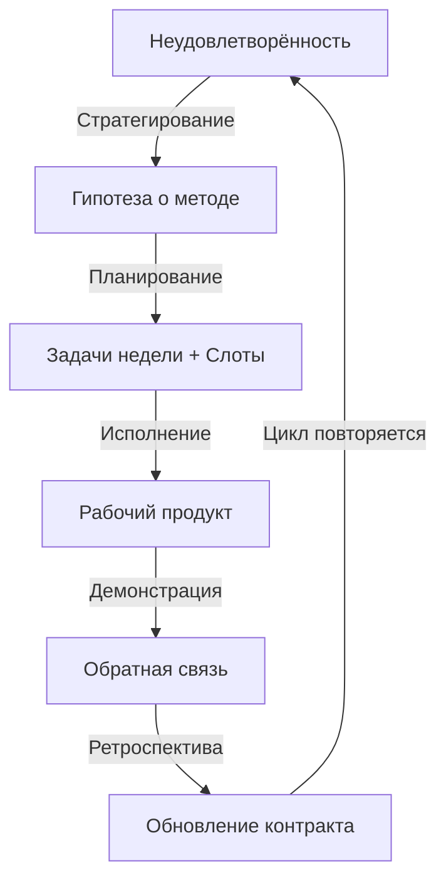

# Фреймворк "Системная карьера"
## Версия 2.0 — Практическое руководство

---

## 📍 Кому это нужно

**Подход универсален**, но язык и метафоры заточены под **ИТ-аудиторию** — три ключевых сегмента:

- **Начинающие специалисты (Junior):**  
  Для создания прочного системного фундамента и осознанного выбора направления вместо хаотичного скакания по технологиям.

- **Опытные профессионалы (Middle/Senior):**  
  Для «отладки» текущей системы, преодоления плато или выгорания, перехода от исполнителя к архитектору собственной карьеры.

- **Руководители и основатели (Tech Lead/CTO):**  
  Для масштабирования влияния через создание устойчивой и предсказуемой системы, интегрированной с работой и личной жизнью.

---

## 🔥 1. Проблематика: почему планы не работают

### 1.1. Что не так с классическим подходом к карьере?

❌ **Пассажирский режим:**  
Внешние институты (компания, рынок, HR) планируют вас, а не вы их.

❌ **Фокус на титулах вместо способностей:**  
"Хочу стать Senior" вместо "Хочу научиться проектировать распределенные системы".

❌ **Разрыв "намерения ↔ календарь":**  
Есть цели на год, но нет защищённых слотов на неделю → прогресс случаен.

❌ **Одноразовое обучение:**  
Прошёл курс, получил сертификат — и забыл. Нет переноса в ежедневную практику.

❌ **Стихийная интеграция с ИИ:**  
Используете ChatGPT как поисковик, вместо того чтобы выстроить киберличность с агентами и регламентами.

❌ **Путаница "роль ↔ должность":**  
Думаете, что должность = способность. На деле, должность следует за доказанной полезностью, а не наоборот.

---

### 1.2. К чему это приводит?

```
Симптомы "сломанной" системы карьеры:

• Работаете много → чувствуете застой
• Учитесь много → не растёт зарплата/ответственность
• Есть планы на квартал → не выполняете их
• "Повышение в должности" → не чувствуете роста
• Выгорание → длинные простои → снова рывок
```

**Главный баг:** Нет управляемого моста между **долгосрочными намерениями** и **недельными действиями**.

---

## 🎯 2. Основные объекты внимания: краткий глоссарий

Чтобы фреймворк работал, нужно чётко различать понятия. Вот 7 ключевых.

---

### 2.1. Неудовлетворённость (источник энергии)

**Что это:**  
Внутреннее психическое состояние — разрыв между "как есть" и "как хочу". Это **топливо** для вашей агентности.

**Не путать с:**  
- **Проблема** — объективный разрыв ("мой доход 100k, нужен 150k")
- **Эмоция** — реакция ("раздражение", "тревога")

**Как работать:**
1. Формально опишите (письмом): "Что именно не устраивает?"
2. Измерьте силу эмоции (0-10)
3. Свяжите с ролью и системным уровнем

**Пример:**
```
Проблема: Мой доход застрял на уровне Middle уже 2 года
Неудовлетворённость: Чувство неуважения к своему вкладу
Эмоция: Раздражение (7/10)
→ Гипотеза о методе: Освоить системный анализ + публично демонстрировать результаты
```

---

### 2.2. Роль vs Должность (ключевое различение)

| Понятие | Что это | Проверка |
|---------|---------|----------|
| **Роль** | Устойчивая **способность** решать класс задач с предсказуемым качеством | "Одна роль → один артефакт" |
| **Должность** | Пакет полномочий и ресурсов в организации; следует за доказанной полезностью | Название в штатном расписании |

**Почему это важно:**
- Роли **переносимы** (можете взять с собой в другую компанию)
- Должности **следуют** за ролями, а не наоборот
- Мыслить ролями = фокус на реальной способности создавать пользу

**Тест на понимание:**
```
❌ Неправильно: "Я — Senior DevOps Engineer"
✅ Правильно: "Я — архитектор CI/CD конвейеров для K8s" 
   → Артефакт: 5 production-ready pipeline templates в GitLab
```

---

### 2.3. Рабочий продукт (единица прогресса)

**Что это:**  
Проверяемый результат работы: код, документ, прототип, процедура, видео, статья.

**Принцип:**  
**Артефакт > задача.** Если нет артефакта → не было работы.

**Критерий качества:**  
Внешний наблюдатель может:
1. Понять пользу
2. Повторить результат

**Еженедельный чек-лист:**
```
□ Рабочий продукт недели определён (что именно создам?)
□ Критерии приёмки заданы (когда считать "готово"?)
□ Проверяющий назначен (кто даст обратную связь?)
□ Формат публичности выбран (где покажу результат?)
```

---

### 2.4. Личный контракт (живой документ)

**Что это:**  
Договор с самим собой, который связывает **смыслы** (неудовлетворённости) с **календарём** (слоты недели).

**Структура цепочки:**
```
Смысл (неудовлетворённости)
    ↓
Роли (кем быть, чтобы их устранить?)
    ↓
Компетенции (что освоить?)
    ↓
Эпики (какие проекты запустить?)
    ↓
Спринты (что сделать за неделю?)
    ↓
Слоты (когда именно работать?)
```

**Тест на реальность:**  
Если в контракте есть цель, но **нет защищённых слотов** в календаре → это не цель, а шум.

---

### 2.5. Стратегирование (еженедельный процесс)

**Что это:**  
Непрерывный процесс работы с неудовлетворённостями и перевод их в проекты через **гипотезы о методах**.

**Не путать с:**  
Стратегия (статичный документ) ≠ Стратегирование (живой процесс)

**Базовый цикл:**
```
1. Неудовлетворённость → Формально описал письмом
2. Гипотеза о методе → "Если освою X, то устраню Y"
3. Проект → Декомпозиция на недельные инкременты
4. Проверка → Публичная демонстрация + обратная связь
5. Корректировка → Обновление контракта и гипотез
```

**Частота:**  
Раз в неделю, 60-90 минут, неотменяемый слот (как встреча с CEO).

---

### 2.6. Приоритетный проект (канал агентности)

**Что это:**  
Всегда действующий проект, который:
- Адресует **ключевую** неудовлетворённость
- Каждую неделю выдаёт **проверяемый** рабочий продукт
- Имеет **публичный** формат демонстрации

**Типы проектов:**
1. **Инвестиционный:** Цель — новое мастерство (например, "Освоение Rust до уровня production-кода")
2. **Рабочий:** Цель — конкретная система (например, "MVP сервиса аналитики логов")

**Обязательные элементы:**
```
• ≥10 часов в неделю в защищённых слотах
• Критерии приёмки артефакта (как узнать, что готово?)
• Назначенный проверяющий (кто даст feedback?)
• Публичный канал (где покажу результат?)
```

---

### 2.7. Киберличность (расширенная система)

**Что это:**  
**Вы + экзокортекс + ИИ-агенты + инструменты + регламенты.**  
Это единица развития и найма в современной реальности.

**Состав:**
```
Человек → Смысл, этика, управление, ответственность
Экзокортекс → Внешняя память (Obsidian, Notion, личная база знаний)
ИИ-агенты → Специализированные исполнители (промпты, MCP-tools, workflows)
Инструменты → IDE, Git, CI/CD, мониторинг
Регламенты → Правила качества, SLO для агентов, тесты
```

**Паспорт киберличности (для найма):**
1. Стек инструментов (что использую?)
2. Реестр агентов (роли, SLO, примеры артефактов)
3. Политики качества (как проверяю результаты?)
4. Кейсы "до/после" (чего достиг с киберличностью?)

---

## 🏗️ 3. Архитектура фреймворка: три уровня управления

Баланс между жёсткими и мягкими правилами строится через **три временных горизонта**.

---

### 3.1. Design-time: Стратегирование (квартал-год)

**Объекты внимания:**
- Неудовлетворённости (откуда энергия?)
- Стратегические проекты (что строю?)
- Этические фильтры ("красные зоны" — куда не пойду?)

**Функция:**  
"Где я должен быть? Кем хочу стать? Что хочу создать?"

**Артефакты:**
1. Список неудовлетворённостей (min 3, ранжированные по силе эмоции)
2. Стратегии-гипотезы (для каждой неудовлетворённости — метод устранения)
3. Этический фильтр (no-go список продуктов/практик)

**Частота обновления:**  
Раз в квартал + на еженедельной сессии стратегирования (мини-корректировка).

---

### 3.2. Plan-time: Планирование (месяц-неделя)

**Объекты внимания:**
- Цели этапа (что завершу в этом месяце?)
- Бюджет времени (сколько часов доступно?)
- Список рабочих продуктов недели

**Функция:**  
"Что именно я сделаю и на что потрачу ресурсы?"

**Артефакты:**
1. Портфель проектов (1-3 приоритетных)
2. Задачи на неделю (декомпозиция проектов)
3. Защищённые слоты в календаре (≥10 часов)

**Частота обновления:**  
Раз в неделю (воскресенье вечер или понедельник утро).

---

### 3.3. Run-time: Исполнение (день-час)

**Объекты внимания:**
- Текущее состояние (сколько энергии сейчас?)
- Список рабочих продуктов дня (что делаю?)
- Методы работы (как именно действую?)

**Функция:**  
"Как именно я действую здесь и сейчас?"

**Ключевое правило:**  
**Состояние > План-график.**  
Действуете исходя не только из расписания, но и из текущей энергии.

**Защита фокуса:**  
Не делаю ничего, что **не записано** в список рабочих продуктов недели.  
Всё новое → в заметки или бэклог.

---

## 🔄 4. Канонический цикл: недельный ритм



**Еженедельная сессия стратегирования (60-90 минут):**

1. **Ретроспектива (15 мин):**  
   Факт часов, завершённые артефакты, обратная связь. Что сработало? Что нет?

2. **Работа со смыслами (15 мин):**  
   Перечитать неудовлетворённости. Что изменилось? Новые появились?

3. **Актуализация стратегии (20 мин):**  
   Гипотезы всё ещё валидны? Нужна ли корректировка проектов?

4. **Планирование недели (30 мин):**  
   Декомпозиция на задачи. Заполнение списка рабочих продуктов. Бронирование слотов.

5. **Разбор заметок (10 мин):**  
   Просмотр исчезающих заметок. Что перенести в черновики/проекты?

---

## 📊 5. Метрики и показатели: как измерять прогресс?

### 5.1. Ведущие показатели (еженедельно)

Эти метрики **вы контролируете** напрямую:

| Метрика | Норма | Как проверить |
|---------|-------|---------------|
| **Время в слотах** | ≥10 ч/неделю | Таймтрекер, календарь |
| **Рабочий продукт недели** | 1 завершённый | Чек-лист критериев приёмки |
| **Публичная демонстрация** | 1 раз/неделю | Ссылка на пост/видео/demo |
| **Обратная связь** | 1 рецензия | Комментарий от peer/наставника |
| **Перенос в практику** | ≥50% изученного применено за 7-14 дней | Список освоенных методов |

---

### 5.2. Запаздывающие показатели (месяц-квартал)

Эти метрики — **результат** ваших ведущих действий:

| Метрика | Что показывает | Пример |
|---------|----------------|--------|
| **Усложнение задач** | Рост по системным уровням | От "fix bug" к "design subsystem" |
| **Расширение ответственности** | Рост влияния | От "solo dev" к "team lead" |
| **Изменение должности** | Внешнее признание | Middle → Senior; Senior → Staff |
| **Расширение ролей** | Портфель способностей | +1 роль в квартал |

---

### 5.3. Характеристические оси устойчивости

Эти метрики показывают **здоровье** вашей системы:

1. **Продуктивное состояние:**  
   Субъективная готовность к работе (шкала 0-5). Цель: чаще 4-5, реже ≤2.

2. **Учтённое vs инвестированное время:**  
   Соотношение учёта (логи/артефакты) и инвестиций (часы/деньги).

3. **План по рабочим продуктам:**  
   % недель с выполненной целью недели. Норма: ≥75%.

---

## 🚀 6. Пошаговое внедрение: с чего начать?

Внедрение фреймворка идёт **итерационно** — от простого к сложному.

---

### Шаг 0: Подготовка (1-2 часа)

**Цель:** Понять текущую ситуацию и создать минимальную инфраструктуру.

**Задачи:**
1. Прочитайте этот фреймворк целиком (ещё раз, медленно).
2. Заведите **экзокортекс** (Notion / Obsidian / Google Docs).
3. Создайте файл **"Личный контракт v0.1"** по шаблону ниже.

**Шаблон Личного контракта v0.1:**
```markdown
# Личный контракт v0.1

## 1. Мои неудовлетворённости (min 3)
1. [Опишите] → Сила эмоции: ?/10
2. [Опишите] → Сила эмоции: ?/10
3. [Опишите] → Сила эмоции: ?/10

## 2. Мои роли (текущие)
- Роль 1: [название] → Артефакт: [ссылка/описание]
- Роль 2: [название] → Артефакт: [ссылка/описание]

## 3. Приоритетный проект (на первые 4 недели)
- Название: [Метод + Рабочий продукт]
- Связанная неудовлетворённость: [#N]
- Результат этапа: [Что создам за 4 недели?]
- Бюджет времени: [X часов в неделю]

## 4. Рабочий продукт недели 1
- Что создам: [конкретный артефакт]
- Критерии приёмки: [как узнаю, что готово?]
- Проверяющий: [кто даст обратную связь?]
- Публичность: [где покажу?]
```

---

### Шаг 1: Первая неделя — "Аудит ролей" (3-5 часов)

**Цель:** Понять, кто вы сейчас (в терминах ролей), и создать Личный контракт v1.0.

**Задачи:**

1. **Провести аудит ролей (90 мин):**
   - Список из 5-10 ролей, которые исполняете **сейчас** (не "хочу", а "делаю")
   - Для каждой роли: контекст, рабочие продукты, уровень мастерства
   - Выделить 2-3 роли, в которых хотите расти

**Формат:**
```markdown
| Роль | Контекст | Рабочие продукты (примеры) | Уровень мастерства |
|------|----------|---------------------------|-------------------|
| Backend-разработчик | Team X, микросервисы на Go | API для биллинга, 3 сервиса в prod | Навык (делаю быстро) |
| Наставник джунов | Онбординг новичков | Гайд "Go best practices", 2 code review сессии | Умение (делаю систематически) |
```

2. **Заполнить раздел "Неудовлетворённости" (60 мин):**
   - Формально опишите 3-5 неудовлетворённостей письмом
   - Измерьте силу эмоции (0-10)
   - Свяжите с ролями: "Чтобы устранить X, нужно усилить роль Y"

3. **Выбрать приоритетный проект (60 мин):**
   - Какая неудовлетворённость самая сильная? (по эмоции)
   - Какой метод (гипотеза) поможет её устранить?
   - Во что это превращается? (Название проекта: "Метод + Рабочий продукт")

**Пример:**
```
Неудовлетворённость: Мой код часто ломается на production (Раздражение 8/10)
Гипотеза: Если освою observability (трейсинг, метрики), то смогу ловить баги раньше
Проект: "Освоение OpenTelemetry для создания dashboard мониторинга сервисов"
```

4. **Создать Личный контракт v1.0 (60 мин):**
   - Заполните шаблон из Шага 0
   - Опубликуйте в экзокортексе
   - (Опционально) Поделитесь с коллегой/наставником для обратной связи

**Рабочий продукт недели:**  
✅ Личный контракт v1.0 (документ) с заполненными разделами 1-4.

---

### Шаг 2: Вторая неделя — "Стратегическое намерение" (4-6 часов)

**Цель:** Превратить неудовлетворённости в стратегии-гипотезы и выбрать приоритетный проект.

**Задачи:**

1. **Для 1-2 ключевых неудовлетворённостей — письменно сформулировать стратегию (120 мин):**
   - Разные варианты решения (brainstorm: 3-5 идей)
   - Обоснование выбора основного метода (почему этот, а не другие?)
   - Целевая роль (кем нужно быть, чтобы это реализовать?)
   - Ключевые компетенции (что освоить?)

**Шаблон:**
```markdown
## Стратегия для неудовлетворённости #1

**Неудовлетворённость:** [Из контракта v1.0]

**Варианты решения:**
1. [Вариант 1: краткое описание + плюсы/минусы]
2. [Вариант 2: краткое описание + плюсы/минусы]
3. [Вариант 3: краткое описание + плюсы/минусы]

**Выбранный метод (стратегия):** [Вариант N, потому что...]

**Целевая роль:** [Например: "Архитектор observability систем"]

**Ключевые компетенции:**
- [Компетенция 1: Distributed tracing]
- [Компетенция 2: Метрики и алертинг]
- [Компетенция 3: Анализ инцидентов]

**Зачем это системе (команде/компании):**
[Какую пользу принесёт? Например: "Сократим MTTR на 40%, улучшим качество релизов"]
```

2. **Определить "красные зоны участия" (30 мин):**
   - Заранее заданные сферы/практики, куда **не пойдёте** ни при каких обстоятельствах
   - Этический фильтр (no-go список)

**Пример:**
```markdown
## Мои "красные зоны"

1. **Вредные продукты:** Gambling, адультерный контент, манипулятивные dark patterns
2. **Нечестные практики:** Фабрикация метрик, сокрытие использования ИИ, плагиат
3. **Правовые риски:** Нарушение приватности, обход лицензий
4. **Неприемлемые эффекты:** Проекты, которые умышленно вредят экологии или людям
```

3. **Провести первую сессию стратегирования (90 мин):**
   - Повестка: Ретро → Смыслы → Стратегия → План недели
   - Заполнить список рабочих продуктов на неделю 2

4. **Забронировать защищённые слоты в календаре (30 мин):**
   - Минимум 10 часов в неделю
   - Отметить как "Busy" / "Focus time" в календаре

**Рабочий продукт недели:**  
✅ Личный контракт v2.0 с заполненным разделом "Стратегии" и "Красные зоны".

---

### Шаг 3: Третья неделя — "Портфель проектов" (4-6 часов)

**Цель:** Превратить стратегии в конкретные проекты с артефактами.

**Задачи:**

1. **Заполнить Таблицу "Анализ и выбор приоритетных проектов" (120 мин):**

| Название проекта | Связанные неудовлетворённости | Статус | Ожидаемый результат | Первый этап |
|------------------|------------------------------|--------|-------------------|-------------|
| [Метод + Рабочий продукт] | [#N] | Приоритетный | [Что создам?] | [Результат, срок, бюджет] |

**Пример:**
```markdown
| Проект | Неудовлетворённости | Статус | Результат | Этап 1 (4 недели) |
|--------|---------------------|--------|-----------|-------------------|
| Освоение OpenTelemetry для мониторинга | #1 (код ломается в prod) | Приоритетный | Dashboard с метриками 5 ключевых сервисов | Прототип dashboard + инструментация 1 сервиса. Срок: 4 нед. Время: 12 ч/нед. |
```

2. **Для приоритетного проекта — декомпозировать на недельные инкременты (60 мин):**
   - Что создам на неделе 3, 4, 5, 6?
   - Критерии приёмки для каждого инкремента

3. **Настроить публичный канал для демонстрации (30 мин):**
   - Блог (Medium / Habr / personal site)
   - Telegram-канал
   - GitHub (readme updates)
   - YouTube (опционально)

4. **Создать рабочий продукт недели 3:**
   - Например: "Инструментировать 1 микросервис трейсами + пост в блог с выводами"

**Рабочий продукт недели:**  
✅ Личный контракт v2.1 с заполненной таблицей "Портфель проектов".

---

### Шаг 4: Четвёртая неделя — "Операционная модель" (3-5 часов)

**Цель:** Превратить контракт в **тактический инструмент** с недельными задачами и слотами.

**Задачи:**

1. **Заполнить Таблицу "Задачи на неделю" (90 мин):**

| Проект | Задача недели | Критерии приёмки | Проверяющий | Публичность | План/Факт часов |
|--------|---------------|------------------|-------------|-------------|-----------------|
| [Проект 1] | [Что делаю?] | [Как узнаю "готово"?] | [Кто проверит?] | [Где покажу?] | [10 / ?] |

2. **Заполнить раздел "Операционные обязательства" (30 мин):**

| Параметр | Моё обязательство | Инструмент контроля |
|----------|-------------------|---------------------|
| Сессия стратегирования | Каждое воскресенье, 19:00, 90 мин | Защищённый слот в календаре |
| Время на приоритетные проекты | ≥12 часов/неделю | Календарь, план/факт |
| Публичная демонстрация | 1 рабочий продукт/неделю | Блог / Telegram |

3. **Провести вторую сессию стратегирования (90 мин):**
   - Ретро недели 3: что сработало? что нет?
   - План недели 4: декомпозиция на задачи

4. **Создать рабочий продукт недели 4:**
   - Продолжение приоритетного проекта
   - Публичная демонстрация промежуточного результата

**Рабочий продукт недели:**  
✅ Личный контракт v3.0 ("Операционная модель") с рабочими слотами в календаре.

---

### Шаг 5: Недели 5-8 — "Устойчивая система" (12-20 часов)

**Цель:** Довести приоритетный проект до завершения первого этапа. Интегрировать фреймворк в стиль жизни.

**Задачи:**

**Неделя 5: Контекст**
- Тема: Карьерная экосистема
- Артефакт: Карта окружения (кто влияет? кто вдохновляет? кого избегаю?)

**Неделя 6: Мастерство**
- Тема: Траектория ролей (Ученик → Интеллектуал → Профессионал → ...)
- Артефакт: План развития 1 ключевой компетенции на квартал

**Неделя 7: Коммуникация**
- Тема: Карта ценности (кому и как становится лучше от вашей работы?)
- Артефакт: Черновик "личного бренда" / elevator pitch

**Неделя 8: Устойчивость**
- Тема: Устойчивая карьера (баланс продуктивность-здоровье-счастье)
- Артефакт: Финальная сборка контракта v4.0 + презентация всей системы

---

## 🛠️ 7. Инструменты и технологии

### 7.1. Минимальный стек (для старта)

**Экзокортекс (выбрать 1):**
- Notion (универсальный, дружелюбный)
- Obsidian (markdown, локальное хранение, мощные связи)
- Google Docs (простота, доступность)

**Таймтрекинг:**
- Toggl Track
- RescueTime
- Pomodoro-таймер (любой)

**Календарь:**
- Google Calendar (интеграция с Notion / Obsidian через API)

**Публичность:**
- Telegram-канал (минимальный порог входа)
- Личный блог (Medium / Habr / GitHub Pages)

---

### 7.2. Продвинутый стек (для киберличности)

**ИИ-агенты:**
- Cursor / Windsurf / Cody (для кода)
- Claude / ChatGPT (для текстов и анализа)
- Perplexity (для research)

**MCP-tools (Model Context Protocol):**
- Интеграция ИИ с вашим экзокортексом
- Примеры: чтение базы знаний, создание задач, анализ метрик

**Автоматизация:**
- Zapier / Make.com (связка календарь → экзокортекс → боты)
- GitHub Actions (для CI/CD рабочих продуктов)

**Мониторинг:**
- Дашборд в Notion / Coda (метрики недели)
- Telegram-бот (чек-ин продуктивного состояния)

---

## 📈 8. Типичные вопросы и anti-паттерны

### 8.1. "У меня нет времени на стратегирование"

**Ответ:**  
Если у вас нет 90 минут в неделю на стратегирование — значит, вы в **пассажирском режиме**. Вас планируют другие.

**Решение:**  
Начните с 30 минут. Даже короткая ретро + список рабочих продуктов недели — это 80% пользы.

---

### 8.2. "Я не знаю, какую неудовлетворённость выбрать"

**Ответ:**  
Выберите ту, где **эмоция сильнее всего** (≥7/10). Это топливо для агентности.

**Решение:**  
Если всё одинаково "не устраивает" — выберите любую и начните. Через 2-3 недели станет ясно, правильный ли это фокус.

---

### 8.3. "Мой план на неделю постоянно рушится"

**Ответ:**  
Скорее всего, вы:
1. Планируете слишком много (завышенные ожидания)
2. Не защищаете слоты (нет boundaries)
3. Не учитываете продуктивное состояние (план не гибкий)

**Решение:**  
- Планируйте на 60% доступного времени (остальное — буфер)
- Защищайте слоты как встречи с CEO
- Применяйте правило: **Состояние > План-график**

---

### 8.4. "У меня нет проверяющего / наставника"

**Ответ:**  
Найдите **peer** (коллегу похожего уровня) и договоритесь о взаимной рецензии раз в неделю.

**Формат:**  
"2 плюса + 1 пожелание" по каждому рабочему продукту. 15 минут на человека.

---

### 8.5. "Я не знаю, что публиковать"

**Ответ:**  
Публикуйте **процесс**, а не идеальный результат.

**Примеры:**
- "Разбираюсь с OpenTelemetry: мои заметки и первый трейс"
- "Неделя 1 проекта X: что планировал vs что сделал"
- "Ошибка, которую словил сегодня, и как исправил"

---

## 🎓 9. Адаптация под сегменты аудитории

### 9.1. Junior (начинающие специалисты)

**Фокус:** Создание системного фундамента + выбор направления.

**Приоритетные практики:**
1. Мышление письмом (заготовки и заметки)
2. Аудит ролей (понять, кто я сейчас)
3. Систематическое медленное чтение (изучение SoTA-методов)

**Типовой приоритетный проект:**
"Освоение [технология/домен] до уровня production-кода"

**Пример:**
- Junior Backend Dev → "Освоение PostgreSQL для создания highload-систем"
- Рабочий продукт недели: Микросервис с оптимизированными запросами + статья с выводами

**Метрики роста:**
- Усложнение задач: от "fix bug" к "design feature"
- Публичность: от 0 статей к 1/месяц
- Обратная связь: от 0 code review к регулярным

---

### 9.2. Middle/Senior (опытные профессионалы)

**Фокус:** Преодоление плато + переход к архитектурным ролям.

**Приоритетные практики:**
1. Стратегирование (работа с неудовлетворённостями)
2. Формирование окружения (сообщество единомышленников)
3. Мышление проговариванием (коммуникация ценности)

**Типовой приоритетный проект:**
"Рост по системным уровням" — от локальных задач к сквозным процессам.

**Пример:**
- Senior Backend Dev → "Создание платформенного решения для observability 10+ сервисов"
- Рабочий продукт недели: Регламент "версия 0.1" + тест-набор + демо для команды

**Метрики роста:**
- Расширение ответственности: от "solo contributor" к "tech lead"
- Влияние: от 1 команды к нескольким
- Публичность: от блога к докладам на конференциях

---

### 9.3. Tech Lead/CTO (руководители и основатели)

**Фокус:** Масштабирование влияния + интеграция работы и жизни.

**Приоритетные практики:**
1. Киберличность (оркестрация ИИ-агентов для делегирования)
2. Организация досуга (устойчивая карьера без выгорания)
3. Просвещение (передача знаний и стандартов)

**Типовой приоритетный проект:**
"Создание устойчивой системы для команды/компании"

**Пример:**
- CTO стартапа → "Внедрение культуры инженерного excellence через регламенты и наставничество"
- Рабочий продукт недели: Playbook "Как мы делаем code review" + воркшоп для команды

**Метрики роста:**
- Калибр личности: от проблем команды к проблемам отрасли
- Ресурсность: доступ к ключевым людям и капиталу
- Элитность: устойчивое создание ценности на высоких системных уровнях

---

## ✅ 10. Чек-лист готовности фреймворка

Вы готовы использовать фреймворк "Системная карьера", если:

```
□ Понимаю различие "роль ↔ должность"
□ Описал ≥3 неудовлетворённости письмом
□ Выбрал приоритетный проект (метод + рабочий продукт)
□ Создал Личный контракт v1.0+ в экзокортексе
□ Забронировал ≥10 часов в неделю в календаре
□ Провёл первую сессию стратегирования (90 мин)
□ Создал рабочий продукт недели #1
□ Опубликовал его в выбранном канале
□ Получил обратную связь от peer/наставника
□ Обновил контракт по результатам недели
```

**Если ≥7 пунктов отмечены:** Фреймворк работает. Продолжайте недельный ритм.

**Если <7:** Вернитесь к Шагу 0. Возможно, нужно упростить или пересмотреть приоритеты.

---

## 📚 11. Дальнейшее развитие

### Следующие шаги после освоения базы:

1. **Рост по траектории ролей:**  
   Ученик → Интеллектуал → Профессионал → Исследователь → Просветитель

2. **Развитие киберличности:**  
   От "я-один" к "я + экзокортекс + ИИ-агенты"

3. **Масштабирование:**  
   От личной практики к командной (Team Playbook)

4. **Элитность:**  
   Устойчивое создание ценности на высоких системных уровнях (отрасль → общество → цивилизация)

---

## 🔗 Связь с другими фреймворками

**Системное мышление (ШСМ):**  
Онтологическая база, различения типов (система/процесс/метод)

**Agile/Scrum:**  
Недельный спринт как единица прогресса, ретроспектива, инкременты

**GTD (Getting Things Done):**  
Инбокс-зеро, разделение горизонтов планирования

**OKR (Objectives & Key Results):**  
Связка долгосрочных целей и еженедельных метрик

**Personal Kanban:**  
Визуализация работ, WIP-лимиты, фокус на завершении

---

## 💬 Обратная связь и улучшения

Этот фреймворк — **живой документ**. Он будет обновляться по мере:
- Получения обратной связи от пользователей
- Появления новых инструментов (ИИ, MCP-tools)
- Эволюции практик (новые методы стратегирования)

**Как улучшить фреймворк:**
1. Попробуйте применить на практике (минимум 4 недели)
2. Зафиксируйте, что сработало / что нет
3. Поделитесь обратной связью (issues / pull requests / комментарии)

---

## 🎯 Итоговая формула успеха

```
Неудовлетворённость (источник энергии)
    + Роль (переносимая способность)
    + Рабочий продукт (единица прогресса)
    + Личный контракт (мост "смысл ↔ календарь")
    + Стратегирование (еженедельный процесс)
    + Приоритетный проект (канал агентности)
    + Киберличность (расширенная система)
    = Системная карьера
```

**Главный принцип:**  
**Стратегия ничто, стратегирование — всё.**

---

**Версия:** 2.0  
**Дата:** 30.09.2025  
**Лицензия:** CC BY-SA 4.0  
**Автор:** [Ваше имя]

---
