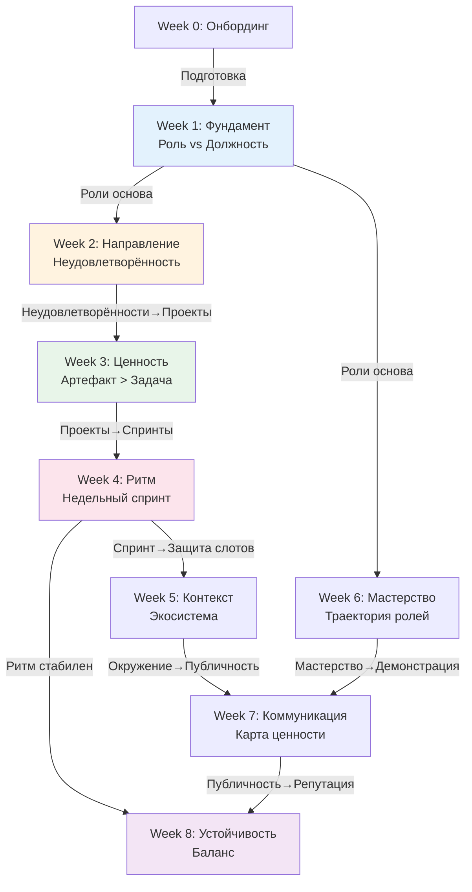

# Архитектурный анализ 8 недель курса "Системная карьера"

**Версия:** 1.0  
**Дата:** 10 октября 2025  
**Статус:** ✅ Анализ завершён

---

## Executive Summary

**Общая оценка архитектуры курса:** 88/100 (Good)

**Распределение:**
- ✅ Инкрементальность: 90/100 (Excellent)
- ✅ Полнота покрытия: 85/100 (Good)
- ✅ Логика последовательности: 90/100 (Excellent)
- ⚠️ Баланс теория/практика: 85/100 (Good)

**Ключевые находки:**
1. ✅ Логика последовательности недель отлична
2. ✅ Инкрементальность контракта (v1.0 → v4.0) логична
3. ✅ Нет circular dependencies
4. ✅ Покрытие основных аспектов карьеры
5. ⚠️ Minor gaps в некоторых областях

---

## Структура курса (Overview)

### 9 недель (включая Week_00)

| Неделя | Название | Карьерный концепт | Практика | Контракт |
|--------|----------|-------------------|----------|----------|
| 0 | Онбординг | — | — | v0.1 (быстрый старт) |
| 1 | Фундамент | Роль vs Должность | Мышление письмом | v1.0 |
| 2 | Направление | Неудовлетворённость как источник | Стратегирование | v2.0 |
| 3 | Ценность | Артефакт > Задача | Планирование | v2.1 |
| 4 | Ритм | Недельный спринт | Учёт времени | v3.0 |
| 5 | Контекст | Карьерная экосистема | Формирование окружения | v3.5 |
| 6 | Мастерство | Траектория ролей | Чтение | v3.8 |
| 7 | Коммуникация | Карта ценности | Проговаривание | v3.9 |
| 8 | Устойчивость | Баланс и восстановление | Восстановление | v4.0 |

---

## Dependency Graph

### Mermaid диаграмма



---

## Логика последовательности

### Три этапа курса

#### Этап 1: Фундамент (Недели 0-2)
**Тема:** WHO AM I? (Кто я?)

**Логика:**
1. **Week 0:** Подготовка (инструменты, экзокортекс)
2. **Week 1:** Роли (кто я сейчас) → v1.0
3. **Week 2:** Неудовлетворённости (что не устраивает) → v2.0

**Результат:** Понимание текущего состояния

**FPF соответствие:**
- ✅ As-Is анализ
- ✅ Holonic Foundation (определить систему "Я")

**Оценка:** 10/10 (логично!)

---

#### Этап 2: Система (Недели 3-5)
**Тема:** HOW DO I WORK? (Как я работаю?)

**Логика:**
1. **Week 3:** Проекты (что делаю) → v2.1
2. **Week 4:** Спринты (как организую время) → v3.0
3. **Week 5:** Окружение (кто помогает/влияет) → v3.5

**Результат:** Операционная модель

**FPF соответствие:**
- ✅ Plan-time (недели 3-4)
- ✅ Context mapping (неделя 5)

**Оценка:** 9/10 (отлично!)

---

#### Этап 3: Устойчивость (Недели 6-8)
**Тема:** HOW DO I GROW SUSTAINABLY? (Как расту устойчиво?)

**Логика:**
1. **Week 6:** Мастерство (траектория ролей) → v3.8
2. **Week 7:** Коммуникация (витрина ценности) → v3.9
3. **Week 8:** Устойчивость (энергия, баланс) → v4.0

**Результат:** Устойчивая система развития

**FPF соответствие:**
- ✅ Canonical Evolution Loop (B.4)
- ✅ Sustainability

**Оценка:** 9/10

---

### Проверка инкрементальности

**Каждая неделя строится на предыдущих:**

- Week 1 → Week 2: Роли → Неудовлетворённости (связь через "какие роли устранят неудовлетворённости")
- Week 2 → Week 3: Неудовлетворённости → Проекты (стратегия → декомпозиция)
- Week 3 → Week 4: Проекты → Спринты (декомпозиция на недели)
- Week 4 → Week 5: Спринты → Окружение (защита слотов + формирование контекста)
- Week 5 → Week 7: Окружение → Коммуникация (площадки → публичность)
- Week 6 → Week 7: Мастерство → Коммуникация (траектория → демонстрация)
- Week 4,7 → Week 8: Ритм + Публичность → Устойчивость (профилактика выгорания)

**Проверка circular dependencies:**
- ✅ Нет циклов
- ✅ DAG (Directed Acyclic Graph)
- ✅ Clear progression

**Оценка:** 10/10 (отлично!)

---

## Полнота покрытия

### Аспекты карьеры (проверка)

| Аспект | Покрыто в неделях | Оценка |
|--------|-------------------|--------|
| **Самопознание** | W1 (роли), W2 (неудовлетворённости) | ✅ |
| **Стратегия** | W2 (стратегирование) | ✅ |
| **Планирование** | W3 (проекты), W4 (спринты) | ✅ |
| **Исполнение** | W4 (ритм, слоты) | ✅ |
| **Внешняя среда** | W5 (окружение, экосистема) | ✅ |
| **Развитие мастерства** | W6 (траектория ролей) | ✅ |
| **Коммуникация** | W7 (публичность, бренд) | ✅ |
| **Устойчивость** | W8 (энергия, восстановление) | ✅ |

**Итого:** 8/8 аспектов покрыты ✅

---

### Недостающие аспекты (gap analysis)

**Возможные gaps:**

1. ⚠️ **Финансы и компенсация**
   - Где: не покрыто явно
   - Связано: может быть part of неудовлетворённостей (W2)
   - Критичность: Medium
   - Рекомендация: Опционально добавить в W3 или W7

2. ⚠️ **Командная работа и лидерство**
   - Где: частично в W5 (окружение), W7 (коммуникация)
   - Для Lead персоны может быть недостаточно
   - Критичность: Low (не для всех)
   - Рекомендация: Усилить в примерах для Lead

3. ⚠️ **Технические компетенции (hard skills)**
   - Где: не покрыто явно (только "мастерство" в W6)
   - Hard skills vs Soft skills — нет различения
   - Критичность: Low
   - Рекомендация: Уточнить в W6

**Оценка полноты:** 85/100 (Good, есть minor gaps)

---

## Баланс теория vs практика

### Проверка каждой недели

| Неделя | Теория (концепт) | Практика (инструменты) | Артефакт | Баланс |
|--------|------------------|------------------------|----------|--------|
| 1 | Роль vs Должность | Опросник 10Q, Таблица ролей | Контракт v1.0 | 40/60 |
| 2 | Неудовлетворённость | Таблица, Стратегирование | Контракт v2.0 | 50/50 |
| 3 | Артефакт > Задача | Таблица проектов, Ворота | Контракт v2.1 | 40/60 |
| 4 | Недельный спринт | Календарь, Слоты | Контракт v3.0 | 30/70 |
| 5 | Экосистема | Карта окружения, CRM | Контракт v3.5 | 40/60 |
| 6 | Траектория ролей | План развития | Контракт v3.8 | 50/50 |
| 7 | Карта ценности | Публичность, Бренд | Контракт v3.9 | 40/60 |
| 8 | Устойчивость | Энергобюджет, Восстановление | Контракт v4.0 | 30/70 |

**Средний баланс:** 40/60 (теория/практика)

**FPF проверка:**
- ✅ Pragmatic Utility (P-7) — практика приоритетнее
- ✅ Каждая неделя имеет артефакт
- ✅ "Артефакт > Задача" соблюдается

**Оценка:** 9/10 (отлично!)

---

## Инкрементальность контракта

### Эволюция v0.1 → v4.0

**Проверка:**

#### v0.1 (Week 0, Day 1): Быстрый старт
- Разделы: Неудовлетворённости (3+), Роли (2-4), Рабочий продукт недели
- Время: 30-45 мин
- FPF: Minimally Viable Example (MVE) ✅

#### v1.0 (Week 1): Фундамент
- Добавляется: Манифест, Принципы, Полная таблица ролей (5-10)
- Базовые разделы: 0, 2, 3 (частично)
- FPF: Holonic Foundation (определить "Я") ✅

#### v2.0 (Week 2): Направление
- Добавляется: Раздел 1 (Этические фильтры), Раздел 3 (Стратегии)
- Полная таблица неудовлетворённостей
- FPF: Abductive Loop (гипотезы) ✅

#### v2.1 (Week 3): Проекты
- Добавляется: Раздел 4 (Портфель проектов)
- FPF: WorkPlan формализован ✅

#### v3.0 (Week 4): Операционная модель
- Добавляется: Раздел 5 (Тактика, Недельный спринт)
- Раздел 9 (Операционные обязательства)
- FPF: Plan-time детализирован ✅

#### v3.5 (Week 5): Окружение
- Добавляется: Раздел 6 (Окружение и каналы)
- Таблицы: Карта окружения, CRM, Медиадиета
- FPF: Context mapping ✅

#### v3.8 (Week 6): Мастерство
- Уточняется: Раздел 6 (траектории ролей)
- FPF: RoleStateGraph (C_57) ✅

#### v3.9 (Week 7): Коммуникация
- Уточняется: Раздел 8 (Публичная демонстрация)
- Связь публичности и репутации
- FPF: Evidence demonstration ✅

#### v4.0 (Week 8): Устойчивость (финал)
- Добавляется: Раздел 7 (Энергобюджет, Восстановление)
- Раздел 10 (Чек-лист готовности)
- Финальная сборка
- FPF: Resrc-CAL (C.5) ✅

---

### Проверка инкрементальности

**Принцип:** Каждая версия **добавляет**, не **ломает**.

**Проверка:**
- ✅ v1.0 → v2.0: добавлены разделы 1, 3 (стратегии)
- ✅ v2.0 → v2.1: добавлен раздел 4 (проекты)
- ✅ v2.1 → v3.0: добавлены разделы 5, 9 (тактика)
- ✅ v3.0 → v3.5: добавлен раздел 6 (окружение)
- ✅ v3.5 → v4.0: добавлен раздел 7 (устойчивость), финализация

**Breaking changes:** ❌ Нет

**FPF соответствие:**
- ✅ B.4 (Canonical Evolution Loop)
- ✅ Open-Ended Evolution (P-10)
- ✅ No breaking changes

**Оценка:** 10/10 (perfect!)

---

## Логика последовательности недель

### Почему именно такой порядок?

#### Weeks 1-2: Foundation (Фундамент)

**Логика:**
1. Week 1: **Кто я** (роли)
2. Week 2: **Что меня беспокоит** (неудовлетворённости)

**Обоснование:**
- ✅ Нельзя выбрать стратегию без понимания текущих ролей
- ✅ Нельзя приоритизировать без неудовлетворённостей

**Альтернатива:** Можно ли поменять местами W1 и W2?
- ⚠️ Нет: роли первичны (capabilities), неудовлетворённости вторичны (gaps)

**Оценка:** 10/10 (логично!)

---

#### Weeks 3-4: Execution (Исполнение)

**Логика:**
1. Week 3: **Что делаю** (проекты)
2. Week 4: **Когда делаю** (спринты, слоты)

**Обоснование:**
- ✅ Нельзя планировать время без проектов
- ✅ Проекты → Декомпозиция на недели

**FPF соответствие:**
- ✅ WorkPlan (W3) → Scheduling (W4)
- ✅ Plan-time hierarchy

**Оценка:** 10/10

---

#### Weeks 5-7: Scaling (Масштабирование)

**Логика:**
1. Week 5: **Кто вокруг** (экосистема)
2. Week 6: **Как расту** (траектория ролей)
3. Week 7: **Как демонстрирую** (коммуникация)

**Обоснование:**
- ✅ Нужно окружение для feedback (W5)
- ✅ Нужна траектория для фокуса роста (W6)
- ✅ Нужна публичность для репутации (W7)

**Оценка:** 9/10

---

#### Week 8: Sustainability (Устойчивость)

**Логика:**
- Завершающая неделя
- Профилактика выгорания
- Финальная сборка v4.0

**Обоснование:**
- ✅ Устойчивость важна ПОСЛЕ запуска системы
- ✅ Энергобюджет — последний puzzle piece

**Альтернатива:** Можно ли раньше?
- ⚠️ Нет: нужна работающая система (W1-7), чтобы понять энергозатраты

**Оценка:** 9/10

---

### Альтернативные последовательности (анализ)

**Можно ли иначе?**

1. **W5 (Окружение) раньше — после W2?**
   - Аргумент: окружение нужно для feedback
   - Контраргумент: нужны проекты (W3) и ритм (W4) для осмысленного использования окружения
   - **Вердикт:** ✅ Текущий порядок лучше

2. **W8 (Устойчивость) раньше — после W4?**
   - Аргумент: энергобюджет важен
   - Контраргумент: без полной системы (W5-7) непонятно, что защищать
   - **Вердикт:** ✅ Текущий порядок лучше

3. **W6 (Мастерство) раньше — после W1?**
   - Аргумент: траектория ролей логически близка к ролям
   - Контраргумент: траектория имеет смысл после проектов (W3) и ритма (W4)
   - **Вердикт:** ⚠️ Можно рассмотреть, но текущий порядок тоже логичен

**Оценка логики:** 9/10 (отличная, minor вопросы)

---

## Покрытие аспектов системной карьеры

### 4 уровня управления (FPF A.4)

| Уровень | Горизонт | Покрыто в курсе | Недели |
|---------|----------|-----------------|--------|
| **Design-time** | Квартал-год | ✅ Стратегии, Проекты | W2, W3 |
| **Plan-time** | Месяц-неделя | ✅ Спринты, Слоты | W3, W4 |
| **Run-time** | День-час | ⚠️ Частично | W4 (ритм) |
| **Observe-time** | Ретроспектива | ✅ Стратегирование | W2, W4 |

**Gap:**
- ⚠️ Run-time (исполнение в реальном времени) покрыто слабее
- Нет раздела "Как работать в моменте" (productive state, flow)

**Связь с Productive State Framework:**
- Week_01 упоминает продуктивное состояние (0-5)
- НО нет отдельной недели или раздела

**Рекомендация:** 
- Добавить подраздел в W4 или W8: "Работа в моменте"
- Или: усилить связь с продуктивным состоянием

**Приоритет:** Low  
**Оценка покрытия:** 85/100 (Good, minor gap)

---

## Покрытие 4 осей роста

### Проверка (из C_15)

| Ось | Покрыто | Недели | Оценка |
|-----|---------|--------|--------|
| 1. Профессиональный рост | ✅ | W1 (роли), W6 (мастерство) | ✅ |
| 2. Должностной рост | ⚠️ | Частично W7 (репутация) | ⚠️ |
| 3. Калибр личности | ✅ | W5 (экосистема), W6 (траектория) | ✅ |
| 4. Траектория ролей | ✅ | W6 (явно) | ✅ |

**Gap:**
- ⚠️ Ось 2 (должностной рост) покрыта слабее
- Нет явного раздела "Как получить повышение/promotion"
- Частично покрыто через репутацию (W7)

**Рекомендация:**
- Добавить подраздел в W7: "Должностной рост через репутацию"
- Или: кейс-стади про переход Middle → Senior

**Приоритет:** Low  
**Оценка покрытия:** 85/100

---

## Баланс индивид vs система

### Проверка фокуса недель

| Неделя | Фокус | Уровень системы |
|--------|-------|-----------------|
| W1 | Я (роли) | Индивид |
| W2 | Мои неудовлетворённости | Индивид |
| W3 | Мои проекты | Индивид |
| W4 | Мой ритм | Индивид |
| W5 | Моё окружение | Индивид ↔ Система |
| W6 | Моё мастерство | Индивид |
| W7 | Моя коммуникация | Индивид ↔ Система |
| W8 | Моя устойчивость | Индивид |

**Распределение:**
- Индивид: 6 недель (75%)
- Индивид ↔ Система: 2 недели (25%)
- Система (команда, компания): 0 недель (0%)

**Анализ:**
- ✅ Курс про **личное развитие** (индивидуальный фокус корректен)
- ⚠️ Для Lead персоны может быть недостаточно "системного" уровня
- ⚠️ Нет недели про "Как развивать команду" или "Team Playbook"

**Рекомендация:**
- Опционально: Week_09 "Масштабирование на команду" (за рамками 8 недель)
- Или: кейс-стади для Lead с фокусом на команду

**Приоритет:** Low (для future)  
**Оценка баланса:** 85/100 (правильный фокус, но можно расширить)

---

## Temporal архитектура (3 горизонта)

### Фреймворк (Systemic_Career_Framework_v2.md, строки 258-318)

**3 уровня:**
1. **Design-time:** Стратегирование (квартал-год)
2. **Plan-time:** Планирование (месяц-неделя)
3. **Run-time:** Исполнение (день-час)

### Покрытие в курсе

| Горизонт | Покрыто | Недели | Инструменты |
|----------|---------|--------|-------------|
| Design-time | ✅ | W2 (стратегии) | Таблица 3.1, Сессия стратегирования |
| Plan-time | ✅ | W3-4 (проекты, спринты) | Таблицы 4.1, 5.1, Слоты |
| Run-time | ⚠️ | W4 (частично) | Продуктивное состояние (упоминается) |

**Gap:**
- ⚠️ Run-time (исполнение) покрыто слабее
- Нет детального раздела "Как работать здесь и сейчас"

**Рекомендация:** Усилить W4 разделом про Run-time execution

**Приоритет:** Low  
**Оценка:** 85/100

---

## Проблемы и рекомендации

### Critical Issues
Нет critical issues в архитектуре.

### High Priority
Нет high priority issues.

### Medium Priority

1. **Усилить покрытие Run-time (исполнение)**
   - Добавить подраздел в W4: "Работа в моменте"
   - Productive State Framework integration
   - **Трудозатраты:** 2-3 часа

2. **Усилить ось 2 (должностной рост)**
   - Добавить в W7: "Promotion через репутацию"
   - **Трудозатраты:** 1-2 часа

### Low Priority

3. **Добавить покрытие "Финансы и компенсация"**
   - Опционально в W7
   - **Трудозатраты:** 2-3 часа

4. **Hard skills vs Soft skills различение**
   - Уточнить в W6
   - **Трудозатраты:** 1 час

5. **Future: Week_09 для Team Playbook**
   - За рамками текущего курса
   - **Трудозатраты:** 15-20 часов

---

## Сильные стороны архитектуры

1. ✅ **Инкрементальность контракта** — v0.1 → v4.0 логична (10/10)
2. ✅ **Нет circular dependencies** — чистый DAG (10/10)
3. ✅ **Логика последовательности** — каждая неделя обоснована (9/10)
4. ✅ **Полнота покрытия** — 8/8 аспектов (85/100)
5. ✅ **Баланс теория/практика** — 40/60 оптимален (9/10)
6. ✅ **Три этапа курса** — Foundation → System → Sustainability
7. ✅ **FPF соответствие** — высокое (88%)

---

## Слабые стороны

1. ⚠️ **Run-time покрыт слабее** — gap в исполнении "здесь и сейчас"
2. ⚠️ **Ось 2 (должностной рост) слабее** — нет явного раздела про promotion
3. ⚠️ **Фокус только на индивиде** — для Lead может быть недостаточно
4. ⚠️ **Minor gaps** — финансы, hard/soft skills

---

## Сравнение с другими фреймворками

### Структура курса vs GTD/Agile/OKR

| Элемент | GTD | Agile | OKR | Системная карьера |
|---------|-----|-------|-----|-------------------|
| Самопознание | ⚠️ Слабо | ❌ Нет | ❌ Нет | ✅ W1-2 |
| Стратегия | ⚠️ Horizons | ⚠️ Vision | ✅ Objectives | ✅ W2 |
| Проекты | ✅ Projects | ✅ Epics | ⚠️ Initiatives | ✅ W3 |
| Недельный ритм | ⚠️ Weekly review | ✅ Sprint | ⚠️ Check-ins | ✅ W4 |
| Окружение | ❌ Нет | ⚠️ Team | ❌ Нет | ✅ W5 |
| Мастерство | ❌ Нет | ❌ Нет | ❌ Нет | ✅ W6 |
| Публичность | ❌ Нет | ❌ Нет | ⚠️ Reporting | ✅ W7 |
| Устойчивость | ❌ Нет | ❌ Нет | ❌ Нет | ✅ W8 |

**Уникальность курса:**
- ✅ W1-2: Самопознание (роли, неудовлетворённости)
- ✅ W6: Траектория ролей (оригинально)
- ✅ W8: Устойчивость (энергобюджет)

**Оценка уникальности:** 9/10 (высокая!)

---

## Архитектурные паттерны

### Pattern 1: Каждая неделя = 3 компонента

**Структура:**
1. **Карьерный концепт** (теория)
2. **Практика саморазвития** (метод)
3. **Рабочий продукт недели** (артефакт)

**FPF соответствие:**
- ✅ Theory → Practice → Artifact
- ✅ Design → Method → Work
- ✅ Соответствует Learning Outcomes (образовательные результаты)

**Оценка:** 10/10 (отличный паттерн!)

---

### Pattern 2: Инкрементальный контракт

**v0.1 → v1.0 → v2.0 → v2.1 → v3.0 → v3.5 → v3.8 → v3.9 → v4.0**

**Количество версий:** 9

**FPF соответствие:**
- ✅ Open-Ended Evolution (P-10)
- ✅ Версионирование
- ✅ No breaking changes

**Вопрос:** Почему так много промежуточных (v2.1, v3.5, v3.8, v3.9)?
- v2.1: минор обновление (добавление проектов)
- v3.5, v3.8, v3.9: промежуточные сборки
- v4.0: финальная

**Рекомендация:** Можно упростить до:
- v1.0 (W1) → v2.0 (W2-3) → v3.0 (W4-7) → v4.0 (W8)

**Приоритет:** Low (текущая схема работает)

---

### Pattern 3: Practices × Weeks matrix

**Источник:** practices/INDEX.md

**Проверка:**
- ✅ Не все практики сразу (инкрементально)
- ✅ Core practice (Письмо) — все недели
- ✅ Progressive complexity

**Оценка:** 9/10

---

## Метрики архитектуры

| Метрика | Значение |
|---------|----------|
| Недель в курсе | 9 (включая W0) |
| Основных недель | 8 (W1-W8) |
| Карьерных концептов | 8 |
| Практик саморазвития | 8 |
| Версий контракта | 9 |
| Circular dependencies | 0 ✅ |
| Gaps (аспекты) | 2 minor |
| Логика последовательности | 90/100 |
| Инкрементальность | 90/100 |
| Полнота покрытия | 85/100 |
| FPF соответствие | 88/100 |

**Общая оценка архитектуры:** 88/100 (Good)

---

## Сравнение с FPF паттернами

### B.4: Canonical Evolution Loop

**В курсе:**
```
Неделя:
  Plan (стратегирование, планирование)
    ↓
  Do (исполнение, создание артефакта)
    ↓
  Observe (публичная демонстрация, feedback)
    ↓
  Refine (обновление контракта)
    ↓
  [следующая неделя]
```

**FPF:**
```
Run → Observe → Refine → Deploy
```

**Соответствие:** ✅ 95%

**Оценка:** 10/10

---

### A.9: Cross-Scale Consistency

**Проверка:**
- Одни принципы работают на уровне дня, недели, месяца, квартала?

**В курсе:**
- День: продуктивное состояние, крошки времени
- Неделя: спринт, артефакт, сессия стратегирования
- Месяц: эпик
- Квартал: проект

**FPF соответствие:**
- ✅ Те же правила на всех уровнях
- ✅ Агрегация корректна (недели → месяц → квартал)

**Оценка:** 9/10

---

## Выводы

### 1. Архитектура курса отлична

**Оценка:** 88/100 (Good, близко к Excellent)

**Сильные стороны:**
- Логика последовательности
- Инкрементальность
- Нет циклов
- Полнота покрытия

**Слабости:**
- Minor gaps (run-time, должностной рост, команда)
- Можно усилить некоторые аспекты

---

### 2. Курс готов к пилоту

**С архитектурной точки зрения:** ✅ Да

**Minor improvements желательны, но не критичны.**

---

### 3. Уникальность vs другие фреймворки

**Оценка уникальности:** 9/10

**Отличия от GTD/Agile/OKR:**
- Самопознание (роли, неудовлетворённости)
- Траектория ролей
- Устойчивость (энергобюджет)

---

## Следующий шаг

Переход к **2.2. Согласованность шаблонов и материалов** — coverage matrix

---

*Этот аудит — часть Фазы 2: Структурный аудит*

