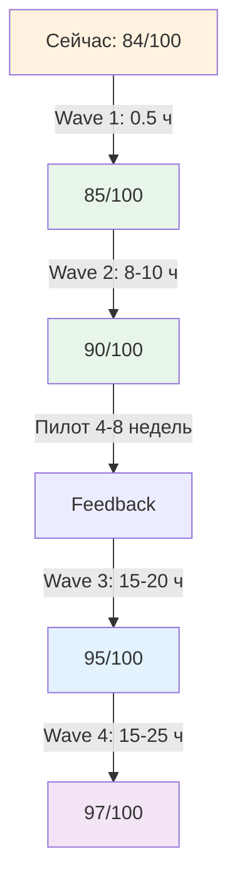

# Action Plan — Приоритизированный план улучшений

**Версия:** 1.0  
**Дата:** 10 октября 2025  
**Для:** Автор курса "Системная карьера"

---

## 🎯 Стратегия улучшений

### Три волны

1. **Wave 1 (Critical):** Исправить перед пилотом (0.5 ч)
2. **Wave 2 (High):** Желательно до пилота (8-10 ч)
3. **Wave 3 (Medium/Low):** После пилота на основе feedback (20-40 ч)

**Рекомендация:** Сделать Wave 1, опционально Wave 2, запустить пилот, затем Wave 3.

---

## Wave 1: Critical (MUST-FIX)

### Трудозатраты: 0.5 часа

### Task 1.1: Исправить broken links

**Проблема:**
- `docs/navigation/QUICK_START.md` содержит некорректные пути:
  - `How_to_fill_contract.md` → должно быть `docs/guides/How_to_fill_contract.md`
  - `SELF_STUDY_GUIDE.md` → должно быть `docs/guides/SELF_STUDY_GUIDE.md`

**Impact:** HIGH (блокирует навигацию для новичков)

**Решение:**
```markdown
# Было:
3. **[How_to_fill_contract.md](How_to_fill_contract.md)**

# Стало:
3. **[How_to_fill_contract.md](docs/guides/How_to_fill_contract.md)**
```

**Файлы для правки:**
- `docs/navigation/QUICK_START.md` (строки ~17, ~20)

**Трудозатраты:** 0.5 часа

**Приоритет:** Critical  
**Дедлайн:** Сделать сейчас (перед пилотом)

---

## Wave 2: High Priority (SHOULD-FIX)

### Трудозатраты: 8-10 часов

### Task 2.1: Исправить 4 critical type errors в Glossary

**Проблемы:**
1. C_14 "Карьера" — тип "Модель/траектория" неясен
2. C_27 "Недельное стратегирование" — смешение Method и Work
3. C_53 vs C_27 — дублирование
4. C_8 "Инкремент" — несуществующий тип "U.Artifact"

**FPF нарушение:** A.7 (Strict Distinction)

**Решение:**

#### C_14 "Карьера"
```markdown
# Вариант 1 (рекомендуемый): Уточнить определение
- Тип: Модель (U.Episteme)
- Определение: Модель траектории изменения характеристик личности (мастерство, ресурсность, калибр, роли) во времени в CharacteristicSpace.

# Вариант 2: Разделить на два
- C_14a "Карьера (процесс)" — Work
- C_14b "Модель карьеры" — U.Episteme
```

#### C_27 "Недельное стратегирование"
```markdown
# Решение: Переклассифицировать как Method
- Тип: Метод (U.Method)
- Определение: Воспроизводимый способ еженедельной работы с неудовлетворённостями и гипотезами через цикл: ретро → смыслы → стратегия → план.
```

#### C_53 vs C_27
```markdown
# Решение: Чётко различить
- C_53 "Стратегирование" — Архитеория (абстрактная теория)
- C_27 "Недельное стратегирование" — Method (конкретная практика)

ИЛИ: Объединить в один концепт (если различие неясно)
```

#### C_8 "Инкремент"
```markdown
# Решение: Заменить тип
- Тип: Артефакт (U.Episteme или U.System, в зависимости от контекста)
- Уточнить: инкремент кода (U.System) или инкремент документа (U.Episteme)
```

**Файлы для правки:**
- `docs/factory/development/Glossary.md`

**Трудозатраты:** 3-4 часа

**Приоритет:** High  
**Дедлайн:** До пилота (опционально) или после Wave 1 feedback

---

### Task 2.2: Исправить inconsistent versioning

**Проблема:**
- Week files показывают: v3.1 (W5), v3.2 (W6), v3.3 (W7)
- Другие источники: v3.5 (W5), v3.8 (W6), v3.9 (W7)

**Решение:**

**Вариант 1 (рекомендуемый): Упростить**
```
v1.0 (W1) → v2.0 (W2) → v2.5 (W3) → v3.0 (W4) → v3.5 (W5) → v4.0 (W8)
```

**Вариант 2: Сохранить детальность**
```
v3.0 (W4) → v3.1 (W5) → v3.2 (W6) → v3.3 (W7) → v4.0 (W8)
```

**Выбрать один вариант и обновить везде:**
- `weeks/Week_05-07.md` (заголовки)
- `Personal_Contract_v4.0_Template.md` (комментарии)
- `README.md` (если упоминается)

**Трудозатраты:** 1-2 часа

**Приоритет:** High  
**Дедлайн:** До пилота

---

### Task 2.3: Добавить объяснение "Метод ≠ План ≠ Работа"

**Проблема:**
- Различение есть в Glossary (строки 487-490)
- НО не объясняется ни в одной неделе как ключевой концепт

**Решение:**

Добавить раздел в `weeks/Week_03_Value.md` или `Week_04_Rhythm.md`:

```markdown
### Ключевое различение: Метод ≠ План ≠ Работа

| Понятие | Определение | Пример |
|---------|-------------|--------|
| **Метод** | Воспроизводимый способ действия (абстрактный) | "Мышление письмом" (C_26) |
| **План** | Конкретизированный набор работ с целью и сроками | "Спринт недели 3" — что сделаю, когда |
| **Работа** | Фактическое выполнение (с ресурсами, результатами) | "Сессия письма 15.10.2025, 19:00-19:30, написано 400 слов" |

**Проверка:**
- Метод отвечает на "КАК вообще делать?"
- План отвечает на "ЧТО и КОГДА сделаю?"
- Работа отвечает на "ЧТО ПРОИЗОШЛО фактически?"

**Пример цепочки:**
1. Метод: "Недельное стратегирование" (воспроизводимый процесс)
2. План: "Сессия стратегирования 13.10.2025, воскресенье 19:00-20:00" (намерение)
3. Работа: "Сессия проведена 13.10.2025, 19:05-20:15, потрачено 70 минут, результат: обновлён контракт v2.0" (факт)
```

**Файлы для правки:**
- `weeks/Week_03_Value.md` (после раздела "Артефакт ≠ Задача")
- Или `weeks/Week_04_Rhythm.md` (в начале)

**Трудозатраты:** 2-3 часа

**Приоритет:** High  
**Дедлайн:** До пилота (опционально)

---

## Wave 3: Medium Priority (NICE-TO-HAVE)

### Трудозатраты: 15-20 часов

### Task 3.1: Добавить TL;DR в Week_01

**Решение:**

Добавить в начало Week_01 (после оглавления):

```markdown
## 🚀 TL;DR — Начните с этого

**Если у вас 30 минут:**
1. Прочитайте раздел [4. Роль vs Должность](#карьерный-концепт-роль-vs-должность) (10 мин)
2. Пройдите опросник 10Q для своей роли (10 мин)
3. Создайте Личный контракт v0.1 по шаблону ниже (10 мин)

**Если у вас 2 часа:**
+ Напишите первую заготовку "Аудит ролей" (30 мин)
+ Заполните таблицу ролей (5-7 ролей) (30 мин)
+ Сформулируйте 3 неудовлетворённости (30 мин)

**Остальное:** Прочитаете в течение недели.
```

**Файлы:** `weeks/Week_01_Foundation_v2.md`

**Трудозатраты:** 0.5 часа

**Приоритет:** Medium

---

### Task 3.2: Добавить упоминания templates в weeks/

**Решение:**

В каждую неделю (W2-W7) добавить секцию "Шаблоны и инструменты":

```markdown
## 📄 Шаблоны и инструменты

**Для этой недели:**
- **Шаблон стратегии:** `templates/Week_02_Strategy_Hypothesis_Template.md`
- **Чек-лист:** `checklists/Checklist_Weekly_Strategizing.md`

**Как использовать:**
1. Скопируйте шаблон
2. Заполните по инструкциям
3. Интегрируйте в контракт v2.0
```

**Файлы:** `weeks/Week_02-07.md`

**Трудозатраты:** 1 час

**Приоритет:** Medium

---

### Task 3.3-3.8: Остальные Medium tasks

**Список:**
3. Формализовать композицию практик (3-5 ч)
4. Объяснить MHT механизм (1-2 ч)
5. Добавить чек-листы для W1, W3, W6, W8 (3-4 ч)
6. Усилить ось 2 (должностной рост) в W7 (2-3 ч)
7. Добавить comparative analysis vs GTD/Agile/OKR (2-3 ч)
8. Добавить "Future Research" раздел (1-2 ч)

**Трудозатраты:** 13-19 часов

**Приоритет:** Medium  
**Дедлайн:** После пилота (на основе feedback)

---

## Wave 4: Low Priority (OPTIONAL)

### Трудозатраты: 15-25 часов

**Задачи:**
- Исправить 8 minor type errors в Glossary (2-3 ч)
- Добавить standalone примеры для W2-W8 (6-8 ч)
- Добавить v2.5 для Dev и Lead персон (2-3 ч)
- Naming consistency (0.5 ч)
- Формализовать библиографию (2-3 ч)
- Снизить cognitive load (Week_01, README) (2-4 ч)

**Приоритет:** Low  
**Дедлайн:** Future iterations

---

## 📊 Roadmap (визуальный)



---

## 📈 Impact Matrix

| Task | Priority | Effort | Impact | ROI |
|------|----------|--------|--------|-----|
| 1.1 Broken links | Critical | 0.5 ч | High | ⭐⭐⭐⭐⭐ |
| 2.1 Type errors | High | 3-4 ч | Medium | ⭐⭐⭐⭐ |
| 2.2 Versioning | High | 1-2 ч | Medium | ⭐⭐⭐⭐ |
| 2.3 Explain Method≠Plan≠Work | High | 2-3 ч | Medium | ⭐⭐⭐ |
| 3.1 TL;DR | Medium | 0.5 ч | Medium | ⭐⭐⭐⭐ |
| 3.2 Templates refs | Medium | 1 ч | Medium | ⭐⭐⭐ |
| 3.3 Formalize Γ_method | Medium | 3-5 ч | Low | ⭐⭐ |
| 3.4 MHT mechanism | Medium | 1-2 ч | Low | ⭐⭐ |

**ROI:** ⭐⭐⭐⭐⭐ = очень высокий, ⭐ = низкий

---

## 🎯 Quick Wins (высокий ROI, малый effort)

### Top-5 Quick Wins

1. **Broken links** (0.5 ч, Impact: High) ⭐⭐⭐⭐⭐
2. **TL;DR в Week_01** (0.5 ч, Impact: Medium) ⭐⭐⭐⭐
3. **Templates refs** (1 ч, Impact: Medium) ⭐⭐⭐
4. **Versioning** (1-2 ч, Impact: Medium) ⭐⭐⭐⭐
5. **Naming consistency** (0.5 ч, Impact: Low) ⭐⭐

**Итого:** 3.5-4 часа, большой impact!

**Рекомендация:** Сделать эти 5 задач перед пилотом.

---

## 📋 Full Task List

### Critical (Wave 1)

- [ ] 1.1. Исправить broken links в QUICK_START.md (0.5 ч)

---

### High Priority (Wave 2)

- [ ] 2.1. Исправить C_14 "Карьера" в Glossary (1 ч)
- [ ] 2.2. Исправить C_27 "Недельное стратегирование" (1 ч)
- [ ] 2.3. Устранить дублирование C_27/C_53 (1 ч)
- [ ] 2.4. Заменить "U.Artifact" в C_8 (0.5 ч)
- [ ] 2.5. Исправить inconsistent versioning контракта (1-2 ч)
- [ ] 2.6. Добавить объяснение "Метод ≠ План ≠ Работа" (2-3 ч)

**Итого Wave 2:** 6.5-9.5 часов

---

### Medium Priority (Wave 3)

- [ ] 3.1. Добавить TL;DR в Week_01 (0.5 ч)
- [ ] 3.2. Добавить упоминания templates в weeks/ (1 ч)
- [ ] 3.3. Формализовать композицию практик (Γ_method pipeline) (3-5 ч)
- [ ] 3.4. Объяснить MHT механизм (синергия) (1-2 ч)
- [ ] 3.5. Добавить чек-листы для W1, W3, W6, W8 (3-4 ч)
- [ ] 3.6. Усилить ось 2 (должностной рост) в Week_07 (2-3 ч)
- [ ] 3.7. Добавить comparative analysis vs GTD/Agile/OKR (2-3 ч)
- [ ] 3.8. Добавить раздел "Future Research" (1-2 ч)
- [ ] 3.9. Добавить термины в Glossary ("устойчивость", "экосистема") (1 ч)
- [ ] 3.10. Усилить объяснения различений (Design≠Run, Стратегия≠Стратегирование) (2-3 ч)

**Итого Wave 3:** 16.5-24.5 часов

---

### Low Priority (Wave 4)

- [ ] 4.1. Исправить 8 minor type errors в Glossary (2-3 ч)
- [ ] 4.2. Добавить standalone примеры для W2-W8 (6-8 ч)
- [ ] 4.3. Добавить v2.5 для Dev и Lead персон (2-3 ч)
- [ ] 4.4. Naming consistency (суффикс "_Template") (0.5 ч)
- [ ] 4.5. Формализовать библиографию (academic format) (2-3 ч)
- [ ] 4.6. Снизить cognitive load (README, Week_01) (2-4 ч)
- [ ] 4.7. Runtime тестирование CLI (2-3 ч)
- [ ] 4.8. Runtime тестирование Ontology Toolkit (2-3 ч)

**Итого Wave 4:** 19-30 часов

---

## 🚀 Рекомендуемый план действий

### Опция A: Minimum (запуск пилота быстро)

**Время:** 0.5 часа

1. Исправить broken links (Wave 1)
2. **ЗАПУСТИТЬ ПИЛОТ**
3. Собрать feedback
4. Итерация (Waves 2-3 на основе feedback)

**Готовность:** 85/100

---

### Опция B: Recommended (сбалансированный подход)

**Время:** 4-5 часов

1. Исправить broken links (Wave 1)
2. Quick wins из Wave 2:
   - Versioning (1-2 ч)
   - Type errors C_14, C_27, C_53, C_8 (3-4 ч)
3. **ЗАПУСТИТЬ ПИЛОТ**
4. Wave 3 параллельно с пилотом

**Готовность:** 90/100

---

### Опция C: Thorough (максимальная подготовка)

**Время:** 20-25 часов

1. Waves 1-2 (Critical + High)
2. Часть Wave 3 (TL;DR, templates refs, чек-листы)
3. **ЗАПУСТИТЬ ПИЛОТ**
4. Оставшееся Wave 3 + Wave 4 на основе feedback

**Готовность:** 95/100

---

**Рекомендация автора аудита:** **Опция B** (4-5 часов, готовность 90%)

**Обоснование:**
- Critical и High issues исправлены
- Качество высокое (90/100)
- Feedback от реальных участников важнее перфекционизма
- Оставшееся можно доделать параллельно

---

## 📅 Timeline

### Вариант: Опция B (рекомендуемый)

**Неделя 1 (сейчас):**
- День 1: Wave 1 (0.5 ч) → broken links ✅
- День 2-3: Wave 2 (4-5 ч) → type errors, versioning ✅
- День 4: Подготовка к пилоту (setup платформы, участники)

**Неделя 2:**
- Запуск пилота

**Недели 3-10 (параллельно с пилотом):**
- Wave 3 tasks (по приоритетам на основе feedback)

**После пилота (недели 11-12):**
- Wave 4 (опционально)
- Итерация на основе полного feedback

---

## 📊 Ожидаемые результаты

### После Wave 1 (0.5 ч):

**Готовность:** 84 → 85/100

**Изменения:**
- ✅ Навигация работает (broken links исправлены)
- ✅ Новички не застревают

---

### После Wave 2 (8-10 ч):

**Готовность:** 85 → 90/100

**Изменения:**
- ✅ Онтологическая чистота: 84% → 90%+
- ✅ Glossary без critical errors
- ✅ Versioning согласован
- ✅ Ключевые различения объяснены

---

### После Wave 3 (15-20 ч):

**Готовность:** 90 → 95/100

**Изменения:**
- ✅ UX улучшен (TL;DR, templates refs)
- ✅ Композиция формализована
- ✅ Comparative analysis есть
- ✅ Research value повышена

---

## 🎓 Метрики успеха Action Plan

**Критерии успешного выполнения:**
- [ ] Wave 1 выполнена (broken links исправлены)
- [ ] Пилот запущен с 3-5 участниками
- [ ] Feedback собран за 4-8 недель
- [ ] Waves 2-3 выполнены на основе feedback
- [ ] Готовность курса: 90-95/100

---

## 📞 Следующие шаги

### Немедленно:

1. **Прочитать EXECUTIVE_SUMMARY.md** — общая картина
2. **Выбрать опцию** (A, B или C)
3. **Начать с Wave 1** (0.5 часа)

### Далее:

4. **Запустить пилот** (опция A) или **сделать Wave 2** (опция B)
5. **Собрать feedback** от участников
6. **Итерация**

---

**Удачи с пилотом!** 🚀

---

*Версия: 1.0 (Final)*  
*Создан: 10 октября 2025*

