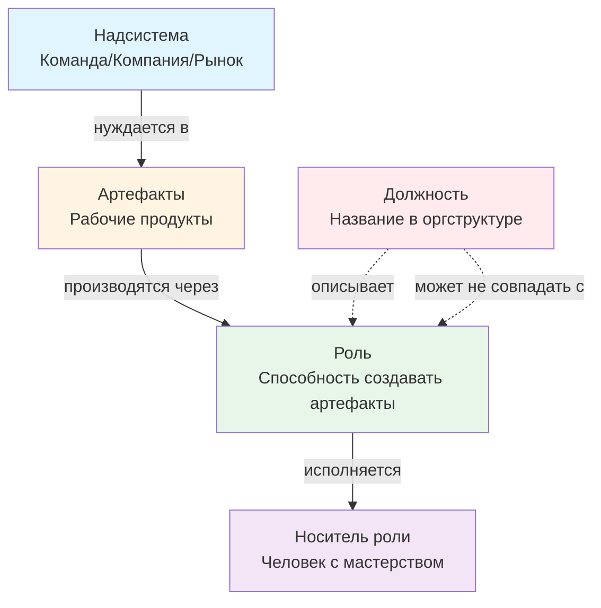

# Неделя 1: Фундамент

**Карьерный концепт:** Роль vs Должность  
**Практика саморазвития:** Мышление письмом  
**Рабочий продукт недели:** Личный контракт v1.0 (Аудит ролей)  
**Версия:** 1.0  
**Дата обновления:** 29.09.2025

---

## 📋 Оглавление

1. [Цели недели](#цели-недели)
2. [Роли участников](#роли-участников)
3. [Карьерный концепт: Роль vs Должность](#карьерный-концепт-роль-vs-должность)
4. [Практика саморазвития: Мышление письмом](#практика-саморазвития-мышление-письмом)
5. [Работа с Личным контрактом](#работа-с-личным-контрактом)
6. [Временной бюджет](#временной-бюджет)
7. [Домашнее задание](#домашнее-задание)
8. [Критерии оценки](#критерии-оценки)
9. [Публичная демонстрация](#публичная-демонстрация)
10. [Часто задаваемые вопросы](#часто-задаваемые-вопросы)
11. [Шаблоны и чек-листы](#шаблоны-и-чек-листы)

---

## 🎯 Цели недели

### Образовательные результаты (Learning Outcomes)

По завершении недели 1 участник будет способен:

1. **Различать роль и должность:**
   - Дать определения понятиям "роль" и "должность"
   - Привести 3+ примера ролей, которые исполняет сейчас
   - Объяснить, почему должность следует за ролью, а не наоборот

2. **Применять практику мышления письмом:**
   - Создать первую заготовку (письменное размышление) на тему своих ролей
   - Зафиксировать 5-7 исчезающих заметок за неделю
   - Объяснить, чем заготовка отличается от публичного поста

3. **Провести аудит своих ролей:**
   - Составить список из 5-10 ролей, которые исполняет сейчас
   - Для каждой роли указать: контекст, рабочие продукты, уровень мастерства
   - Выделить 2-3 роли, в которых хочет расти

4. **Создать Личный контракт v1.0:**
   - Заполнить разделы "Манифест" и "Принципы" (адаптировав под себя)
   - Заполнить раздел "Анализ неудовлетворённостей" (минимум 3 неудовлетворённости)
   - Опубликовать контракт для получения обратной связи

### Сквозная линия: связь с целью курса

Эта неделя закладывает фундамент для всего курса:
- **Позиция "заказчик собственного развития"** (вместо "пассажирский режим")
- **Мышление письмом** — основной инструмент для стратегирования (недели 2-8)
- **Различение роль/должность** — базовое для понимания карьерного роста

---

## 👥 Роли участников

### Роль участника (студента)

**Что делает:**
- Активно рефлексирует над своими текущими ролями
- Пишет заготовки и фиксирует заметки
- Заполняет шаблон Личного контракта v1.0
- Задаёт вопросы для прояснения понятий
- Даёт обратную связь другим участникам (peer review)

**Что НЕ делает:**
- Не ждёт "правильного ответа" или универсального рецепта
- Не пытается сделать "идеально" с первого раза
- Не скрывает свои размышления из страха критики

**Ключевая установка:** "Я экспериментирую с практикой мышления письмом и честно описываю свои роли. Контракт v1.0 — это черновик, который буду улучшать."

### Роль ведущего (фасилитатора)

**Что делает:**
- Объясняет различие роль/должность на примерах
- Демонстрирует практику мышления письмом (показывает свою заготовку)
- Задаёт "правильные вопросы" для углубления рефлексии
- Отлавливает "онтологический дребезг" (смешение понятий)
- Организует peer review и даёт обратную связь

**Инструменты ведущего:**
- Карта ролей / карта системы карьеры (визуализация)
- Примеры заполненных контрактов (2-3 персоны)
- Чек-лист для проверки качества аудита ролей

---

## 📖 Карьерный концепт: Роль vs Должность

### Визуализация концепта




**Ключевая идея диаграммы:** Роль следует из потребности надсистемы в артефактах, а должность — это лишь ярлык, который может отставать от реальных ролей.

### Ключевое различение

| Понятие | Определение | Пример |
|---------|-------------|--------|
| **Роль** | Устойчивая способность решать класс задач с предсказуемым качеством | Системный аналитик, Наставник, Исследователь |
| **Должность** | Закреплённый пакет ролей, полномочий и ресурсов в организации; следует за доказанной полезностью | Senior Product Manager, Team Lead |

### Почему это важно?

**Проблема:** Люди фокусируются на титулах ("хочу стать Senior"), вместо развития способностей. Это приводит к:
- Разочарованию (получил должность, но не чувствую роста)
- Зависимости от внешней оценки (начальник не даёт повышение)
- Непереносимости опыта (сменил компанию — начал с нуля)

**Возможность:** Мыслить ролями = фокус на **реальной способности** создавать пользу:
- Должности следуют за доказанной полезностью
- Роли переносимы между контекстами (компаниями, проектами)
- Рост мастерства в роли = накопление капитала

### Как проверить, что понял?

**Тест "Одна роль — один артефакт":**
Для каждой роли, которую ты называешь, покажи хотя бы один рабочий продукт, который подтверждает эту способность.

Пример:
- ❌ "Я — менеджер" (это должность, не роль)
- ✅ "Я — фасилитатор ретроспектив" → артефакт: протоколы 10+ ретро с решениями

### Практическое упражнение (на занятии, 20 мин)

**Задание:** Составить карту своих ролей

1. Возьмите лист бумаги или откройте документ
2. Нарисуйте 3 круга:
   - **Надсистемы** (кому я приношу пользу): команда, компания, клиенты
   - **Я** (центр): мои роли
   - **Подсистемы** (что я создаю): продукты, процессы, знания

3. Для каждой надсистемы выпишите 2-3 роли, которые вы исполняете
4. Для каждой роли укажите 1 рабочий продукт

**Пример результата:**

```
Надсистема: Команда разработки
├─ Роль: Код-ревьюер
│  └─ Артефакт: 50+ PR с комментариями
├─ Роль: Наставник джунов
│  └─ Артефакт: Чек-лист онбординга
```

### Типичные ошибки (что отлавливает ведущий)

| Ошибка | Пример | Как исправить |
|--------|--------|---------------|
| Путают роль и должность | "Я — Team Lead" | "Какие роли входят в Team Lead? Например: фасилитатор планирований, ревьюер кода, наставник" |
| Называют абстракции | "Я — профессионал" | "В какой предметной области? Профессионал-аналитик? Профессионал-тестировщик?" |
| Нет артефактов | "Я — ментор" | "Покажи план развития хотя бы одного менти или протокол 1-on-1" |
| Смешивают роль и человека | "Моя роль — быть хорошим человеком" | "Роль — это способность, а не личное качество. Например: волонтёр, организатор мероприятий" |

---

## ✍️ Практика саморазвития: Мышление письмом

### Что это такое?

**Мышление письмом** — это практика, при которой мысли создаются прямо в процессе письма, а не оформляются после размышлений "в голове".

**Цель:** Получить результат размышлений в виде текста (заготовки), который можно:
- Перечитать и улучшить
- Показать единомышленникам для обратной связи
- Интегрировать в личную базу знаний

### Почему это важно для системной карьеры?

1. **Основной инструмент стратегирования:** Все ключевые решения (анализ неудовлетворённостей, выбор проектов) принимаются через письменные размышления
2. **Экзокортекс:** Мышление с помощью компьютера продуктивнее, чем только головой
3. **Обучение нейросети:** Каждая заготовка тренирует ваш мозг мыслить системно

### Ключевые рабочие продукты практики

| Продукт | Назначение | Когда создаётся | Пример |
|---------|------------|-----------------|--------|
| **Исчезающие заметки** | Поймать мимолётную мысль, идею, наблюдение | Сразу, как возникла | "Вопрос: почему в команде нет ретро? Может, предложить провести?" |
| **Заготовка** | Проработать тему через письменное размышление | Когда есть 30-60 мин для глубокой работы | "Размышление: Какие роли я исполняю в команде и в каких хочу расти?" |
| **Публичный пост** | Поделиться выводами с аудиторией | После доработки заготовки | Статья в блоге или канале |

### Пошаговая инструкция: создание заготовки

**Шаг 1: Выбор темы (5 мин)**
- Тема недели 1: "Какие роли я исполняю на самом деле?"
- Дополнительно: выберите 1-2 исчезающих заметки для проработки

**Шаг 2: Шаблон 5-абзацной заготовки (30-40 мин письма)**

```markdown
## [Название темы]

**Абзац 1: Контекст**
С какой ситуацией/вопросом столкнулся? Почему это важно сейчас?

**Абзац 2: Проблема/Вопрос**
Что конкретно не понятно или беспокоит? Какие гипотезы есть?

**Абзац 3: Анализ**
Как можно посмотреть на это через призму системного мышления?
Какие различения помогают?

**Абзац 4: Выводы**
К каким выводам пришёл? Что изменилось в понимании?

**Абзац 5: Действия**
Что сделаю на этой неделе? Какой рабочий продукт создам?
```

**Шаг 3: Правило "не редактировать во время письма" (важно!)**
- Пишите непрерывно 25-30 минут (1 Pomodoro)
- Не останавливайтесь на редактировании, грамматике, стиле
- Если застряли — пишите "Не знаю, что писать дальше. Возможно..."
- Цель — **поток мышления**, а не красивый текст

**Шаг 4: Разбор и интеграция (10 мин)**
- Перечитайте заготовку
- Выделите 2-3 ключевых инсайта
- Зафиксируйте их как отдельные заметки или обновите контракт

### Типичные ошибки новичков

| Ошибка | Симптом | Как исправить |
|--------|---------|---------------|
| Перфекционизм | Застрял на первом абзаце, переписываю | Правило: 30 мин письма БЕЗ редактуры |
| "Пишу для публики" | Думаю "что скажут люди", блокируюсь | Заготовка — для себя и единомышленников, не для всех |
| "Нет идей" | Не знаю о чём писать | Начни с вопроса: "Что меня беспокоит в карьере?" |
| Оформление вместо мышления | Трачу время на форматирование | Оформление — ПОСЛЕ, сначала мысли |

### Практическое упражнение (на занятии, 30 мин)

**Задание:** Написать первую заготовку

**Тема:** "Какие роли я исполняю на самом деле, независимо от моей должности?"

1. Откройте документ (Google Docs, Notion, Obsidian)
2. Поставьте таймер на 25 минут
3. Пишите непрерывно, используя шаблон 5-абзацной заготовки
4. Не редактируйте во время письма!
5. После таймера: 5 минут на перечитывание и выделение ключевых мыслей

**Результат:** Заготовка на 300-500 слов с анализом своих ролей

---

## 📝 Работа с Личным контрактом

### Что создаём на неделе 1?

**Личный контракт v1.0: Аудит ролей**

Структура контракта v1.0 (упрощённая версия):

```markdown
# Личный контракт развития v1.0

## 1. Манифест
[Адаптируй под себя из шаблона]

## 2. Принципы
[Выбери 3-5 ключевых принципов из шаблона]

## 3. Аудит ролей

### 3.1. Роли, которые исполняю сейчас

| Роль | Контекст (надсистема) | Рабочие продукты | Уровень мастерства | Хочу расти? |
|------|----------------------|------------------|-------------------|-------------|
| ... | ... | ... | ... | Да/Нет |

### 3.2. Анализ неудовлетворённостей

[Таблица из шаблона Personal Contract]

## 4. Операционные обязательства (пока оставить пустым)
[Заполним на неделях 3-4]
```

### Пошаговая инструкция: заполнение контракта

#### Шаг 1: Манифест (10 мин)

Прочитайте шаблон манифеста из `Personal Contract v3.2.md` (строки 5-7).

**Адаптация под себя:**
- Замените "Я" на своё имя (опционально)
- Добавьте 1-2 предложения о том, почему это важно лично для вас
- Пример: "Я, Иван, не плыву по течению. Я выбираю свои роли и проекты осознанно..."

#### Шаг 2: Принципы (15 мин)

Из 11 принципов в шаблоне (строки 11-21) выберите **3-5 самых резонирующих** с вашей текущей ситуацией.

**Критерий выбора:** Принцип вызывает "мыслительный резонанс" (ощущение "да, это про меня!") или "онтологический дребезг" (раздражение, несогласие — тоже полезный сигнал).

Для каждого выбранного принципа **добавьте 1-2 предложения**: "Для меня это значит..."

#### Шаг 3: Аудит ролей (40 мин — основная работа)

**3.1. Составьте список ролей (20 мин)**

Используйте результат упражнения "Карта ролей" (см. раздел выше).

**Подсказка:** Где искать роли?
- Рабочий контекст: что делаю в команде, для клиентов, для компании
- Семейный контекст: роли в семье (родитель, супруг, организатор)
- Сообщество: волонтёр, ментор, организатор встреч
- Личное: ученик (чему учусь), творец (что создаю)

**Минимум:** 5 ролей  
**Оптимально:** 7-10 ролей

**3.2. Для каждой роли заполните таблицу (20 мин)**

| Поле | Как заполнять | Пример |
|------|---------------|--------|
| **Роль** | Название способности | Код-ревьюер |
| **Контекст** | Кому приношу пользу | Команда разработки |
| **Рабочие продукты** | 1-2 артефакта | 50+ PR с комментариями, гайд по code review |
| **Уровень мастерства** | Объяснение / Умение / Навык / Мастерство | Навык |
| **Хочу расти?** | Да / Нет | Да |

**Критерий качества:** Для каждой роли есть хотя бы 1 наблюдаемый артефакт.

#### Шаг 4: Анализ неудовлетворённостей (30 мин)

Заполните таблицу 1.1 из шаблона `Personal Contract v3.2.md` (строки 104-106).

**Минимум:** 3 неудовлетворённости  
**Оптимально:** 5-7 неудовлетворённостей

**Как найти неудовлетворённости?**
1. Перечитайте свой аудит ролей
2. Спросите себя: "Что меня беспокоит в моей карьере/жизни?"
3. Для каждого беспокойства заполните:
   - Проблема (объективный разрыв)
   - Неудовлетворённость (психическое состояние)
   - Эмоции (с оценкой силы 1-10)
   - Гипотезы действий (пока предварительные)

**Связь с ролями:** Выделите 2-3 роли из аудита, рост в которых поможет устранить неудовлетворённости.

---

## ⏱️ Временной бюджет

### Синхронная работа (вебинар/занятие): 2-2.5 часа

| Блок | Время | Формат | Содержание |
|------|-------|--------|------------|
| **Введение и мотивация** | 20 мин | Лекция + обсуждение | Зачем различать роль/должность. Позиция "заказчик развития" |
| **Концепт: Роль vs Должность** | 30 мин | Лекция + примеры | Определения, тест "одна роль — один артефакт", типичные ошибки |
| **Упражнение: Карта ролей** | 20 мин | Практика | Составление карты своих ролей в группах по 2-3 человека |
| **Практика: Мышление письмом** | 40 мин | Демо + практика | Показ заготовки ведущим (10 мин) + написание своей заготовки (30 мин) |
| **Перерыв** | 10 мин | — | — |
| **Работа с контрактом** | 30 мин | Инструкция + Q&A | Пошаговый разбор заполнения контракта v1.0 |
| **Peer review** | 20 мин | Взаимная рецензия | Обмен черновиками контрактов в парах, обратная связь по шаблону |
| **Домашнее задание и итоги** | 10 мин | Инструкция | Что сделать до следующей недели |

### Асинхронная работа (самостоятельно): 4-6 часов

| Задача | Время | Когда | Результат |
|--------|-------|-------|-----------|
| Завершить заготовку "Аудит ролей" | 1 час | День 1-2 | Заготовка на 500+ слов |
| Заполнить таблицу ролей в контракте | 1 час | День 2-3 | 7-10 ролей с артефактами |
| Заполнить таблицу неудовлетворённостей | 1 час | День 3-4 | 3-5 неудовлетворённостей |
| Адаптировать манифест и принципы | 30 мин | День 4-5 | Персонализированная версия |
| Оформить контракт v1.0 | 30 мин | День 5-6 | Чистовая версия документа |
| Опубликовать контракт для peer review | 30 мин | День 6 | Ссылка в общем канале |
| Дать обратную связь 2-3 участникам | 1 час | День 6-7 | Комментарии по шаблону "2+1" |
| Фиксация исчезающих заметок (5-7 шт) | 30 мин | Вся неделя | Заметки в экзокортексе |

**Итого:** 6-8.5 часов (с учётом синхронной работы)

---

## 🎯 Домашнее задание

### Обязательный минимум (для получения зачёта)

1. **Создать Личный контракт v1.0** (Google Docs / Notion / Markdown)
   - ✅ Заполнен раздел "Манифест" (адаптирован под себя)
   - ✅ Выбрано 3-5 принципов с комментариями
   - ✅ Заполнена таблица "Аудит ролей" (минимум 5 ролей с артефактами)
   - ✅ Заполнена таблица "Анализ неудовлетворённостей" (минимум 3 записи)

2. **Опубликовать контракт v1.0**
   - ✅ Ссылка размещена в общем канале курса
   - ✅ Доступ на чтение открыт (или публичный пост)

3. **Написать заготовку "Аудит ролей"**
   - ✅ Текст на 300+ слов
   - ✅ Использован шаблон 5-абзацной заготовки
   - ✅ Есть выводы и связь с неудовлетворённостями

4. **Дать peer review 2 участникам**
   - ✅ Комментарии оставлены по шаблону "2 сильных места + 1 улучшение"
   - ✅ Конструктивная обратная связь (не "хорошо/плохо")

### Дополнительно (для углубления)

- Создать визуальную "Карту ролей" (схема в Miro/Draw.io/бумага + фото)
- Зафиксировать 7-10 исчезающих заметок за неделю
- Написать вторую заготовку на тему: "Чем моё понимание 'роли' отличается от того, что было неделю назад?"
- Прочитать статью о практике мышления письмом (ссылка в материалах)

---

## ✅ Критерии оценки

### Критерии качества Личного контракта v1.0

| Критерий | Проверка | Примеры "Да" / "Нет" |
|----------|----------|----------------------|
| **1. Различение роль/должность** | Все ли названия в таблице ролей — это способности, а не титулы? | ✅ "Фасилитатор ретро" / ❌ "Team Lead" |
| **2. Артефакты для ролей** | Для каждой роли указан хотя бы 1 проверяемый рабочий продукт? | ✅ "Протоколы 10 ретро" / ❌ "Опыт 3 года" |
| **3. Связь ролей и неудовлетворённостей** | Есть ли 2-3 роли, рост в которых адресует неудовлетворённости? | ✅ Явная связь в тексте / ❌ Роли и неудовлетворённости не связаны |
| **4. Конкретность неудовлетворённостей** | Каждая неудовлетворённость описана через проблему, состояние, эмоцию? | ✅ Все поля заполнены / ❌ Только общие слова |
| **5. Персонализация** | Манифест и принципы адаптированы под себя (не просто копия)? | ✅ Добавлены личные комментарии / ❌ Шаблон без изменений |

### Чек-лист самопроверки перед публикацией

```markdown
[ ] В таблице ролей минимум 5 записей
[ ] Для каждой роли указан хотя бы 1 артефакт
[ ] Нет путаницы: все названия ролей — это способности, не должности
[ ] В таблице неудовлетворённостей минимум 3 записи
[ ] Для каждой неудовлетворённости указана сила эмоции (1-10)
[ ] Манифест адаптирован под себя (не копия шаблона)
[ ] Выбрано 3-5 принципов с комментариями "Для меня это значит..."
[ ] Документ доступен по ссылке для peer review
[ ] Заготовка "Аудит ролей" написана (300+ слов)
[ ] Даны комментарии 2 участникам по шаблону "2+1"
```

### Шаблон peer review "2+1"

Используйте этот шаблон при рецензии контрактов других участников:

```markdown
## Peer review для [Имя участника]

**Два сильных места (что получилось):**
1. [Конкретно: что именно сильно? Пример из текста]
   - Проверка: Есть ли конкретные артефакты для каждой роли?
2. [Конкретно: что именно сильно? Пример из текста]
   - Проверка: Видна ли связь между ролями и неудовлетворённостями?

**Одно улучшение (что можно усилить):**
- [Конкретное предложение по улучшению с примером]
   - Подсказка: Смотри на критерии качества из чек-листа выше

**Вопрос для углубления:**
- [Вопрос, который поможет автору глубже проработать тему]
   - Например: "Какая из твоих ролей приносит наибольшую ценность надсистеме? Как это измерить?"
```

---

### Рубрика оценки аудита ролей (для рецензента)

Используй эту таблицу, чтобы понять, на что обращать внимание при review:

| Аспект | Слабо (1-2) | Хорошо (3-4) | Отлично (5) |
|--------|-------------|--------------|-------------|
| **Количество ролей** | 1-3 роли | 4-6 ролей | 7-10 ролей |
| **Конкретность артефактов** | Абстрактно ("документы") | Частично конкретно ("отчёты") | Конкретно ("Еженедельный dashboard с метриками X, Y") |
| **Связь роли с надсистемой** | Контекст не указан | Контекст указан общо ("команда") | Контекст конкретен ("Команда из 5 разработчиков продукта X") |
| **Оценка мастерства** | Нет или абстрактно | Есть уровень по шкале (Объяснение/Умение/Навык/Мастерство) или грейд (Junior/Middle/Senior) | Есть уровень + обоснование (по шкале/грейду) |
| **Роли для роста** | Не выбраны | Выбраны, но без объяснения | Выбраны + есть связь с неудовлетворённостями |

**Как использовать:** Укажи в review, какие аспекты на уровне "Хорошо/Отлично", и что можно подтянуть до следующего уровня.

---

## 📢 Публичная демонстрация

### Формат публикации

**Вариант А: Пост в общем канале курса (рекомендуется)**
- Краткое резюме (100-150 слов): что узнал, что изменилось в понимании
- Ссылка на полный контракт v1.0 (Google Docs с доступом на чтение)
- 1-2 ключевых инсайта

**Вариант Б: Публичный пост (для смелых)**
- Статья в личном блоге / Telegram-канале
- Тема: "Мои роли vs должность: что я понял за неделю"
- Ссылка на пост в общем канале курса

### Шаблон публичного поста (недельный отчёт)

```markdown
# Неделя 1: Аудит ролей

## Что сделал:
- ✅ Создал Личный контракт v1.0: [ссылка]
- ✅ Написал заготовку "Аудит ролей" (500 слов)
- ✅ Зафиксировал 7 исчезающих заметок
- ✅ Дал peer review 2 участникам

## Ключевые инсайты:
1. [Один инсайт про различие роль/должность]
2. [Один инсайт про мышление письмом]

## Роли, в которых хочу расти:
- [Роль 1]
- [Роль 2]
- [Роль 3]

## Планы на неделю 2:
- [Что буду делать]
```

### Критерии качества публикации

- ✅ Пост размещён до конца недели 1 (дедлайн: воскресенье 23:59)
- ✅ Ссылка на контракт рабочая (доступ на чтение)
- ✅ Есть хотя бы 1 конкретный инсайт (не общие слова)
- ✅ Указаны 2-3 роли для роста

---

## ❓ Часто задаваемые вопросы

### О концепте "Роль vs Должность"

**Q: У меня нет официальной должности (фрилансер/студент). Это значит, у меня нет ролей?**

A: Наоборот! У вас больше свободы в выборе ролей. Примеры ролей фрилансера: Исполнитель проектов, Продавец своих услуг, Маркетолог себя, Менеджер своего времени. Студента: Ученик дисциплины X, Участник проектной команды, Исследователь темы Y.

**Q: Моя должность и роль совпадают. Например, я "Системный аналитик" и по должности, и по роли. В чём разница?**

A: Должность "Системный аналитик" — это пакет, который может включать несколько ролей: Сборщик требований, Моделировщик процессов, Фасилитатор воркшопов, Документер спецификаций. Различение помогает понять, какие **именно** способности развивать.

**Q: Как отличить "хорошую" роль от "плохой"?**

A: Роль проверяема, если есть артефакт. Если для роли сложно назвать рабочий продукт, то это, скорее всего, абстракция или личное качество, а не роль.

### О практике "Мышление письмом"

**Q: У меня не получается писать 30 минут непрерывно. Я застреваю.**

A: Это нормально для первых попыток. Лайфхаки:
- Пишите вопросы: "Что меня беспокоит?", "Почему я застрял?"
- Пишите буквально: "Не знаю, что писать. Возможно, проблема в том, что..."
- Снизьте планку: 15 минут вместо 30 для первой недели

**Q: Заготовка вышла "сырой". Можно ли её редактировать перед публикацией?**

A: Да, но только после первого черновика. Последовательность: 30 мин письма БЕЗ редактуры → перерыв → 10-15 мин редактуры. Главное — сначала поток, потом форма.

**Q: Чем заготовка отличается от публичного поста?**

A: **Заготовка** — для себя и единомышленников, сырая, честная. **Публичный пост** — для широкой аудитории, отредактированный, с учётом контекста читателей. Заготовка → доработка → пост (но не обязательно публиковать).

### О Личном контракте

**Q: Можно ли изменять контракт после публикации?**

A: Да, более того — это **ожидается**! Контракт — живой документ. Версии v1.0, v2.0, v3.0 будут появляться каждые 1-2 недели по мере углубления понимания.

**Q: Что делать, если не могу выделить 5 ролей?**

A: Расширьте контекст. Роли бывают не только рабочие. Примеры:
- Семья: Родитель, Организатор отдыха, Финансовый планировщик
- Сообщество: Волонтёр, Участник митапов, Ментор
- Личное: Ученик языка X, Спортсмен-любитель, Читатель

**Q: Мои неудовлетворённости слишком "личные". Публиковать их страшно.**

A: Помните: контракт v1.0 публикуется **для peer review**, а не для всего интернета. Аудитория — ваши единомышленники по курсу. Если всё равно страшно: замените имена/компании на "Компания X", "Проект Y". Суть важнее деталей.

---

## 📋 Шаблоны и чек-листы

### Шаблон: Исчезающая заметка

```markdown
[Дата и время]

## Тип: Мимолётная / Образовательная

**Контекст:** [Что происходило, когда возникла мысль?]

**Мысль/Идея:**
[1-3 предложения: что пришло в голову]

**Связь с проектами/ролями:**
[Опционально: к чему это относится]

---
Статус: [ ] Новая [ ] Обработана в заготовку [ ] Удалена
```

### Шаблон: 5-абзацная заготовка

```markdown
# [Название темы]

**Дата:** [ДД.ММ.ГГГГ]  
**Тип:** Заготовка  
**Теги:** #роли #аудит #неделя1

## 1. Контекст
[С какой ситуацией столкнулся? Почему это важно сейчас?]

## 2. Проблема/Вопрос
[Что конкретно не понятно или беспокоит?]

## 3. Анализ
[Как можно посмотреть на это через призму системного мышления?]

## 4. Выводы
[К каким выводам пришёл?]

## 5. Действия
[Что сделаю на этой неделе? Какой рабочий продукт создам?]

---
**Статус:** Черновик / На ревью / Готово
```

### Чек-лист: Повестка сессии (для самостоятельной работы)

```markdown
## Сессия работы над контрактом v1.0

**Дата:** _________  
**Время:** _________  
**Длительность:** 2 часа

### До сессии (подготовка):
[ ] Перечитал материалы недели 1
[ ] Подготовил список ролей из упражнения "Карта ролей"
[ ] Открыл шаблон контракта

### Во время сессии:
[ ] 0:00-0:10 — Адаптация манифеста
[ ] 0:10-0:25 — Выбор 3-5 принципов
[ ] 0:25-1:05 — Заполнение таблицы ролей (40 мин — основное время)
[ ] 1:05-1:15 — Перерыв
[ ] 1:15-1:45 — Заполнение таблицы неудовлетворённостей
[ ] 1:45-2:00 — Самопроверка по чек-листу качества

### После сессии:
[ ] Оформить чистовую версию
[ ] Опубликовать для peer review
[ ] Написать пост в канале курса
```

---

## 🔗 Связь с другими неделями

**Неделя 0 (онбординг):** Выбор экзокортекса, настройка инструментов → используем на неделе 1 для фиксации заметок

**Неделя 2 (Направление):** Неудовлетворённости из недели 1 → станут основой для формулирования стратегии

**Неделя 3 (Ценность):** Роли из недели 1 → покажем через рабочие продукты и артефакты

**Неделя 4 (Ритм):** Практика мышления письмом → встроим в недельный спринт как обязательный ритуал

---

## 📚 Дополнительные материалы

### Для чтения (опционально)

1. **Концепт "Роль vs Должность":**
   - Файл: `systemic_career_v2.3 - concepts.csv`, концепты C_5 (Должность), C_46 (Роль)
   - Связанные понятия: C_23 (Мастерство), C_15 (Карьерный рост)

2. **Практика "Мышление письмом":**
   - Файл: `systemic_career_v2.3 - concepts.csv`, концепт C_26
   - Связанные понятия: C_7 (Заготовка), C_11 (Исчезающие заметки), C_64 (Экзокортекс)

3. **Личный контракт:**
   - Файл: `Personal Contract v3.2.md` (полная версия для ознакомления)

### Примеры (для вдохновения)

- **Пример 1:** [Заполненный контракт v1.0 — Анна (Начинающий аналитик)](../examples/persona_1_analyst_contract_v1.md)
  - 5 ролей с конкретными артефактами
  - 4 неудовлетворённости с оценкой силы эмоций
  - Персонализированный манифест и 4 принципа
  
- **Пример 2:** [Заполненный контракт v1.0 — Сергей (Опытный разработчик в карьерном поиске)](../examples/persona_2_dev_contract_v1.md) *(скоро)*

- **Пример 3:** [Заполненный контракт v1.0 — Мария (Team Lead с выгоранием)](../examples/persona_3_lead_contract_v1.md) *(скоро)*

**Как использовать примеры:**
1. Прочитайте контракт одной персоны полностью
2. Обратите внимание на уровень конкретности (артефакты, контекст ролей)
3. Используйте как образец, но не копируйте — адаптируйте под свою ситуацию

---

**Версия документа:** 1.0  
**Дата последнего обновления:** 29.09.2025  
**Автор:** AI-методолог + команда курса "Системная карьера"  
**Обратная связь:** [ссылка на форму обратной связи]

---

*Этот документ — живой артефакт, который обновляется на основе feedback участников и результатов пилотных запусков.*
