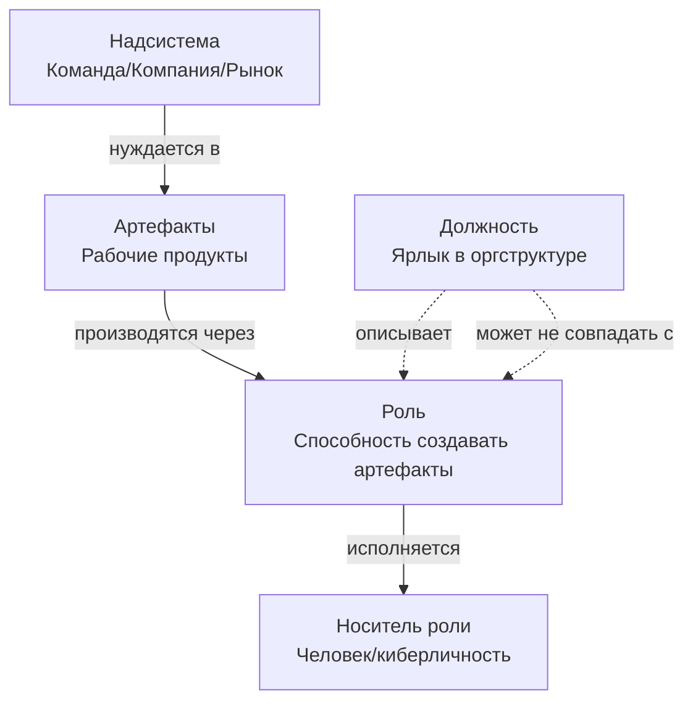

# Неделя 1: Фундамент — v2

**Карьерный концепт:** Роль vs Должность  
**Практика саморазвития:** Мышление письмом  
**Рабочий продукт недели:** Личный контракт v1.0 (Аудит ролей) + быстрый `v0.1` в День 1  
**Версия:** 2.0  
**Дата обновления:** 30.09.2025

---

## 📋 Оглавление

1. [Что нового в v2 (над v1)](#что-нового-в-v2-над-v1)
2. [Цели недели](#цели-недели)
3. [Роли и ответственность](#роли-и-ответственность)
4. [Карьерный концепт: Роль vs Должность](#карьерный-концепт-роль-vs-должность)
5. [Практика: Мышление письмом (ритуал 25–30′)](#практика-мышление-письмом-ритуал-25-–-30)
6. [Работа с Личным контрактом (v0.1 → v1.0)](#работа-с-личным-контрактом-v01--v10)
7. [Временной бюджет](#временной-бюджет)
8. [Домашнее задание](#домашнее-задание)
9. [Критерии приёмки и оценка](#критерии-приёмки-и-оценка)
10. [Публичная демонстрация](#публичная-демонстрация)
11. [FAQ](#faq)
12. [Шаблоны и чек-листы](#шаблоны-и-чек-листы)
13. [Связь с другими неделями](#связь-с-другими-неделями)
14. [Источники и выравнивание](#источники-и-выравнивание)

---

## 🆕 Что нового в v2 (над v1)

- **Двухшаговый старт контракта:** быстрый `v0.1` в День 1 (30–45 мин) → полнота `v1.0` к концу недели.
- **Диагностический чекер «роль ≠ должность» (10 вопросов)** + «Одна роль — один артефакт» как автоматический фильтр.
- **Интеграция продуктивного состояния (0–5):** как писать заготовки и делать аудит ролей с учётом состояния (связь с Productive State Framework).
- **Персонификация под три сегмента (Junior/Middle–Senior/Lead):** подсказки по ролям/артефактам.
- **Строже критерии приёмки:** назначенный проверяющий, явные «ворота» готовности, публичная демо обязательно.

---

## 🎯 Цели недели

### Образовательные результаты (Learning Outcomes)
По завершении недели 1 участник будет способен:

1. **Различать роль и должность**
   - Дать определения и пройти диагностический чекер (≥8/10 правильных)
   - Назвать 5–10 ролей, которые исполняет сейчас, без смешения с должностями
   - Для каждой роли указать ≥1 проверяемый артефакт

2. **Применять практику мышления письмом**
   - Написать ≥1 заготовку на 300–500 слов по теме «Мои роли vs должность»
   - Зафиксировать 5–7 исчезающих заметок в экзокортексе

3. **Собрать Личный контракт v1.0**
   - `v0.1` в День 1: неудовлетворённости (сырой список 3+), 2–4 роли, рабочий продукт недели
   - `v1.0` к Дню 7: манифест, 3–5 принципов (с пояснениями), таблица ролей (5–10), начат раздел неудовлетворённостей (3+)

### Сквозная логика недели
- Позиция **«заказчик собственного развития»**: ресурсы следуют за доказанной полезностью
- **Мышление письмом** — основной инструмент стратегирования всех последующих недель
- Различение **роль/должность** — базовая единица онтологической чистоты курса

### Два режима прохождения
- **Минимальный трек (6–8 ч):** `v0.1` в День 1, 5 ролей (по 1 артефакту), 3 неудовлетворённости, заготовка 300 слов, 1 peer review.
- **Полный трек (9–12 ч):** `v0.1` + `v1.0`, 7–10 ролей, 5–7 неудовлетворённостей, заготовка 500 слов, 2 peer review.

---

## 👥 Роли и ответственность

### Роль участника
- Исполняет роли «Ученик» и «Владелец приоритетного проекта»
- Пишет заготовки и фиксирует исчезающие заметки
- Заполняет `Личный контракт v0.1 → v1.0`
- Публикует артефакт недели и запрашивает peer review

### Роль ведущего (фасилитатора)
- Демонстрирует различение «роль vs должность» на живых примерах
- Показывает свой процесс мышления письмом (10 мин демо-заготовки)
- Отлавливает онтологический дребезг, модерирует peer review

### Инструменты
- Экзокортекс: Notion / Obsidian / Google Docs
- Таймер: Pomodoro 25/5
- Канал публичности: TG/блог/GitHub

---

## 📖 Карьерный концепт: Роль vs Должность

### Ключевое различение
| Понятие | Определение | Проверка |
|---|---|---|
| **Роль** | Устойчивая способность решать класс задач с предсказуемым качеством | «Одна роль → один артефакт» |
| **Должность** | Пакет ролей/полномочий/ресурсов в конкретной организации | Название в оргструктуре |

### Диаграмма (визуализация)


### Диагностический чекер «роль ≠ должность» (10 вопросов)
Отметьте «Да/Нет»:
1) Название — это способность («фасилитатор ретроспектив»), а не титул?  
2) Можно показать артефакт этой роли за последние 3–6 мес?  
3) Артефакт публично демонстрируем (ссылка/примеры)?  
4) Есть надсистема (для кого создаётся польза) и контекст?  
5) Понятен уровень мастерства по роли (объяснение/умение/навык/мастерство)?  
6) Роль переносима между компаниями?  
7) Есть проверяющий по качеству (peer/наставник)?  
8) Есть критерии приёмки артефактов?  
9) Можно обучить другого (минимум «объяснение» + пример)?  
10) Можно усилить роль за 4–8 недель понятным проектом?

Порог: **≥8 «Да»** — корректно описанная роль.

### Карта ролей (упражнение, 20 мин)
- Три зоны: Надсистемы → Мои роли → Артефакты
- Для каждой надсистемы выпишите 2–3 роли; для каждой роли — ≥1 артефакт

Пример результата:
```
Надсистема: Команда Dev
├─ Роль: Фасилитатор ретроспектив
│  └─ Артефакт: 10+ протоколов с решениями, follow-up план
├─ Роль: Код-ревьюер
│  └─ Артефакт: 50+ PR с комментариями, гайд по code review
```

### Типичные ошибки и исправления
| Ошибка | Пример | Как исправить |
|---|---|---|
| Путают роль и должность | «Я — Team Lead» | Разложите должность на роли (фасилитатор планирований, ревьюер кода, наставник…) |
| Называют абстракции | «Я — профессионал» | Укажите предметную область и класс задач |
| Нет артефактов | «Я — ментор» | Портфель: план развития менти, 1-on-1 протоколы |
| Смешивают роль и человека | «Моя роль — быть хорошим человеком» | Роль — способность создавать пользу для надсистемы |

---

## ✍️ Практика: Мышление письмом (ритуал 25–30′)

### Суть практики
- Мысли создаются во время письма; цель — заготовка (черновик мысли), а не «красивый пост»
- Результат интегрируется в контракт и личную базу знаний

### Ритуал (пошагово)
1) Выбор темы (5′): «Какие роли я исполняю на самом деле?»  
2) Письмо без редактуры (25′): по шаблону 5 абзацев (ниже)  
3) Разбор (10′): выделить 2–3 инсайта, завести заметки  
4) Интеграция (5′): обновить контракт/таблицу ролей

### Матрица продуктивного состояния (0–5) — как писать «в любом состоянии»
- 4–5: пишем заготовку целиком (25–30′)  
- 3: пишем 2 абзаца + список ролей/артефактов  
- 2: только заметки/список артефактов по фактам  
- 1–0: восстановление, без письма; вернуться позже

### Шаблон 5-абзацной заготовки
```markdown
## [Название темы]

**Абзац 1: Контекст**
Что происходит и почему важно сейчас?

**Абзац 2: Проблема/Вопрос**
Что именно не ясно? Какие гипотезы?

**Абзац 3: Анализ**
Какие различения помогают (роль/должность, артефакт/задача)?

**Абзац 4: Выводы**
Что понял о своих ролях и артефактах?

**Абзац 5: Действия**
Что сделаю на неделе? Какой артефакт создам?
```

---

## 📝 Работа с Личным контрактом (v0.1 → v1.0)

### День 1: быстрый `v0.1` (30–45 мин)
```markdown
# Личный контракт v0.1

## 1. Неудовлетворённости (сырой список, 3+)
- [ ] ... → Сила эмоции: _/10

## 2. Мои роли (текущие)
- Роль: [название] → Артефакт: [ссылка/описание]

## 3. Рабочий продукт недели 1
- Что создам: [конкретный артефакт]
- Критерии приёмки: [условия «готово»]
- Проверяющий: [peer/наставник]
- Публичность: [где покажу?]
```

### К концу недели: `v1.0` (полноценная версия)
```markdown
# Личный контракт v1.0 — Аудит ролей

## 1. Манифест
[Адаптируйте из шаблона: Personal_Contract_v4.0_Template.md]

## 2. Принципы (3–5) с пояснением «Для меня это значит…»

## 3. Аудит ролей
| Роль | Надсистема (контекст) | Рабочие продукты | Уровень мастерства | Роль для роста? |
|---|---|---|---|---|
| … | … | … | Объяснение/Умение/Навык/Мастерство | Да/Нет |

## 4. Неудовлетворённости (старт)
[3+ записи с силами эмоций]
```

#### Примечание: шкала мастерства и мостик к грейдам
- Базовая шкала: Объяснение → Умение → Навык → Мастерство.
- Мостик с грейдами рынка: Junior ≈ Объяснение/Умение; Middle ≈ Навык; Senior/Lead ≈ Мастерство. Указывайте обоснование уровня.

### Пошаговая инструкция (90–120 мин)
- 10′ Манифест (адаптируйте 1–2 фразы под себя)
- 15′ Выбор 3–5 принципов и пояснения к ним
- 40′ Таблица ролей (5–10 записей, у каждой ≥1 артефакт)
- 25′ Таблица неудовлетворённостей (3+)
- 10′ Самопроверка по чек-листу

### Персональные подсказки (по сегментам)
- Junior: роли «Ученик практики X», «Исследователь багов», артефакты: конспект SoTA, pull-request с фиксом, заметка «что узнал»
- Middle/Senior: «Фасилитатор ретро», «Автор регламентов», артефакты: гайд v0.1, ретро-протоколы, метрики улучшений
- Lead/CTO: «Архитектор процессов», «Наставник», артефакты: playbook, обзор метрик качества, план онбординга

---

## ⏱️ Временной бюджет

### Синхронно (вебинар/занятие): 2–2.5 часа
| Блок | Время | Формат | Содержание |
|---|---|---|---|
| Введение | 15′ | Лекция + Q&A | Позиция «заказчик», роль vs должность |
| Концепт | 25′ | Примеры | Тест «одна роль — один артефакт», чекер 10Q |
| Карта ролей | 20′ | Практика | Составление карты (пары/тройки) |
| Мышление письмом | 40′ | Демо + практика | Демо 10′ + письмо 30′ |
| Перерыв | 10′ | — | — |
| Контракт | 30′ | Инструкция | v0.1 → v1.0: шаги, критерии |
| Peer review | 20′ | Пары | Шаблон «2+1», назначить проверяющего |

### Асинхронно: 4–6 часов
| Задача | Время | Результат |
|---|---|---|
| Завершить заготовку «Аудит ролей» | 1 ч | Текст 300–500 слов |
| Заполнить таблицу ролей | 1 ч | 5–10 ролей с артефактами |
| Заполнить неудовлетворённости | 1 ч | 3+ записи с силами эмоций |
| Адаптировать манифест и принципы | 30′ | Персонализированный текст |
| Оформить `v1.0` | 30′ | Готовый документ |
| Опубликовать и сделать 2 review | 1 ч | Ссылка + 2 рецензии |

---

## 🎯 Домашнее задание

### Обязательный минимум (зачёт)
1. `Личный контракт v1.0`: манифест, 3–5 принципов, таблица ролей (5+), неудовлетворённости (3+)
2. Публичная ссылка на `v1.0` (доступ на чтение)
3. Заготовка «Аудит ролей» (≥300 слов) по шаблону 5 абзацев
4. Peer review 2 участникам по шаблону «2+1»

### Дополнительно (углубление)
- Визуальная «Карта ролей» (Miro/Draw.io/бумага)
- 7–10 исчезающих заметок за неделю
- Вторая заготовка: «Как изменилось моё понимание роли за неделю?»

---

## ✅ Критерии приёмки и оценка

### Критерии качества `v1.0`
| Критерий | Проверка | Примеры «Да/Нет» |
|---|---|---|
| Различение роль/должность | Все названия в таблице — способности | ✅ «Фасилитатор ретро» / ❌ «Team Lead» |
| Артефакты для ролей | У каждой роли ≥1 артефакт | ✅ «10 ретро-протоколов» / ❌ «Опыт 3 года» |
| Связь ролей и неудовлетворённостей | Есть 2–3 роли для роста, адресующие неудовлетворённости | ✅ Явно в тексте |
| Персонализация | Манифест/принципы адаптированы | ✅ «Для меня это значит…» |
| Проверяющий назначен | Указан peer/наставник | ✅ В конце документа |

### Чек-лист самопроверки (перед публикацией)
```markdown
[ ] 5–10 ролей, у каждой ≥1 артефакт
[ ] Нет титулов в колонке «Роль» (только способности)
[ ] 3+ неудовлетворённостей с силами эмоций
[ ] Манифест и принципы персонализированы
[ ] Заготовка написана (≥300 слов)
[ ] Назначен проверяющий; указаны критерии приёмки артефакта недели
[ ] Ссылка на публичную демо добавлена
```

### Рубрика peer review (для рецензента)
| Аспект | Слабо (1–2) | Хорошо (3–4) | Отлично (5) |
|---|---|---|---|
| Количество ролей | 1–3 | 4–6 | 7–10 |
| Конкретность артефактов | «документы» | «отчёты» | «Dashboard X/Y, 10 ретро-протоколов» |
| Контекст надсистемы | Отсутствует | Общий | Конкретный («Команда 5 dev, продукт X») |
| Оценка мастерства | Нет/размыто | Есть уровень | Уровень + обоснование |
| Роли для роста | Не выбраны | Выбраны | Выбраны + связаны с неудовлетворённостями |

---

### Шаблон peer review «2+1»
```markdown
## Peer review для [Имя участника]

**Два сильных места (что получилось):**
1. [Конкретно: что именно сильно? Пример]
   - Проверка: Есть ли конкретные артефакты для каждой роли?
2. [Конкретно: что именно сильно? Пример]
   - Проверка: Видна ли связь между ролями и неудовлетворённостями?

**Одно улучшение (что можно усилить):**
- [Конкретное предложение по улучшению]
  - Подсказка: Смотри на критерии качества выше

**Вопрос для углубления:**
- [Вопрос для автора]
  - Например: «Какая роль даёт наибольшую ценность надсистеме? Как измерить?»
```

---

## 📢 Публичная демонстрация

### Формат
- Пост в общем канале: резюме (100–150 слов), 1–2 инсайта, ссылка на `v1.0`
- Вариант для смелых: публичный пост «Мои роли vs должность: что понял за неделю»

### Шаблон недельного отчёта
```markdown
# Неделя 1: Аудит ролей

## Что сделал
- Контракт v1.0: [ссылка]
- Заготовка «Аудит ролей» (500 слов)
- 7 исчезающих заметок
- Peer review 2 участникам

## Инсайты
1. …
2. …

## Роли для роста
- …
```

### Критерии качества публикации
- ✅ Пост размещён до конца недели 1 (дедлайн: воскресенье 23:59)
- ✅ Ссылка на контракт рабочая (доступ на чтение)
- ✅ Есть минимум 1 конкретный инсайт
- ✅ Указаны 2–3 роли для роста

---

## ❓ FAQ

- **У меня нет должности (фрилансер/студент). Есть ли роли?**  
Да. Роли зависят от способности, а не от титула: «Исполнитель проектов», «Продавец услуг», «Исследователь темы Y».

- **Моя должность и роль совпадают («Системный аналитик»). В чём разница?**  
Должность — пакет; разложите её на роли: «Сборщик требований», «Моделировщик процессов», «Фасилитатор воркшопов»…

- **Как отличить «хорошую» формулировку роли?**  
Есть проверяемый артефакт и надсистема. Пройдите чекер 10Q (≥8 «Да»).

- **Не получается писать 30 минут.**  
Понизьте планку под состояние: при «3» — 2 абзаца; при «2» — список артефактов.

- **Чем заготовка отличается от публичного поста?**  
Заготовка — сырая и для единомышленников; пост — отредактированный для широкой аудитории. Последовательность: черновик → доработка → (по желанию) публикация.

- **Можно ли изменять контракт после публикации?**  
Да. Контракт — живой документ. Версии v1.0, v2.0, v3.0 появляются каждые 1–2 недели по мере углубления понимания.

- **Не могу выделить 5 ролей — что делать?**  
Расширьте контекст: рабочие, семейные, сообщество, личные (ученик/творец).

- **Неудовлетворённости «слишком личные». Публиковать страшно.**  
Публикация — для peer review, а не «в интернет». При необходимости обезличьте детали (Компания X/Проект Y).

- **Заготовка получилась «сырой». Можно редактировать?**  
Да, но после первого черновика: 25–30′ письма без правок → перерыв → 10–15′ редактуры.

---

## 📋 Шаблоны и чек-листы

### Исчезающая заметка
```markdown
[Дата/время]
Тип: Мимолётная / Образовательная
Контекст: …
Мысль/Идея: …
Связь с ролями/проектами: …
Статус: [ ] Новая [ ] В заготовку [ ] Удалена
```

### 5-абзацная заготовка
```markdown
# [Название]
Дата: [ДД.ММ.ГГГГ]  |  Теги: #роли #неделя1

1. Контекст
2. Проблема/Вопрос
3. Анализ
4. Выводы
5. Действия
```

### Повестка самостоятельной 2‑часовой сессии
```markdown
0:00–0:10 — Манифест
0:10–0:25 — Принципы (3–5)
0:25–1:05 — Таблица ролей (40′)
1:05–1:15 — Перерыв
1:15–1:40 — Неудовлетворённости (25′)
1:40–2:00 — Самопроверка + публикация
```

---

## 🔗 Связь с другими неделями
- Неделя 2 (Направление): неудовлетворённости → стратегии-гипотезы
- Неделя 3 (Ценность): «Артефакт > задача», портфель проектов
- Неделя 4 (Ритм): недельный спринт и защищённые слоты (≥10 ч/нед)

---

## 📚 Дополнительные материалы и примеры
- Пример: [Заполненный контракт v1.0 — Анна (Начинающий аналитик)](../examples/persona_1_analyst_contract_v1.md)
- Пример: Заполненный контракт v2.0 — Анна (обновлённый) — скоро

---

## 📚 Источники и выравнивание
- `Systemic_Career_Framework_v2.md`: глоссарий, недельный цикл, метрики
- `Personal_Contract_v4.0_Template.md`: актуальный шаблон контракта (манифест, принципы, таблицы 2.1/3.1/4.1/5.1–5.3/7.1–7.4)
- `OtherMaterials/ProductiveStateFramework2.md`: шкала 0–5 и ритуалы состояния
- CSV `systemic_career_v2.3 — concepts.csv`: C_46 (Роль), C_5 (Должность), C_44 (Рабочий продукт), C_29 (Неудовлетворённость), C_50 (Слоты)

---

**Версия документа:** 2.0  
**Дата последнего обновления:** 30.09.2025  
**Автор:** AI-методолог + команда курса «Системная карьера»  
**Обратная связь:** [ссылка на форму]

---

*Этот документ — живой артефакт. Обновляется на основе обратной связи и публичных демонстраций.*
