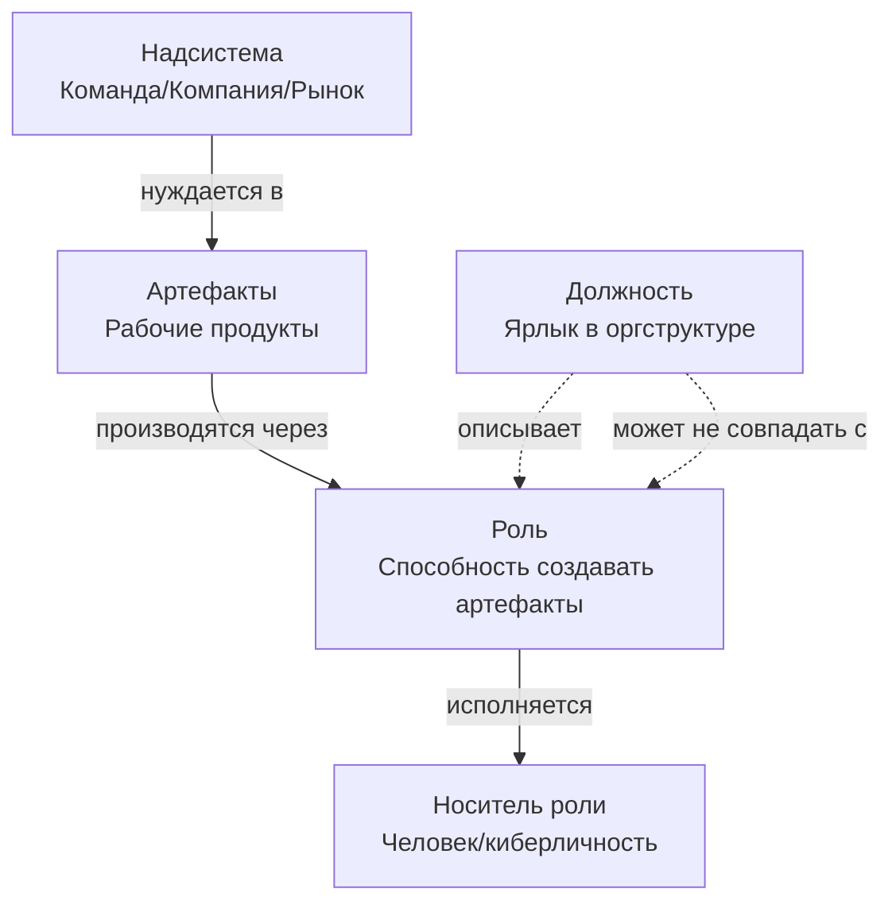

# Неделя 1: Фундамент — v2

**Карьерный концепт:** Роль vs Должность  
**Практика саморазвития:** Мышление письмом  
**Рабочий продукт недели:** Личный контракт v1.0 (Аудит ролей) + быстрый `v0.1` в День 1  
**Версия:** 2.0  
**Дата обновления:** 30.09.2025

---

## 📋 Оглавление

1. [Что нового в v2 (над v1)](#что-нового-в-v2-над-v1)
2. [Цели недели](#цели-недели)
3. [Роли и ответственность](#роли-и-ответственность)
4. [Карьерный концепт: Роль vs Должность](#карьерный-концепт-роль-vs-должность)
5. [Практика: Мышление письмом (ритуал 25–30′)](#практика-мышление-письмом-ритуал-25-–-30)
6. [Работа с Личным контрактом (v0.1 → v1.0)](#работа-с-личным-контрактом-v01--v10)
7. [Временной бюджет](#временной-бюджет)
8. [Домашнее задание](#домашнее-задание)
9. [Критерии приёмки и оценка](#критерии-приёмки-и-оценка)
10. [Публичная демонстрация](#публичная-демонстрация)
11. [FAQ](#faq)
12. [Шаблоны и чек-листы](#шаблоны-и-чек-листы)
13. [Связь с другими неделями](#связь-с-другими-неделями)
14. [Источники и выравнивание](#источники-и-выравнивание)

---

## 🆕 Что нового в v2 (над v1)

- **Двухшаговый старт контракта:** быстрый `v0.1` в День 1 (30–45 мин) → полнота `v1.0` к концу недели.
- **Диагностический чекер «роль ≠ должность» (10 вопросов)** + «Одна роль — один артефакт» как автоматический фильтр.
- **Интеграция продуктивного состояния (0–5):** как писать заготовки и делать аудит ролей с учётом состояния (связь с Productive State Framework).
- **Персонификация под три сегмента (Junior/Middle–Senior/Lead):** подсказки по ролям/артефактам.
- **Строже критерии приёмки:** назначенный проверяющий, явные «ворота» готовности, публичная демо обязательно.

---

## 🎯 Цели недели

### Образовательные результаты (Learning Outcomes)
По завершении недели 1 участник будет способен:

1. **Различать роль и должность**
   - Дать определения и пройти диагностический чекер (≥8/10 правильных)
   - Назвать 5–10 ролей, которые исполняет сейчас, без смешения с должностями
   - Для каждой роли указать ≥1 проверяемый артефакт

2. **Применять практику мышления письмом**
   - Написать ≥1 заготовку на 300–500 слов по теме «Мои роли vs должность»
   - Зафиксировать 5–7 исчезающих заметок в экзокортексе

3. **Собрать Личный контракт v1.0**
   - `v0.1` в День 1: неудовлетворённости (сырой список 3+), 2–4 роли, рабочий продукт недели
   - `v1.0` к Дню 7: манифест, 3–5 принципов (с пояснениями), таблица ролей (5–10), начат раздел неудовлетворённостей (3+)

### Сквозная логика недели
- Позиция **«заказчик собственного развития»**: ресурсы следуют за доказанной полезностью
- **Мышление письмом** — основной инструмент стратегирования всех последующих недель
- Различение **роль/должность** — базовая единица онтологической чистоты курса

### Два режима прохождения
- **Минимальный трек (6–8 ч):** `v0.1` в День 1, 5 ролей (по 1 артефакту), 3 неудовлетворённости, заготовка 300 слов, 1 peer review.
- **Полный трек (9–12 ч):** `v0.1` + `v1.0`, 7–10 ролей, 5–7 неудовлетворённостей, заготовка 500 слов, 2 peer review.

---

## 👥 Роли и ответственность

### Роль участника
- Исполняет роли «Ученик» и «Владелец приоритетного проекта»
- Пишет заготовки и фиксирует исчезающие заметки
- Заполняет `Личный контракт v0.1 → v1.0`
- Публикует артефакт недели и запрашивает peer review

### Роль ведущего (фасилитатора)
- Демонстрирует различение «роль vs должность» на живых примерах
- Показывает свой процесс мышления письмом (10 мин демо-заготовки)
- Отлавливает онтологический дребезг, модерирует peer review

### Инструменты
- Экзокортекс: Notion / Obsidian / Google Docs
- Таймер: Pomodoro 25/5
- Канал публичности: TG/блог/GitHub

---

## 📖 Карьерный концепт: Роль vs Должность

### Ключевое различение
| Понятие | Определение | Проверка |
|---|---|---|
| **Роль** | Устойчивая способность решать класс задач с предсказуемым качеством | «Одна роль → один артефакт» |
| **Должность** | Пакет ролей/полномочий/ресурсов в конкретной организации | Название в оргструктуре |

### Диаграмма (визуализация)


### Диагностический чекер «роль ≠ должность» (10 вопросов)
Отметьте «Да/Нет»:
1) Название — это способность («фасилитатор ретроспектив»), а не титул?  
2) Можно показать артефакт этой роли за последние 3–6 мес?  
3) Артефакт публично демонстрируем (ссылка/примеры)?  
4) Есть надсистема (для кого создаётся польза) и контекст?  
5) Понятен уровень мастерства по роли (объяснение/умение/навык/мастерство)?  
6) Роль переносима между компаниями?  
7) Есть проверяющий по качеству (peer/наставник)?  
8) Есть критерии приёмки артефактов?  
9) Можно обучить другого (минимум «объяснение» + пример)?  
10) Можно усилить роль за 4–8 недель понятным проектом?

Порог: **≥8 «Да»** — корректно описанная роль.

### Как использовать чекер 10Q (пошаговая инструкция)

**Шаг 1:** Для каждой роли из вашей таблицы пройдите 10 вопросов.  
**Шаг 2:** Если <8 «Да» → переформулируйте роль или добавьте артефакты.  
**Шаг 3:** Запишите результат в столбец «Чекер 10Q» (формат: 8/10, 6/10 и т.д.).

**Пример «до/после»:**

❌ **ДО (чекер: 4/10):**
- Роль: «Team Lead»
- Артефакт: «Опыт 3 года»
- Проблемы: название = должность; нет конкретного артефакта; не переносимо

✅ **ПОСЛЕ (чекер: 9/10):**
- Роль: «Фасилитатор спринт-планирований»
- Артефакт: «15 протоколов планирований (последние 3 мес.), чек-лист подготовки, метрики: снижение овертаймов на 20%»
- Надсистема: Команда 5 dev, продукт X
- Уровень: Навык (провожу без ревью, есть собственный формат)
- Проверяющий: Scrum Master команды

### Карта ролей (упражнение, 20 мин)
- Три зоны: Надсистемы → Мои роли → Артефакты
- Для каждой надсистемы выпишите 2–3 роли; для каждой роли — ≥1 артефакт

Пример результата:
```
Надсистема: Команда Dev
├─ Роль: Фасилитатор ретроспектив
│  └─ Артефакт: 10+ протоколов с решениями, follow-up план
├─ Роль: Код-ревьюер
│  └─ Артефакт: 50+ PR с комментариями, гайд по code review
```

### Типичные ошибки и исправления
| Ошибка | Пример | Как исправить |
|---|---|---|
| Путают роль и должность | «Я — Team Lead» | Разложите должность на роли (фасилитатор планирований, ревьюер кода, наставник…) |
| Называют абстракции | «Я — профессионал» | Укажите предметную область и класс задач |
| Нет артефактов | «Я — ментор» | Портфель: план развития менти, 1-on-1 протоколы |
| Смешивают роль и человека | «Моя роль — быть хорошим человеком» | Роль — способность создавать пользу для надсистемы |

---

## ✍️ Практика: Мышление письмом (ритуал 25–30′)

### Суть практики
- Мысли создаются во время письма; цель — заготовка (черновик мысли), а не «красивый пост»
- Результат интегрируется в контракт и личную базу знаний

### Ритуал (пошагово)
1) Выбор темы (5′): «Какие роли я исполняю на самом деле?»  
2) Письмо без редактуры (25′): по шаблону 5 абзацев (ниже)  
3) Разбор (10′): выделить 2–3 инсайта, завести заметки  
4) Интеграция (5′): обновить контракт/таблицу ролей

### Матрица продуктивного состояния (0–5) — как писать «в любом состоянии»
- 4–5: пишем заготовку целиком (25–30′)  
- 3: пишем 2 абзаца + список ролей/артефактов  
- 2: только заметки/список артефактов по фактам  
- 1–0: восстановление, без письма; вернуться позже

### Шаблон 5-абзацной заготовки
```markdown
## [Название темы]

**Абзац 1: Контекст**
Что происходит и почему важно сейчас?

**Абзац 2: Проблема/Вопрос**
Что именно не ясно? Какие гипотезы?

**Абзац 3: Анализ**
Какие различения помогают (роль/должность, артефакт/задача)?

**Абзац 4: Выводы**
Что понял о своих ролях и артефактах?

**Абзац 5: Действия**
Что сделаю на неделе? Какой артефакт создам?
```

### Пример заполненной заготовки

📄 **См. полный пример:** `examples/week_01_writing_sample_roles_audit.md`

**Краткий фрагмент для образца:**

> **Абзац 1: Контекст**  
> Я работаю в команде разработки 2 года. Моя должность — «Middle Developer», и до этой недели я думала, что понимаю, чем занимаюсь. Но когда начала заполнять таблицу ролей для Личного контракта, столкнулась с проблемой: я не могу назвать конкретные артефакты для большинства «ролей»...
>
> **Абзац 4: Выводы**  
> Главное, что понял: различение «роль vs должность» — это не игра слов, а инструмент. Когда я разложила должность на роли и для каждой роли указала артефакты, я увидела: где я сильна (Разработчик REST API — стабильный навык), где есть потенциал (Онбординг-гид), где слаба (Код-ревьюер — нет системы)...

---

## 📝 Работа с Личным контрактом (v0.1 → v1.0)

### День 1: быстрый `v0.1` (30–45 мин)
```markdown
# Личный контракт v0.1

## 1. Неудовлетворённости (сырой список, 3+)
- [ ] ... → Сила эмоции: _/10

## 2. Мои роли (текущие)
- Роль: [название] → Артефакт: [ссылка/описание]

## 3. Рабочий продукт недели 1
- Что создам: [конкретный артефакт]
- Критерии приёмки: [условия «готово»]
- Проверяющий: [peer/наставник]
- Публичность: [где покажу?]
```

### К концу недели: `v1.0` (полноценная версия)

**Используйте упрощённый шаблон для Недели 1:**  
📄 `templates/Personal_Contract_v1.0_Week1_Template.md`

Этот шаблон содержит только 4 раздела (вместо 10 в полном v4.0):
1. Манифест (упрощённый, 2–3 предложения)
2. Принципы (3–5 из списка, с пояснениями)
3. Аудит ролей (расширенная таблица с чекером 10Q)
4. Неудовлетворённости (начало работы)

**Инкрементальная логика:** Полный контракт v4.0 собирается постепенно:
- Неделя 1: v1.0 (манифест + роли + неудовлетворённости)
- Неделя 2: v2.0 (+ раздел «Стратегия»)
- Неделя 3: v2.5 (+ раздел «Проекты»)
- Неделя 4: v3.0 (+ раздел «Тактика»)
- Неделя 5: v3.5 (+ раздел «Окружение»)
- Неделя 8: v4.0 (+ раздел «Устойчивость»)

**Краткий пример структуры v1.0:**
```markdown
# Личный контракт v1.0 — Аудит ролей

## 0. Манифест
[2–3 предложения, адаптированные под вас]

## 1. Принципы (3–5)
[Выбрать из списка + добавить «Для меня это значит...»]

## 2. Аудит ролей
| Роль | Надсистема | Артефакты | Уровень | Чекер 10Q | Роль для роста? |
|---|---|---|---|---|---|
| … | … | … | … | 8/10 | Да/Нет + обоснование |

## 3. Неудовлетворённости
[3+ записи с различением: проблема ↔ неудовлетворённость ↔ эмоция]
```

#### Шкала уровней мастерства (расшифровка)

Используйте эту таблицу для оценки уровня по каждой роли:

| Уровень | Определение | Проверка | Пример (роль «Фасилитатор ретроспектив») |
|---|---|---|---|
| **Объяснение** | Могу рассказать суть и показать чужой пример | Конспект метода, пересказ | Читал про ретро-форматы, могу объяснить |
| **Умение** | Могу выполнить по инструкции под присмотром | Артефакт создан с помощью наставника | Провёл 2 ретро по чек-листу, получил ревью |
| **Навык** | Могу выполнить самостоятельно с предсказуемым качеством | Артефакт создаётся без ревью, повторяемо | Провёл 10+ ретро, есть собственный формат |
| **Мастерство** | Могу создавать новые методы и обучать других | Публичные кейсы, обучены ≥2 человека | Разработал формат под контекст команды, провёл воркшоп |

**Мостик с рыночными грейдами:**
- Junior ≈ Объяснение/Умение
- Middle ≈ Навык (устойчивое качество)
- Senior ≈ Навык + начало Мастерства (обучение других)
- Lead ≈ Мастерство (создание методов, масштабирование)

**Важно:** Указывайте краткое обоснование уровня в таблице ролей (1–2 предложения).

### Пошаговая инструкция (90–120 мин)
- 10′ Манифест (адаптируйте 1–2 фразы под себя)
- 15′ Выбор 3–5 принципов и пояснения к ним
- 40′ Таблица ролей (5–10 записей, у каждой ≥1 артефакт)
- 25′ Таблица неудовлетворённостей (3+)
- 10′ Самопроверка по чек-листу

### Персональные подсказки (по сегментам)
- Junior: роли «Ученик практики X», «Исследователь багов», артефакты: конспект SoTA, pull-request с фиксом, заметка «что узнал»
- Middle/Senior: «Фасилитатор ретро», «Автор регламентов», артефакты: гайд v0.1, ретро-протоколы, метрики улучшений
- Lead/CTO: «Архитектор процессов», «Наставник», артефакты: playbook, обзор метрик качества, план онбординга

---

## ⏱️ Временной бюджет

### Синхронно (вебинар/занятие): 2–2.5 часа
| Блок | Время | Формат | Содержание |
|---|---|---|---|
| Введение | 15′ | Лекция + Q&A | Позиция «заказчик», роль vs должность |
| Концепт | 25′ | Примеры | Тест «одна роль — один артефакт», чекер 10Q |
| Карта ролей | 20′ | Практика | Составление карты (пары/тройки) |
| Мышление письмом | 40′ | Демо + практика | Демо 10′ + письмо 30′ |
| Перерыв | 10′ | — | — |
| Контракт | 30′ | Инструкция | v0.1 → v1.0: шаги, критерии |
| Peer review | 20′ | Пары | Шаблон «2+1», назначить проверяющего |

### Асинхронно: 4–6 часов
| Задача | Время | Результат |
|---|---|---|
| Завершить заготовку «Аудит ролей» | 1 ч | Текст 300–500 слов |
| Заполнить таблицу ролей | 1 ч | 5–10 ролей с артефактами |
| Заполнить неудовлетворённости | 1 ч | 3+ записи с силами эмоций |
| Адаптировать манифест и принципы | 30′ | Персонализированный текст |
| Оформить `v1.0` | 30′ | Готовый документ |
| Опубликовать и сделать 2 review | 1 ч | Ссылка + 2 рецензии |

---

## 🎯 Домашнее задание

### Обязательный минимум (зачёт)
1. `Личный контракт v1.0`: манифест, 3–5 принципов, таблица ролей (5+), неудовлетворённости (3+)
2. Публичная ссылка на `v1.0` (доступ на чтение)
3. Заготовка «Аудит ролей» (≥300 слов) по шаблону 5 абзацев
4. Peer review 2 участникам по шаблону «2+1»

### Дополнительно (углубление)
- Визуальная «Карта ролей» (Miro/Draw.io/бумага)
- 7–10 исчезающих заметок за неделю
- Вторая заготовка: «Как изменилось моё понимание роли за неделю?»

---

## ✅ Критерии приёмки и оценка

### Чек-лист самопроверки перед публикацией (единая точка контроля)

**Таблица ролей:**
- [ ] 5–10 ролей (минимум 5 для зачёта, 7–10 для полного трека)
- [ ] У каждой роли ≥1 конкретный артефакт (не «опыт», а «10 протоколов ретро с метриками»)
- [ ] Нет титулов в колонке «Роль» (только способности: «Фасилитатор...», «Разработчик...»)
  - ✅ «Фасилитатор ретро» / ❌ «Team Lead»
  - *Подсказка:* Если написано «Team Lead» / «Manager» — разложите на роли
- [ ] Для каждой роли пройден чекер 10Q (результат ≥8/10 или запланировано улучшение)
- [ ] Указан уровень мастерства (Объяснение/Умение/Навык/Мастерство) + краткое обоснование
- [ ] Выбраны 2–3 роли для роста + обоснование «почему»
  - *Проверка:* Связаны ли роли для роста с неудовлетворённостями?

**Неудовлетворённости:**
- [ ] 3+ записи с силами эмоций (шкала 1–10)
- [ ] Различение: проблема (объективный разрыв) ↔ неудовлетворённость (состояние) ↔ эмоция (реакция)
  - ✅ «Доход не растёт (проблема) → неудовлетворённость в безопасности → тревога 8/10»
  - ❌ «Мне плохо на работе»

**Манифест и принципы:**
- [ ] Манифест персонализирован (не копипаста из шаблона, а «для меня это значит...»)
- [ ] 3–5 принципов с пояснениями (выбраны из списка в шаблоне)

**Заготовка:**
- [ ] Написана заготовка «Аудит ролей» (≥300 слов, шаблон 5 абзацев)
- [ ] Выделены 2–3 инсайта из заготовки

**Публикация и ревью:**
- [ ] Назначен проверяющий (peer/наставник) + указаны критерии приёмки артефакта недели
- [ ] Ссылка на публичную демо добавлена (доступ на чтение)
- [ ] Сделано peer review 2 участникам (шаблон «2+1»)

**Если хотя бы один пункт не выполнен — вернитесь к соответствующему разделу.**

### Рубрика peer review (для рецензента)
| Аспект | Слабо (1–2) | Хорошо (3–4) | Отлично (5) |
|---|---|---|---|
| Количество ролей | 1–3 | 4–6 | 7–10 |
| Конкретность артефактов | «документы» | «отчёты» | «Dashboard X/Y, 10 ретро-протоколов» |
| Контекст надсистемы | Отсутствует | Общий | Конкретный («Команда 5 dev, продукт X») |
| Оценка мастерства | Нет/размыто | Есть уровень | Уровень + обоснование |
| Роли для роста | Не выбраны | Выбраны | Выбраны + связаны с неудовлетворённостями |

---

### Шаблон peer review «2+1»
```markdown
## Peer review для [Имя участника]

**Два сильных места (что получилось):**
1. [Конкретно: что именно сильно? Пример]
   - Проверка: Есть ли конкретные артефакты для каждой роли?
2. [Конкретно: что именно сильно? Пример]
   - Проверка: Видна ли связь между ролями и неудовлетворённостями?

**Одно улучшение (что можно усилить):**
- [Конкретное предложение по улучшению]
  - Подсказка: Смотри на критерии качества выше

**Вопрос для углубления:**
- [Вопрос для автора]
  - Например: «Какая роль даёт наибольшую ценность надсистеме? Как измерить?»
```

---

## 📢 Публичная демонстрация

### Формат
- Пост в общем канале: резюме (100–150 слов), 1–2 инсайта, ссылка на `v1.0`
- Вариант для смелых: публичный пост «Мои роли vs должность: что понял за неделю»

### Шаблон недельного отчёта
```markdown
# Неделя 1: Аудит ролей

## Что сделал
- Контракт v1.0: [ссылка]
- Заготовка «Аудит ролей» (500 слов)
- 7 исчезающих заметок
- Peer review 2 участникам

## Инсайты
1. …
2. …

## Роли для роста
- …
```

### Критерии качества публикации
- ✅ Пост размещён до конца недели 1 (дедлайн: воскресенье 23:59)
- ✅ Ссылка на контракт рабочая (доступ на чтение)
- ✅ Есть минимум 1 конкретный инсайт
- ✅ Указаны 2–3 роли для роста

---

## ❓ FAQ

- **У меня нет должности (фрилансер/студент). Есть ли роли?**  
Да. Роли зависят от способности, а не от титула: «Исполнитель проектов», «Продавец услуг», «Исследователь темы Y».

- **Моя должность и роль совпадают («Системный аналитик»). В чём разница?**  
Должность — пакет; разложите её на роли: «Сборщик требований», «Моделировщик процессов», «Фасилитатор воркшопов»…

- **Как отличить «хорошую» формулировку роли?**  
Есть проверяемый артефакт и надсистема. Пройдите чекер 10Q (≥8 «Да»).

- **Не получается писать 30 минут.**  
Понизьте планку под состояние: при «3» — 2 абзаца; при «2» — список артефактов.

- **Чем заготовка отличается от публичного поста?**  
Заготовка — сырая и для единомышленников; пост — отредактированный для широкой аудитории. Последовательность: черновик → доработка → (по желанию) публикация.

- **Можно ли изменять контракт после публикации?**  
Да. Контракт — живой документ. Версии v1.0, v2.0, v3.0 появляются каждые 1–2 недели по мере углубления понимания.

- **Не могу выделить 5 ролей — что делать?**  
Расширьте контекст за пределы работы. Вот примеры «скрытых» ролей:

  **Рабочие:**
  - Онбординг-гид для новичков (артефакт: гайд v1.0 + 3 успешных онбординга)
  - Хранитель знаний (артефакт: wiki-страницы, FAQ, обучающие материалы)
  - Debugger сложных багов (артефакт: 10+ решённых задач с RCA-анализом)
  - Код-ревьюер (артефакт: 50+ PR с комментариями, гайд по code review)
  - Исследователь новых библиотек (артефакт: 3 конспекта SoTA, сравнительный анализ)

  **Семейные/личные:**
  - Организатор семейных финансов (артефакт: бюджет на 6 мес., дашборд расходов)
  - Домашний повар (артефакт: 20+ рецептов, меню на неделю)
  - Организатор семейных мероприятий (артефакт: план 5 событий, фотоотчёты)

  **Сообщество:**
  - Участник peer-review (артефакт: 15+ рецензий на GitHub/форуме)
  - Автор обучающих постов (артефакт: 5 статей на Medium/Habr с метриками просмотров)
  - Ментор для начинающих (артефакт: 2 менти, планы развития, 1-on-1 протоколы)

- **Неудовлетворённости «слишком личные». Публиковать страшно.**  
Публикация — для peer review, а не «в интернет». При необходимости обезличьте детали (Компания X/Проект Y).

- **Заготовка получилась «сырой». Можно редактировать?**  
Да, но после первого черновика: 25–30′ письма без правок → перерыв → 10–15′ редактуры.

---

## 📋 Шаблоны и чек-листы

### Исчезающая заметка
```markdown
[Дата/время]
Тип: Мимолётная / Образовательная
Контекст: …
Мысль/Идея: …
Связь с ролями/проектами: …
Статус: [ ] Новая [ ] В заготовку [ ] Удалена
```

### 5-абзацная заготовка
```markdown
# [Название]
Дата: [ДД.ММ.ГГГГ]  |  Теги: #роли #неделя1

1. Контекст
2. Проблема/Вопрос
3. Анализ
4. Выводы
5. Действия
```

### Повестка самостоятельной 2‑часовой сессии
```markdown
0:00–0:10 — Манифест
0:10–0:25 — Принципы (3–5)
0:25–1:05 — Таблица ролей (40′)
1:05–1:15 — Перерыв
1:15–1:40 — Неудовлетворённости (25′)
1:40–2:00 — Самопроверка + публикация
```

---

## 🔗 Связь с другими неделями (нитка сквозной систематичности)

**Неделя 1 (Фундамент) → Неделя 2 (Направление):**
- Таблица ролей (столбец «Роль для роста») → Определение целевой роли для развития
- Неудовлетворённости (3+) → Связь с гипотезами-стратегиями: «Какая роль устранит эту неудовлетворённость?»
- Пример: «Исследователь новых библиотек» (сейчас Умение) → целевая роль «Евангелист технологии» (Мастерство) → стратегия: курс + 3 публичных доклада

**Неделя 1 → Неделя 3 (Ценность):**
- Артефакты из таблицы ролей → Портфель рабочих продуктов
- Принцип «Артефакт > задача» → Декомпозиция проектов на проверяемые артефакты
- Пример: роль «Фасилитатор ретро» (10 протоколов) → проект «Создание регламента ретроспектив для компании»

**Неделя 1 → Неделя 4 (Ритм):**
- «Роль для роста» → Приоритетный проект на спринт
- Мышление письмом (25–30′) → Защищённый слот в календаре
- Пример: роль «Код-ревьюер» (сейчас Умение) → проект «Гайд по code review v1.0» → слот 2 ч/нед.

**Неделя 1 → Неделя 5 (Окружение):**
- Таблица ролей → Карта окружения: «Кто даёт обратную связь по каждой роли?»
- Артефакты → Витрина ценности: «Где публично показать артефакты?»
- Пример: роль «Евангелист технологии» → наставник (Lead Dev), площадка (LinkedIn, конференции)

**Неделя 1 → Неделя 8 (Устойчивость):**
- Продуктивное состояние (0–5) для письма → Энергобюджет и регламенты восстановления
- Ритуал мышления письмом → Shutdown-ритуал, управление фокусом
- Пример: состояние 2 → только заметки/список артефактов → раннии маркеры и протоколы

**Ключевая нить:** Аудит ролей (Неделя 1) создаёт фундамент для всех последующих разделов контракта v4.0. Каждая следующая неделя добавляет 1–2 раздела к контракту:
- v1.0 (Неделя 1): Роли + Неудовлетворённости
- v2.0 (Неделя 2): + Стратегия
- v2.5 (Неделя 3): + Проекты
- v3.0 (Неделя 4): + Тактика (спринт)
- v3.5 (Неделя 5): + Окружение
- v4.0 (Неделя 8): + Устойчивость

**Без качественного аудита ролей в Неделе 1 весь последующий контракт будет стоять на слабом фундаменте.**

---

## 📚 Дополнительные материалы и примеры
- **Шаблон:** [Личный контракт v1.0 (Week 1 edition)](../templates/Personal_Contract_v1.0_Week1_Template.md) — упрощённая версия для Недели 1
- **Пример заготовки:** [Мои роли vs должность — что понял за неделю](../examples/week_01_writing_sample_roles_audit.md) — 500 слов по шаблону 5 абзацев
- Пример: [Заполненный контракт v1.0 — Анна (Начинающий аналитик)](../examples/persona_1_analyst_contract_v1.md)
- Пример: Заполненный контракт v2.0 — Анна (обновлённый) — скоро

---

## 📚 Источники и выравнивание
- `Systemic_Career_Framework_v2.md`: глоссарий, недельный цикл, метрики
- `Personal_Contract_v4.0_Template.md`: полный шаблон контракта (10 разделов, для итоговой сборки к Неделе 8)
- **`templates/Personal_Contract_v1.0_Week1_Template.md`**: упрощённый шаблон для Недели 1 (4 раздела)
- `OtherMaterials/ProductiveStateFramework2.md`: шкала 0–5 и ритуалы состояния
- CSV `systemic_career_v2.3 — concepts.csv`: C_46 (Роль), C_5 (Должность), C_44 (Рабочий продукт), C_29 (Неудовлетворённость), C_50 (Слоты)

---

**Версия документа:** 2.0  
**Дата последнего обновления:** 30.09.2025  
**Автор:** AI-методолог + команда курса «Системная карьера»  
**Обратная связь:** [ссылка на форму]

---

*Этот документ — живой артефакт. Обновляется на основе обратной связи и публичных демонстраций.*
