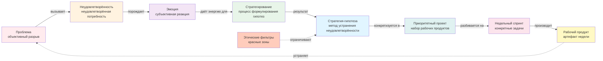

# Неделя 2: Направление

**Карьерный концепт:** Неудовлетворённость как источник приоритетных проектов  
**Практика саморазвития:** Стратегирование  
**Рабочий продукт недели:** Личный контракт v2.0 (Стратегическое намерение)  
**Версия:** 1.0  
**Дата обновления:** 29.09.2025

---

## 📋 Оглавление

1. [Цели недели](#цели-недели)
2. [Связь с неделей 1](#связь-с-неделей-1)
3. [Роли участников](#роли-участников)
4. [Карьерный концепт: Неудовлетворённость как источник проектов](#карьерный-концепт-неудовлетворённость-как-источник-проектов)
5. [Практика саморазвития: Стратегирование](#практика-саморазвития-стратегирование)
6. [Работа с Личным контрактом](#работа-с-личным-контрактом)
7. [Временной бюджет](#временной-бюджет)
8. [Домашнее задание](#домашнее-задание)
9. [Критерии оценки](#критерии-оценки)
10. [Публичная демонстрация](#публичная-демонстрация)
11. [Часто задаваемые вопросы](#часто-задаваемые-вопросы)
12. [Шаблоны и чек-листы](#шаблоны-и-чек-листы)

---

## 🎯 Цели недели

### Образовательные результаты (Learning Outcomes)

По завершении недели 2 участник будет способен:

1. **Различать проблему, неудовлетворённость и эмоцию:**
   - Дать определения трём понятиям
   - Привести 3+ примера неудовлетворённостей из своей жизни
   - Для каждой неудовлетворённости различить объективную проблему и субъективную эмоциональную реакцию

2. **Работать с неудовлетворённостями как источником проектов:**
   - Формализовать 3-5 ключевых неудовлетворённостей по методике
   - Оценить силу эмоций (шкала 1-10) для приоритизации
   - Выявить связь между неудовлетворённостями и ролями (из недели 1)

3. **Применять практику стратегирования:**
   - Провести первую сессию стратегирования (60 мин)
   - Для 1-2 неудовлетворённостей письменно сформулировать стратегию-гипотезу
   - Объяснить разницу между стратегией и планом

4. **Работать с этическими ограничениями:**
   - Сформулировать свои «красные зоны участия» (минимум 3)
   - Объяснить, как этические фильтры влияют на выбор проектов
   - Интегрировать этические ограничения в контракт

5. **Создать Личный контракт v2.0:**
   - Уточнить таблицу неудовлетворённостей (из v1.0)
   - Заполнить таблицу "Формулирование стратегии" для 1-2 ключевых неудовлетворённостей
   - Добавить раздел "Этические фильтры / Красные зоны"
   - Опубликовать контракт v2.0 для peer review

### Сквозная линия: связь с целью курса

Эта неделя переводит фокус от **"кто я"** (роли) к **"куда я иду"** (стратегия):
- **Неудовлетворённости** — это «топливо» для движения (источник энергии)
- **Стратегирование** — это процесс превращения беспокойства в действие
- **Этические фильтры** — это защита от «ложных целей» и фатальных ошибок

---

## 🔗 Связь с неделей 1

### Что мы уже сделали (неделя 1):

✅ Провели аудит ролей (5-10 ролей с артефактами)  
✅ Зафиксировали 3-5 неудовлетворённостей в таблице  
✅ Освоили практику мышления письмом (заготовки, исчезающие заметки)  
✅ Создали Личный контракт v1.0

- Для самопроверки различения «роль ≠ должность» используйте диагностический чекер (10 вопросов) из `weeks/Week_01_Foundation_v2.md`.

### Что развиваем на неделе 2:

🔄 **Углубляем работу с неудовлетворённостями:**
- Неделя 1: просто зафиксировали
- Неделя 2: различаем проблему/неудовлетворённость/эмоцию, приоритизируем по силе эмоций

🔄 **От ролей к стратегии:**
- Неделя 1: "В каких ролях я хочу расти?"
- Неделя 2: "Почему именно в этих? Какую неудовлетворённость это устранит?"

🔄 **Мышление письмом → Стратегирование:**
- Неделя 1: писали заготовки спонтанно
- Неделя 2: используем письмо для **регулярного** процесса принятия решений

### Практический пример связи:

**Неделя 1:** Я выявил роль "Наставник джунов" (хочу расти)  
**Неделя 2:** Почему? → Неудовлетворённость: "Вижу, что джуны делают одни и те же ошибки, это раздражает (7/10) и беспокоит за качество продукта"  
→ Стратегия-гипотеза: "Создать систему онбординга и регулярных 1-on-1, чтобы ошибки выявлялись раньше"

---

## 👥 Роли участников

### Роль участника (студента)

**Что делает:**
- Честно рефлексирует над своими неудовлетворённостями (даже "неудобными")
- Проводит первую сессию стратегирования по чек-листу
- Письменно формулирует стратегию-гипотезу для 1-2 неудовлетворённостей
- Определяет свои этические границы ("красные зоны")
- Обновляет контракт до версии v2.0

**Что НЕ делает:**
- Не пытается найти "идеальную" стратегию (стратегия — это гипотеза, которую будем проверять)
- Не скрывает "неудобные" неудовлетворённости из-за стыда или страха осуждения
- Не путает стратегию (как) с целью (что)

**Ключевая установка:** "Моя стратегия — это гипотеза о том, как устранить неудовлетворённость. Я буду проверять её на практике и корректировать."

### Роль ведущего (фасилитатора)

**Что делает:**
- Объясняет различие проблема/неудовлетворённость/эмоция на примерах
- Демонстрирует процесс стратегирования (показывает свою сессию)
- Задаёт "сократические вопросы" для углубления стратегии
- Помогает участникам формулировать этические фильтры
- Отлавливает смешение "стратегия/план/цель"

**Инструменты ведущего:**
- Примеры стратегий для разных неудовлетворённостей (3-4 кейса)
- Чек-лист повестки сессии стратегирования
- Шаблоны для формулирования этических ограничений

---

## 📖 Карьерный концепт: Неудовлетворённость как источник проектов

### Визуализация концепта



**Ключевая идея диаграммы:** Неудовлетворённость — это не проблема, а **топливо** для движения. Цепочка "Неудовлетворённость → Стратегия → Проект → Спринт → Артефакт" превращает беспокойство в управляемое действие.

### Ключевые различения

| Понятие | Определение | Пример |
|---------|-------------|--------|
| **Проблема** | Объективный разрыв между текущим состоянием и желаемым для определённой роли | Доход не растёт 2 года, хотя я много работаю |
| **Неудовлетворённость** | Психическое состояние, возникающее из-за проблемы; потребность (безопасность, самореализация, уважение) | Неудовлетворённость в безопасности и уважении |
| **Эмоция/Чувство** | Субъективная реакция на неудовлетворённость с оценкой силы | Тревога (8/10), раздражение (5/10) |

### Почему это важно?

**Проблема:** Люди либо игнорируют свои неудовлетворённости ("всё нормально"), либо застревают в эмоциях ("всё плохо"), вместо того чтобы превратить их в проекты.

**Ловушки:**
1. **Подавление:** "Не буду думать о плохом" → энергия уходит в фоновое беспокойство
2. **Застревание:** "Вечно одно и то же" → нет перехода от жалобы к действию
3. **Хаотичность:** "Хочу всё и сразу" → распыление на множество целей без приоритетов

**Возможность:** Формальное описание неудовлетворённостей = первый шаг от «шума в голове» к управляемому проекту:
- Неудовлетворённость → Стратегия-гипотеза → Приоритетный проект → Недельный спринт (неделя 4)

### Как работать с неудовлетворённостями?

#### **Шаг 1: Выгрузка (brain dump) — 15 мин**

**Инструкция:**
Откройте документ и напишите всё, что вас беспокоит в карьере/жизни. Без фильтров, без редактуры.

**Подсказки:**
- Что вызывает раздражение/тревогу/грусть?
- Что хотелось бы изменить, но "не получается"?
- О чём думаете перед сном или в душе?
- Что откладываете месяцами/годами?

**Результат:** Список из 10-20 пунктов (сырой)

#### **Шаг 2: Формализация — 30 мин**

**Инструкция:**
Для каждой неудовлетворённости заполните таблицу:

| Проблема | Неудовлетворённость | Эмоции | Сила эмоции (1-10) |
|----------|---------------------|--------|-------------------|
| Объективный факт | Потребность | Название эмоции | Оценка |

**Пример:**

| Проблема | Неудовлетворённость | Эмоции | Сила |
|----------|---------------------|--------|------|
| Доход не растёт 2 года | В безопасности и уважении | Тревога, раздражение | 8, 5 |
| Работаю по выходным, нет времени на семью | В балансе и самореализации | Вина, грусть | 7, 6 |
| Задачи рутинные, не учусь новому | В развитии и интересе | Скука, беспокойство | 6, 5 |

**Критерий качества:** Для каждой неудовлетворённости есть:
1. Проверяемая проблема (можно замерить)
2. Названная потребность (по Маслоу: безопасность, уважение, самореализация...)
3. Конкретная эмоция с оценкой силы

#### **Шаг 3: Приоритизация — 10 мин**

**Критерии выбора 1-2 ключевых неудовлетворённостей:**

1. **Сила эмоции** (≥7/10) — "болит сильно"
2. **Связь с ролями** (из недели 1) — есть роль, рост в которой устранит неудовлетворённость
3. **Управляемость** — я могу повлиять (vs внешние обстоятельства)
4. **Системность** — устранение повлияет на несколько сфер жизни

**Результат:** 1-2 неудовлетворённости для формулирования стратегии

### Рост калибра неудовлетворённостей

**Важная идея:** Неудовлетворённости эволюционируют по мере роста:

| Уровень | Фокус неудовлетворённостей | Пример |
|---------|----------------------------|--------|
| **Личный** | Мои проблемы | "Мало зарабатываю" |
| **Командный** | Проблемы команды | "Процессы в команде неэффективны" |
| **Организационный** | Проблемы компании | "Продукт не решает проблемы клиентов" |
| **Общественный** | Проблемы отрасли/общества | "В отрасли нет стандартов качества" |

**Практика:** По мере роста калибра личности (неделя 1, концепт из CSV C_12) ваши неудовлетворённости будут "подниматься" по этой лестнице. Это нормально и желательно.

---

## 📝 Практика саморазвития: Стратегирование

### Что такое стратегирование?

**Стратегирование** — это непрерывный процесс работы с неудовлетворённостями и их перевода в приоритетные проекты через формулирование и проверку гипотез.

**Ключевое различение:**
- **Стратегия (существительное)** — это гипотеза о методе устранения неудовлетворённости
- **Стратегирование (глагол)** — это регулярный процесс формулирования, проверки и корректировки этих гипотез

### Почему "стратегирование", а не "стратегия"?

**Цитата из принципов контракта:**
> "Стратегия ничто, стратегирование — всё. Мой контракт — это не застывший план, а живой процесс его постоянной адаптации."

**Логика:**
- Мир меняется быстро → статичная стратегия устаревает
- Я меняюсь (учусь, расту) → мои гипотезы уточняются
- Процесс важнее плана → регулярность стратегирования = ключ к адаптивности

### Структура сессии стратегирования (60 мин)

#### **Блок 1: Ретроспектива (15 мин)**

**Вопросы:**
- Что сделал за прошлую неделю по приоритетным задачам?
- План/факт: сколько часов выделил vs потратил?
- Какие гипотезы проверял? Что подтвердилось/опровергнулось?
- Что узнал нового о себе/своих ролях/неудовлетворённостях?

**Рабочий продукт:** 5-7 тезисов в заметке

#### **Блок 2: Синхронизация со смыслами (10 мин)**

**Вопросы:**
- Перечитать таблицу неудовлетворённостей
- Что изменилось? Появились новые? Старые ослабли?
- Какие неудовлетворённости "горят" сильнее всего (эмоция ≥7)?

**Рабочий продукт:** Обновлённая таблица неудовлетворённостей

**Зачем:** Этот шаг "пропитывает" мозг актуальными неудовлетворённостями, что повышает качество идей в течение недели.

#### **Блок 3: Актуализация стратегии (20 мин) — ядро сессии**

**Задание:** Для 1-2 ключевых неудовлетворённостей письменно ответить:

1. **Какие варианты решения вижу?** (brain storm, 5-7 вариантов)
2. **Плюсы и минусы каждого варианта** (быстрый анализ)
3. **Какой метод выбираю как основной?** (стратегия-гипотеза)
4. **Почему именно этот?** (обоснование выбора)
5. **Как проверю гипотезу?** (критерий успеха)

**Формат:** Письменное размышление (заготовка), 300-500 слов

**Пример:**

```markdown
## Стратегия по неудовлетворённости: "Доход не растёт"

**Варианты:**
1. Просить повышение у текущего работодателя
2. Искать новую работу с более высокой зарплатой
3. Запустить свой проект (фриланс/продукт)
4. Освоить новый навык, который повысит мою ценность
5. Перейти в другую отрасль с более высокими зарплатами

**Анализ:**
- Вариант 1: низкие шансы (нет сильных аргументов)
- Вариант 2: рискованно (рынок нестабилен)
- Вариант 3: долго (нужно время на раскачку)
- Вариант 4: реалистично (3-6 месяцев)
- Вариант 5: радикально (потеря накопленного опыта)

**Стратегия-гипотеза:**
Освою системный анализ (востребованный навык) через онлайн-курс + практику на рабочих задачах. Это повысит мою ценность и даст аргументы для повышения или смены работы через 6 месяцев.

**Критерий проверки:**
Через 3 месяца: завершён курс + 2 рабочих кейса с применением системного анализа.
Через 6 месяцев: получил повышение ИЛИ оффер с зарплатой +30%.
```

#### **Блок 4: Выбор приоритетного проекта (10 мин)**

**Вопрос:** Какой проект запускаю/продолжаю на этой неделе, чтобы проверить стратегию?

**Результат:** Название проекта + 1 рабочий продукт недели

**Пример:**
- Проект: "Освоение системного анализа"
- Рабочий продукт недели: "Пройти модули 1-3 курса, выполнить первое задание"

#### **Блок 5: Разбор заметок (5 мин)**

**Задание:** Пересмотреть исчезающие заметки за неделю, интегрировать идеи в стратегию или контракт.

---

### Типичные ошибки в стратегировании

| Ошибка | Симптом | Как исправить |
|--------|---------|---------------|
| Путают стратегию и цель | "Моя стратегия — заработать миллион" | Цель — "что", стратегия — "как". "Моя стратегия — освоить навык X, чтобы повысить доход" |
| Путают стратегию и план | "Моя стратегия: понедельник — учу главу 1, вторник..." | План — расписание, стратегия — метод/подход |
| Нет обоснования | "Выбрал вариант 3, потому что он лучший" | Объясни: почему лучший? По каким критериям? |
| Нет критерия проверки | "Попробую и посмотрю" | Как поймёшь, что гипотеза работает/не работает? |
| Перфекционизм | "Не могу выбрать, все варианты несовершенны" | Стратегия — это гипотеза, а не истина. Выбери best guess, проверь |

---

## 🛡️ Этические фильтры / "Красные зоны участия"

### Что это такое?

**Красные зоны участия** — это заранее определённые виды продуктов, практик и условий, в которых вы не участвуете **ни при каких обстоятельствах**.

**Назначение:**
1. Ускоряют выбор (не тратите время на обдумывание "этичных дилемм")
2. Защищают от фатальных ошибок (репутация, здоровье, отношения)
3. Держат долгий горизонт (краткосрочная выгода vs долгосрочные последствия)

### Примеры красных зон

**Типы продуктов:**
- Не работаю над продуктами, которые манипулируют вниманием (dark patterns, игровая зависимость)
- Не участвую в проектах с сомнительной легальностью
- Не создаю системы слежки без согласия пользователей

**Типы практик:**
- Не работаю в командах без code review
- Не соглашаюсь на проекты без письменных требований
- Не работаю систематически >50 часов в неделю

**Типы условий:**
- Не работаю в компаниях с токсичной культурой (конкретные признаки)
- Не соглашаюсь на оплату "по результату" без аванса
- Не участвую в проектах без возможности публично показать результат

### Практическое упражнение (20 мин)

**Задание:** Сформулируйте свои красные зоны (минимум 3)

**Шаблон:**

```markdown
## Мои этические фильтры / Красные зоны

### 1. Продукты и услуги
Я не участвую в разработке/продвижении:
- [Тип продукта 1: почему]
- [Тип продукта 2: почему]

### 2. Практики и методы работы
Я не соглашаюсь на:
- [Практика 1: почему]
- [Практика 2: почему]

### 3. Условия и контексты
Я не работаю в:
- [Условие 1: почему]
- [Условие 2: почему]

### Проверка на сессии стратегирования
[ ] Каждый новый проект/работа проверяется на соответствие этим фильтрам
[ ] При нарушении — отказ без обсуждений
```

**Критерий качества:** Для каждой красной зоны есть конкретное обоснование (не абстрактное "это плохо").

---

## 📝 Работа с Личным контрактом

### Что создаём на неделе 2?

**Личный контракт v2.0: Стратегическое намерение**

Структура обновлений v1.0 → v2.0:

```markdown
# Личный контракт развития v2.0

## 1. Манифест
[Без изменений из v1.0]

## 2. Принципы
[Без изменений из v1.0]

## 3. Аудит ролей
[Без изменений из v1.0]

## 4. Анализ неудовлетворённостей ⬅️ ОБНОВЛЯЕМ
[Уточнённая таблица 1.1 из Personal Contract]

## 5. Формулирование стратегии ⬅️ НОВОЕ
[Таблица 2.1 из Personal Contract для 1-2 неудовлетворённостей]

## 6. Этические фильтры / Красные зоны ⬅️ НОВОЕ
[Список из 3-5 красных зон с обоснованием]

## 7. Операционные обязательства (пока пусто)
[Заполним на неделях 3-4]
```

### Пошаговая инструкция: обновление контракта

#### **Шаг 1: Уточнение неудовлетворённостей (20 мин)**

**Задание:**
1. Откройте контракт v1.0, раздел "Анализ неудовлетворённостей"
2. Перечитайте каждую запись
3. Для каждой неудовлетворённости проверьте:
   - ✅ Есть ли чёткое различие: проблема / неудовлетворённость / эмоция?
   - ✅ Указана ли сила эмоции (1-10)?
   - ✅ Есть ли связь с ролями (из недели 1)?

4. Добавьте новые неудовлетворённости, если появились
5. Удалите/снизьте приоритет тех, которые ослабли

**Результат:** Таблица с 3-7 неудовлетворённостями, отсортированная по силе эмоций

#### **Шаг 2: Формулирование стратегии (40 мин — основная работа)**

**Задание:**
Заполните таблицу 2.1 "Формулирование стратегии" из Personal Contract v3.2 для 1-2 ключевых неудовлетворённостей.

**Таблица 2.1:**

| Неудовлетворённость | Стратегия как описание | Основной метод | Целевая роль | Ключевые компетенции | Зачем это системе |
|---------------------|------------------------|----------------|--------------|---------------------|-------------------|
| Из таблицы 1.1 | Письменное рассуждение (200-300 слов) | Выбранный метод-гипотеза | 1-2 роли | 2-3 компетенции | Польза для надсистемы |

**Как заполнять столбец "Стратегия как описание":**

Это **самый важный** столбец. Здесь вы письменно рассуждаете (как на сессии стратегирования):
1. Какие варианты решения рассматриваю?
2. Плюсы и минусы каждого
3. Какой метод выбираю и почему?
4. Как проверю гипотезу?

**Пример:**

```
Я могу сменить работу, но рынок нестабилен. 
Просить повышения рискованно — нет сильных аргументов. 
Запуск своего проекта требует много времени. 

Наиболее реалистичный путь — освоить востребованный навык 
(системный анализ), чтобы повысить свою ценность на текущем 
месте или на рынке. Буду учиться на онлайн-курсе + применять 
на рабочих задачах. Критерий успеха: через 3 месяца — курс завершён 
+ 2 кейса, через 6 месяцев — повышение или оффер с зарплатой +30%.
```

**Остальные столбцы:**
- **Основной метод:** "Освоение системного анализа"
- **Целевая роль:** "Системный аналитик уровня Middle"
- **Ключевые компетенции:** "1) Декомпозиция задач 2) Работа с требованиями 3) Моделирование процессов"
- **Зачем это системе:** "Снижение времени на R&D, повышение предсказуемости результатов, тиражирование практик в команде"

#### **Шаг 3: Этические фильтры (15 мин)**

**Задание:**
Добавьте новый раздел в контракт:

```markdown
## 6. Этические фильтры / Красные зоны

Я заранее определяю виды продуктов, практик и условий, в которых 
не участвую ни при каких обстоятельствах. Это мой этический фильтр, 
который ускоряет выбор и защищает от фатальных ошибок.

### Продукты и услуги
- [Красная зона 1]
- [Красная зона 2]

### Практики и методы
- [Красная зона 3]

### Условия работы
- [Красная зона 4]

### Проверка
На каждой сессии стратегирования я проверяю новые проекты/работы 
на соответствие этим фильтрам.
```

#### **Шаг 4: Самопроверка (10 мин)**

**Чек-лист перед публикацией v2.0:**

```markdown
[ ] Таблица неудовлетворённостей обновлена (3-7 записей)
[ ] Для каждой неудовлетворённости: проблема/состояние/эмоция различены
[ ] Указана сила эмоций (1-10)
[ ] Таблица "Формулирование стратегии" заполнена для 1-2 неудовлетворённостей
[ ] Столбец "Стратегия как описание" содержит рассуждение (200+ слов)
[ ] Раздел "Этические фильтры" добавлен (минимум 3 красные зоны)
[ ] Для каждой красной зоны есть обоснование
[ ] Контракт сохранён как v2.0
```

---

## ⏱️ Временной бюджет

### Синхронная работа (вебинар/занятие): 2.5-3 часа

| Блок | Время | Формат | Содержание |
|------|-------|--------|------------|
| **Введение: от ролей к стратегии** | 15 мин | Лекция | Связь с неделей 1, зачем работать с неудовлетворённостями |
| **Концепт: Проблема/Неудовлетворённость/Эмоция** | 30 мин | Лекция + примеры | Различения, примеры, типичные ошибки |
| **Упражнение: Формализация неудовлетворённостей** | 25 мин | Практика | Заполнение таблицы неудовлетворённостей в парах |
| **Перерыв** | 10 мин | — | — |
| **Практика: Стратегирование** | 40 мин | Демо + практика | Демо сессии ведущим (15 мин) + мини-сессия участников (25 мин) |
| **Концепт: Этические фильтры** | 20 мин | Лекция + обсуждение | Красные зоны, примеры, как формулировать |
| **Упражнение: Формулирование стратегии** | 30 мин | Практика | Письменное рассуждение для 1 неудовлетворённости |
| **Peer review черновиков** | 20 мин | Взаимная рецензия | Обмен черновиками стратегий, обратная связь |
| **Работа с контрактом v2.0** | 15 мин | Инструкция + Q&A | Как обновить контракт до v2.0 |
| **Домашнее задание и итоги** | 10 мин | Инструкция | Что сделать до следующей недели |

### Асинхронная работа (самостоятельно): 5-7 часов

| Задача | Время | Когда | Результат |
|--------|-------|-------|-----------|
| Провести полную сессию стратегирования | 1 час | День 1-2 | Заготовка с рассуждениями по 1-2 неудовлетворённостям |
| Уточнить таблицу неудовлетворённостей | 30 мин | День 2 | Обновлённая таблица (3-7 записей) |
| Заполнить таблицу "Формулирование стратегии" | 1.5 часа | День 3-4 | Стратегия для 1-2 неудовлетворённостей |
| Сформулировать этические фильтры | 45 мин | День 4 | 3-5 красных зон с обоснованием |
| Обновить контракт до v2.0 | 1 час | День 5 | Чистовая версия v2.0 |
| Написать заготовку "Моя стратегия" | 1 час | День 5-6 | Заготовка 400+ слов |
| Опубликовать контракт v2.0 | 30 мин | День 6 | Ссылка в канале + пост |
| Дать peer review 2 участникам | 1 час | День 6-7 | Комментарии по шаблону |

**Итого:** 7-10 часов (с учётом синхронной работы)

---

## 🎯 Домашнее задание

### Обязательный минимум (для получения зачёта)

1. **Провести сессию стратегирования**
   - ✅ Проведена по чек-листу (60 мин)
   - ✅ Создана заготовка с письменным рассуждением по 1-2 неудовлетворённостям
   - ✅ Выбран приоритетный проект на основе стратегии

2. **Обновить Личный контракт до v2.0**
   - ✅ Уточнена таблица неудовлетворённостей (3-7 записей)
   - ✅ Заполнена таблица "Формулирование стратегии" (минимум 1 неудовлетворённость)
   - ✅ Добавлен раздел "Этические фильтры" (минимум 3 красные зоны)

3. **Опубликовать контракт v2.0**
   - ✅ Ссылка размещена в канале курса
   - ✅ Доступ на чтение открыт

4. **Дать peer review 2 участникам**
   - ✅ Комментарии по шаблону "2+1"
   - ✅ Фокус на качестве стратегии (логика выбора метода)

### Дополнительно (для углубления)

- Провести 2-ю сессию стратегирования в конце недели (ретро + корректировка)
- Написать вторую заготовку: "Эволюция моих неудовлетворённостей: что изменилось с недели 1?"
- Создать визуальную карту связей: неудовлетворённости → роли → проекты
- Прочитать статью о практике стратегирования (ссылка в материалах)

---

## ✅ Критерии оценки

### Критерии качества стратегии

| Критерий | Проверка | Примеры "Да" / "Нет" |
|----------|----------|----------------------|
| **1. Различение понятий** | Чётко разделены проблема/неудовлетворённость/эмоция? | ✅ Все 3 компонента различимы / ❌ Всё смешано в кучу |
| **2. Многовариантность** | Рассмотрено 3+ вариантов решения? | ✅ "Вариант 1... Вариант 2... Вариант 3..." / ❌ Только один вариант |
| **3. Обоснование выбора** | Есть объяснение, почему выбран именно этот метод? | ✅ "Выбрал X, потому что..." / ❌ "Выбрал X" (без "почему") |
| **4. Критерий проверки** | Указано, как проверим гипотезу? | ✅ "Через 3 месяца: метрика Y" / ❌ "Попробую и посмотрю" |
| **5. Связь с ролями** | Стратегия связана с ростом в конкретных ролях? | ✅ Явная связь / ❌ Роли не упомянуты |

---

### Шкала качества стратегии (0-10 баллов)

Используй эту шкалу для самооценки и peer review:

| Баллы | Уровень | Описание | Что присутствует |
|-------|---------|----------|------------------|
| **9-10** | Отлично | Стратегия системная, многовариантная, проверяемая | • 5+ вариантов рассмотрено<br>• Обоснование по 3+ критериям<br>• Критерии проверки на 1, 3, 6 месяцев<br>• Связь с 2-3 ролями<br>• Учтены риски и альтернативы |
| **7-8** | Хорошо | Стратегия проработана, есть логика выбора | • 3-4 варианта рассмотрено<br>• Обоснование по 2 критериям<br>• Критерий проверки на 3 месяца<br>• Связь с 1-2 ролями |
| **5-6** | Удовлетворительно | Стратегия есть, но поверхностна | • 2-3 варианта рассмотрено<br>• Обоснование есть, но слабое<br>• Критерий проверки абстрактный<br>• Роли упомянуты |
| **3-4** | Слабо | Стратегия больше похожа на план или цель | • 1-2 варианта<br>• Нет обоснования или оно нелогично<br>• Нет критерия проверки<br>• Нет связи с ролями |
| **0-2** | Очень слабо | Стратегия не сформулирована | • Только один вариант<br>• Нет обоснования<br>• Путаница стратегия/цель/план |

**Как использовать:** После формулирования стратегии оцени себя по шкале. Если меньше 7 баллов — пересмотри стратегию, усиль слабые аспекты.

### Чек-лист самопроверки перед публикацией

```markdown
## Контракт v2.0

[ ] Таблица неудовлетворённостей обновлена
[ ] Для 1-2 неудовлетворённостей заполнена таблица "Формулирование стратегии"
[ ] Столбец "Стратегия как описание" содержит рассуждение (200+ слов)
[ ] Есть анализ 3+ вариантов решения
[ ] Выбор основного метода обоснован
[ ] Указан критерий проверки гипотезы
[ ] Раздел "Этические фильтры" добавлен (минимум 3 красные зоны)

## Сессия стратегирования

[ ] Проведена по чек-листу (5 блоков)
[ ] Создана заготовка с письменным рассуждением
[ ] Выбран приоритетный проект на основе стратегии

## Публикация

[ ] Контракт v2.0 доступен по ссылке
[ ] Написан пост в канале с кратким резюме
[ ] Даны комментарии 2 участникам
```

### Шаблон peer review для недели 2

```markdown
## Peer review для [Имя участника] — Контракт v2.0

**Два сильных места в стратегии:**
1. [Что сильно: многовариантность, обоснование, связь с ролями?]
2. [Что сильно: критерий проверки, этические фильтры?]

**Одно улучшение:**
- [Что можно усилить: больше вариантов, глубже обоснование, конкретнее критерий?]

**Вопрос для углубления:**
- [Вопрос, который поможет проработать стратегию глубже]
- Например: "Как поймёшь через 1 месяц, что двигаешься в правильном направлении?"
```

---

## 📢 Публичная демонстрация

Сверка: используйте чек-лист `checklists/Check_Public_Demo.md`.

### Шаблон публичного поста (недельный отчёт)

```markdown
# Неделя 2: Стратегическое намерение

## Что сделал:
- ✅ Провёл первую сессию стратегирования (60 мин)
- ✅ Обновил контракт до v2.0: [ссылка]
- ✅ Сформулировал стратегию для [N] неудовлетворённостей
- ✅ Определил свои этические фильтры ([N] красных зон)
- ✅ Дал peer review 2 участникам

## Ключевой инсайт про стратегирование:
[Один конкретный инсайт: что понял про процесс стратегирования? 
Например: "Главное открытие — стратегия это не план, а гипотеза. 
Я не должен знать ответ заранее, я проверяю предположение."]

## Моя стратегия-гипотеза:
**Неудовлетворённость:** [Краткое описание]  
**Стратегия:** [Выбранный метод в 1-2 предложениях]  
**Критерий проверки:** [Как пойму через 1-3 месяца, что работает?]

## Этические фильтры (красные зоны):
1. [Красная зона 1]
2. [Красная зона 2]
3. [Красная зона 3]

## Планы на неделю 3:
- [Что буду делать для проверки стратегии]
```

---

## ❓ Часто задаваемые вопросы

### О неудовлетворённостях

**Q: Все мои неудовлетворённости "личные" (зарплата, время). Это нормально?**

A: Да, это абсолютно нормально! Большинство начинает с личного уровня. Рост калибра неудовлетворённостей (к командным, организационным, общественным) происходит постепенно, по мере роста мастерства и влияния. См. таблицу "Рост калибра неудовлетворённостей" в разделе выше.

**Q: Что делать, если неудовлетворённостей слишком много (20+)?**

A: Это признак того, что вы честно выгрузили «шум из головы» — отлично! Теперь приоритизируйте по двум критериям: 1) Сила эмоции (≥7/10) 2) Управляемость (могу повлиять). Выберите 3-5 самых сильных и управляемых. Остальные зафиксируйте в «бэклоге» для будущих сессий.

**Q: Моя неудовлетворённость «внешняя» (начальник/рынок/экономика). Как с ней работать?**

A: Различайте две части: 1) То, на что не можете повлиять (внешние обстоятельства) 2) То, как реагируете (ваша стратегия). Стратегия — это не изменение внешнего мира, а ваша адаптация к нему. Например: "Рынок нестабилен (факт) → Моя стратегия: повысить устойчивость через освоение навыка X".

### О стратегировании

**Q: Я провёл сессию, но стратегия получилась "слабой". Нормально ли это?**

A: Да! Первая сессия стратегирования — это как первая заготовка в мышлении письмом. Мастерство приходит с практикой. Главное — вы **начали процесс**. Стратегия уточнится через 2-3 сессии (еженедельно).

**Q: Как часто нужно проводить сессии стратегирования?**

A: **Минимум:** раз в неделю (60 мин). Это базовый ритм для поддержания «связи смысл ↔ календарь». На неделе 4 мы встроим это в операционные обязательства контракта.

**Q: Чем стратегирование отличается от "обычного планирования"?**

A: 

| Обычное планирование | Стратегирование |
|---------------------|------------------|
| Фокус на задачах | Фокус на смыслах (неудовлетворённостях) |
| "Что сделать?" | "Зачем? Какую неудовлетворённость устраню?" |
| Статичный список | Живой процесс: гипотеза → проверка → корректировка |
| Ориентир: завершить задачи | Ориентир: устранить неудовлетворённость |

### Об этических фильтрах

**Q: Как понять, что именно включить в "красные зоны"?**

A: Задайте себе вопросы:
- О чём я точно пожалею через 5-10 лет?
- Что нарушит мои глубинные ценности?
- Что может разрушить репутацию/здоровье/отношения?
- От чего я уже отказывался, но потом возвращался "за деньги"?

Красные зоны — это не абстрактная мораль, а **конкретные** ситуации, где вы говорите "нет" без обсуждений.

**Q: Можно ли менять красные зоны?**

A: Да, но редко и осознанно. Красные зоны — это не догма, а инструмент. Если понимание изменилось (вырос, узнал новое), зоны можно пересмотреть на сессии стратегирования. Но часто менять = сигнал, что зоны сформулированы нечётко.

---

## 📋 Шаблоны и чек-листы

### Чек-лист повестки сессии стратегирования

```markdown
## Сессия стратегирования — Неделя [N]

**Дата:** _________  
**Время:** _________ - _________  
**Длительность:** 60 мин

### Блок 1: Ретроспектива (15 мин)
[ ] Что сделал за прошлую неделю?
[ ] План/факт часов: _____ / _____
[ ] Какие гипотезы проверял? Результат?
[ ] Что узнал нового о себе/ролях/неудовлетворённостях?

### Блок 2: Синхронизация со смыслами (10 мин)
[ ] Перечитал таблицу неудовлетворённостей
[ ] Что изменилось? Новые/ослабшие?
[ ] Какие неудовлетворённости "горят" (эмоция ≥7)?

### Блок 3: Актуализация стратегии (20 мин)
[ ] Выбрал 1-2 ключевые неудовлетворённости
[ ] Для каждой: brain storm вариантов (5-7)
[ ] Плюсы/минусы каждого варианта
[ ] Выбрал основной метод (стратегия-гипотеза)
[ ] Обосновал выбор письменно
[ ] Определил критерий проверки гипотезы

### Блок 4: Выбор проекта (10 мин)
[ ] Какой проект запускаю/продолжаю?
[ ] Рабочий продукт недели: _________________

### Блок 5: Разбор заметок (5 мин)
[ ] Пересмотрел исчезающие заметки за неделю
[ ] Интегрировал идеи в стратегию/контракт

---
**Итого время:** _____ мин (цель: 60 мин)
**Рабочий продукт сессии:** Заготовка с рассуждением (300+ слов)
```

### Шаблон: Заготовка "Формулирование стратегии"

```markdown
# Стратегия по неудовлетворённости: [Название]

**Дата:** [ДД.ММ.ГГГГ]  
**Тип:** Заготовка (сессия стратегирования)  
**Теги:** #стратегия #неудовлетворённость #неделя2

## 1. Контекст: Неудовлетворённость

**Проблема (объективный факт):**
[Что происходит? Разрыв между желаемым и действительным]

**Неудовлетворённость (психическое состояние):**
[Какая потребность не удовлетворена? Безопасность, уважение, самореализация...]

**Эмоции:**
[Какие эмоции вызывает? Сила каждой эмоции 1-10]

## 2. Варианты решения (brain storm)

1. [Вариант 1]
2. [Вариант 2]
3. [Вариант 3]
4. [Вариант 4]
5. [Вариант 5]

## 3. Анализ вариантов

**Вариант 1:**  
Плюсы: [...]  
Минусы: [...]

**Вариант 2:**  
Плюсы: [...]  
Минусы: [...]

[и т.д. для всех вариантов]

## 4. Стратегия-гипотеза (выбор)

**Выбираю:** [Вариант N]

**Обоснование выбора:**
[Почему именно этот? По каким критериям? Что делает его лучшим из всех?]

**Основной метод/подход:**
[Как буду действовать? Конкретный способ]

**Целевая роль:**
[Рост в какой роли это поддерживает?]

**Ключевые компетенции:**
[2-3 навыка/метода, которые нужно освоить]

## 5. Критерий проверки гипотезы

**Через 1 месяц:**
[Какие индикаторы покажут, что двигаюсь в правильном направлении?]

**Через 3 месяца:**
[Что должно измениться? Конкретные метрики]

**Через 6 месяцев:**
[Целевое состояние: неудовлетворённость устранена ИЛИ гипотеза опровергнута]

## 6. Первый шаг (на эту неделю)

**Приоритетный проект:** [Название]  
**Рабочий продукт недели:** [Конкретный артефакт]

---
**Статус:** Гипотеза сформулирована / В проверке / Подтверждена / Опровергнута
```

### Шаблон: Этические фильтры

```markdown
# Мои этические фильтры / Красные зоны участия

**Дата создания:** [ДД.ММ.ГГГГ]  
**Последнее обновление:** [ДД.ММ.ГГГГ]

---

## Зачем мне это?

Красные зоны — это ситуации, где я говорю "нет" **автоматически**, без раздумий.  
Это защищает меня от фатальных ошибок и держит долгий горизонт.

---

## 1. Продукты и услуги

Я не участвую в разработке/продвижении:

### ❌ [Тип продукта 1]
**Почему:** [Конкретное обоснование: что это нарушает? репутацию, ценности, здоровье?]

### ❌ [Тип продукта 2]
**Почему:** [Обоснование]

---

## 2. Практики и методы работы

Я не соглашаюсь на:

### ❌ [Практика 1]
**Почему:** [Обоснование]

### ❌ [Практика 2]
**Почему:** [Обоснование]

---

## 3. Условия и контексты

Я не работаю в условиях:

### ❌ [Условие 1]
**Почему:** [Обоснование]

### ❌ [Условие 2]
**Почему:** [Обоснование]

---

## Проверка на сессии стратегирования

Каждый новый проект/работу/возможность я проверяю по этому чек-листу:

- [ ] Не нарушает ли красные зоны по продуктам?
- [ ] Не нарушает ли красные зоны по практикам?
- [ ] Не нарушает ли красные зоны по условиям?

**Правило:** Если хотя бы один пункт нарушен → отказ без обсуждений.

---

## История изменений

- [ДД.ММ.ГГГГ]: Создан начальный список (3 красные зоны)
- [ДД.ММ.ГГГГ]: Добавлена зона "[...]" после инцидента/инсайта
```

---

## 🔗 Связь с другими неделями

**Неделя 1 (Фундамент):** Роли из недели 1 → теперь связываем с неудовлетворённостями ("Рост в роли X устранит неудовлетворённость Y")

**Неделя 3 (Ценность):** Стратегия из недели 2 → переведём в конкретные проекты с рабочими продуктами

**Неделя 4 (Ритм):** Сессия стратегирования из недели 2 → встроим в еженедельный ритм как обязательство

**Неделя 5-8:** Стратегия будет корректироваться на основе обратной связи, окружения, мастерства

---

## 📚 Дополнительные материалы

### Для чтения (опционально)

1. **Концепт "Неудовлетворённость":**
   - Файл: `systemic_career_v2.3 - concepts.csv`, концепт C_29
   - Связанные понятия: C_40 (Проблема), C_66 (Эмоции), C_9 (Интенсивность эмоций)

2. **Практика "Стратегирование":**
   - Файл: `systemic_career_v2.3 - concepts.csv`, концепт C_53
   - Связанные понятия: C_22 (Личный контракт), C_37 (Приоритетный проект)

3. **Этические фильтры:**
   - Файл: `systemic_career_v2.3 - concepts.csv`, концепт C_67
   - Связанные понятия: C_2 (Агентность), C_12 (Калибр личности)

### Примеры (для вдохновления)

- **Пример 1:** [Заполненный контракт v2.0 — Анна (Начинающий аналитик)](../examples/persona_1_analyst_contract_v2.md)
  - Таблица "Формулирование стратегии" с рассмотрением 5 вариантов
  - Обоснование выбора по 3 критериям (применимость, бюджет, портфолио)
  - Критерии проверки на 1, 3, 6 месяцев
  - 4 этических фильтра с конкретными обоснованиями
  
- **Пример 2:** [Заполненный контракт v2.0 — Сергей (Опытный разработчик в поиске)](../examples/persona_2_dev_contract_v2.md) *(скоро)*

- **Пример 3:** [Заполненный контракт v2.0 — Мария (Team Lead с выгоранием)](../examples/persona_3_lead_contract_v2.md) *(скоро)*

**Как использовать примеры:**
1. Прочитайте раздел "Формулирование стратегии" в контракте Анны
2. Обратите внимание на количество рассмотренных вариантов (5) и глубину анализа плюсов/минусов
3. Посмотрите, как сформулированы критерии проверки гипотезы (конкретные метрики на 1, 3, 6 месяцев)
4. Используйте как образец структуры, но содержание адаптируйте под свою неудовлетворённость

---

**Версия документа:** 1.0  
**Дата последнего обновления:** 29.09.2025  
**Автор:** AI-методолог + команда курса "Системная карьера"  
**Обратная связь:** [ссылка на форму обратной связи]

---

*Этот документ — живой артефакт, который обновляется на основе feedback участников и результатов пилотных запусков.*
