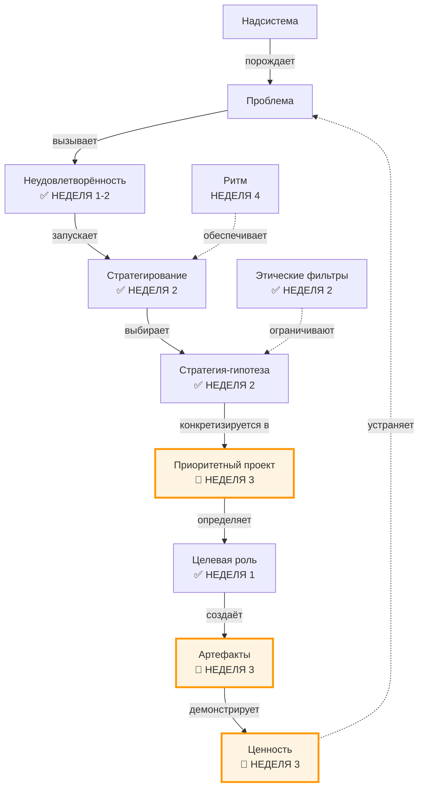
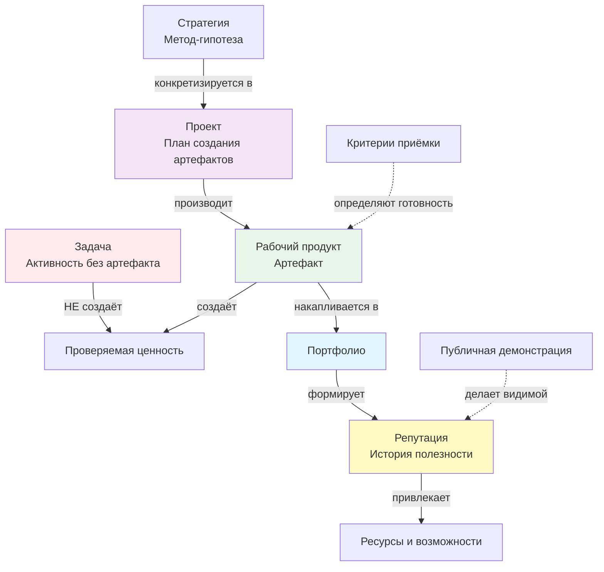
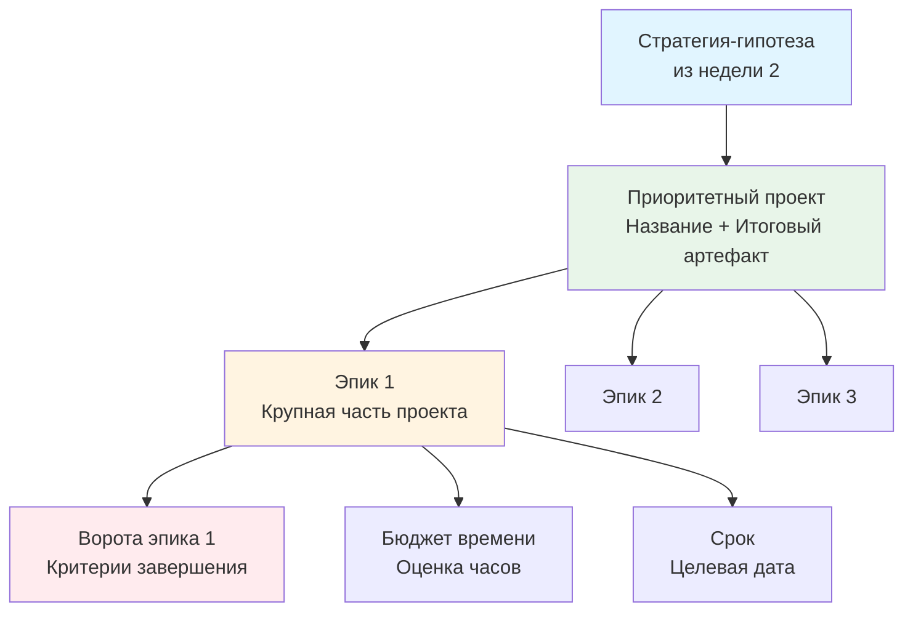

# Неделя 3: Ценность

**Карьерный концепт:** Артефакт > Задача (Рабочий продукт как доказательство мастерства)  
**Практика саморазвития:** Планирование  
**Рабочий продукт недели:** Личный контракт v2.1 (Портфель проектов)  
**Версия:** 1.0  
**Дата обновления:** 30.09.2025

---

## 📋 Оглавление

1. [Цели недели](#цели-недели)
2. [Два режима прохождения](#два-режима-прохождения)
3. [Связь с предыдущими неделями](#связь-с-предыдущими-неделями)
4. [Роли участников](#роли-участников)
5. [Карьерный концепт: Рабочий продукт как единица ценности](#карьерный-концепт-рабочий-продукт-как-единица-ценности)
6. [Практика саморазвития: Планирование](#практика-саморазвития-планирование)
7. [Работа с Личным контрактом](#работа-с-личным-контрактом)
8. [Временной бюджет](#временной-бюджет)
9. [Домашнее задание](#домашнее-задание)
10. [Критерии оценки](#критерии-оценки)
11. [Публичная демонстрация](#публичная-демонстрация)
12. [Часто задаваемые вопросы](#часто-задаваемые-вопросы)
13. [Шаблоны и чек-листы](#шаблоны-и-чек-листы)

---

## 🎯 Цели недели

### Образовательные результаты (Learning Outcomes)

По завершении недели 3 участник будет способен:

1. **Различать задачу, артефакт и проект:**
   - Дать определения трём понятиям
   - Объяснить, почему артефакт важнее задачи
   - Привести 3+ примера рабочих продуктов из своей практики

2. **Переводить стратегию в проекты:**
   - Для 1-2 стратегий (из недели 2) сформулировать приоритетный проект
   - Для каждого проекта определить итоговый артефакт и критерии "готово"
   - Объяснить связь: неудовлетворённость → стратегия → проект → артефакт

3. **Применять практику планирования:**
   - Декомпозировать проект на эпики (крупные части)
   - Для первого эпика определить "ворота" (критерии завершения)
   - Оценить бюджет времени на проект (в часах)

4. **Понимать связь артефактов и репутации:**
   - Объяснить, как артефакты формируют репутацию
   - Назвать 3+ типа артефактов для своей целевой роли
   - Сформулировать план публичной демонстрации артефактов

5. **Создать Личный контракт v2.1:**
   - Заполнить таблицу 3.1 "Портфель проектов" (1-3 проекта)
   - Для каждого проекта: название, итоговый результат, связь с неудовлетворённостью
   - Для приоритетного проекта: описание первого эпика с "воротами"
   - Опубликовать контракт v2.1 для peer review

### Сквозная линия: связь с целью курса

Эта неделя переводит фокус от **"куда я иду"** (стратегия) к **"что я делаю"** (проекты):
- **Рабочий продукт** — единственное проверяемое доказательство движения
- **Планирование** — мост между стратегией и календарём (готовит к неделе 4)
- **Репутация** — накопленная история полезности через публичные артефакты

---

## ⚙️ Два режима прохождения

**Выберите свой режим в зависимости от доступного времени:**

### Минимальный трек (6-8 часов на неделю)

Для тех, кто работает full-time и может выделить ~1 час в день.

**Упрощения:**
- Портфель проектов: **1 проект** (вместо 1-3)
- Эпики: только **первый эпик** с "воротами"
- Заготовка: **300 слов** (вместо 500+)
- Peer review: **1 участник** (вместо 2)

**Критерий "зачёт":** Контракт v2.1 создан с 1 проектом и опубликован.

### Полный трек (10-15 часов на неделю)

Для тех, кто может инвестировать 1.5-2 часа в день.

**Полные требования:** как описано ниже в разделе "Домашнее задание".

---

## 🔗 Связь с предыдущими неделями

### Навигационная карта: где мы сейчас?



**Легенда:**  
✅ Уже проработано (недели 1-2)  
🎯 Фокус этой недели (неделя 3)

---

### Что мы уже сделали (недели 1-2):

✅ **Неделя 1:** Провели аудит ролей (5-10 ролей с артефактами)  
✅ **Неделя 1:** Зафиксировали 3-5 неудовлетворённостей  
✅ **Неделя 2:** Сформулировали стратегию-гипотезу для 1-2 ключевых неудовлетворённостей  
✅ **Неделя 2:** Определили этические фильтры (красные зоны)

- Для самопроверки формулировок ролей используйте диагностический чекер «роль ≠ должность» (10 вопросов) в `weeks/Week_01_Foundation_v2.md`.

### Что делаем на неделе 3:

🎯 **От стратегии к проектам:**
- Неделя 2: "Мой метод — освоить системный анализ"
- Неделя 3: "Проект: Освоение практики системного анализа до уровня создания ТЗ"

🎯 **От ролей к артефактам:**
- Неделя 1: "Роль: Системный аналитик"
- Неделя 3: "Артефакты: 1) Техническое задание на продукт X, 2) Библиотека шаблонов ТЗ"

🎯 **От идеи к плану:**
- Неделя 2: Стратегия (ЧТО и КАК)
- Неделя 3: Проект с эпиками (ЧТО, КАК, КОГДА, СКОЛЬКО ВРЕМЕНИ)

### Практический пример связи:

**Неделя 1:** Роль "Системный аналитик" (хочу расти)  
**Неделя 2:** Стратегия: "Освою системный анализ через онлайн-курс + применение на рабочих задачах"  
**Неделя 3:** Проект: "Освоение практики системного анализа до уровня создания ТЗ"  
→ Итоговый артефакт: "Техническое задание на продукт X + шаблон для команды"  
→ Эпик 1: "Пройти онлайн-курс (модули 1-5)" → 3 месяца, 150 часов  
→ Эпик 2: "Создать первое ТЗ на рабочей задаче" → 1 месяц, 30 часов

---

## 👥 Роли участников

### Роль участника (студента)

**Что делает:**
- Превращает свои стратегии (из недели 2) в конкретные проекты
- Определяет итоговый артефакт для каждого проекта
- Планирует декомпозицию проекта на эпики
- Оценивает бюджет времени на проект
- Обновляет контракт до версии v2.1

**Что НЕ делает:**
- Не путает проект с задачей ("сделать что-то" vs "создать артефакт")
- Не планирует "на всю жизнь" (фокус на 1-3 проектах)
- Не создаёт проекты без связи с неудовлетворённостями

**Ключевая установка:** "Проект — это не список задач, а путь к конкретному артефакту, который устраняет мою неудовлетворённость. Если я не могу назвать итоговый артефакт, это не проект."

### Роль ведущего (фасилитатора)

**Что делает:**
- Объясняет различие задача/проект/артефакт на примерах
- Демонстрирует процесс декомпозиции проекта на эпики
- Задаёт проверочные вопросы: "Что конкретно будет создано?"
- Помогает участникам связать проекты с неудовлетворённостями
- Отлавливает "виртуальные проекты" (без артефакта)

**Инструменты ведущего:**
- Примеры портфелей проектов (3-4 персоны)
- Чек-лист качества описания проекта
- Шаблон декомпозиции "Проект → Эпики → Ворота"

---

## 📖 Карьерный концепт: Рабочий продукт как единица ценности

### Визуализация концепта



**Ключевая идея диаграммы:** Задача — это процесс, артефакт — результат. Репутация строится через историю публичных артефактов, а не через список выполненных задач.

---

### Ключевое различение

| Понятие | Определение | Пример |
|---------|-------------|--------|
| **Задача** | Активность или действие, которое нужно выполнить | "Изучить главу 3", "Провести встречу с командой" |
| **Рабочий продукт (артефакт)** | Проверяемый, осязаемый результат работы, по которому можно судить о пользе | Техническое задание, прототип интерфейса, статья в блоге, код в репозитории |
| **Проект** | План работ, нацеленный на создание конкретного итогового артефакта | "Проект: Создание системы личного финансового учёта" |

### Почему "Артефакт > Задача"?

**Проблема:** Люди фокусируются на активности ("я занят"), а не на результатах. Это приводит к:
- Иллюзии прогресса (много задач выполнено, но ценности не создано)
- Невозможности доказать свою компетенцию (нет артефактов)
- Зависимости от "добросовестности" вместо демонстрации пользы

**Возможность:** Мыслить артефактами = фокус на **проверяемой ценности**:
- Артефакт можно показать, измерить, улучшить
- Портфолио артефактов = доказательство мастерства
- Репутация строится через историю публичных артефактов

---

### Типы рабочих продуктов

| Тип артефакта | Назначение | Примеры |
|---------------|------------|---------|
| **Эпистемический** | Знание, зафиксированное в форме | Статья, техническое задание, документация, учебный курс, презентация |
| **Системный** | Работающая система или её часть | MVP продукта, прототип интерфейса, микросервис, настроенный процесс |
| **Инструментальный** | Инструмент для создания других артефактов | Библиотека кода, шаблон документа, чек-лист, фреймворк |
| **Демонстрационный** | Кейс, показывающий применение метода | Кейс-стади, видео-разбор, публичное выступление, портфолио-проект |

**Правило для проверки:** Если артефакт нельзя "передать другому человеку" (отправить ссылку, файл, показать), то это не артефакт.

---

### Как артефакты формируют репутацию?

**Формула репутации:**

```
Репутация = Σ (Артефакт × Публичность × Польза для надсистемы)
```

**Расшифровка:**
- **Артефакт:** Что создано? (проверяемый результат)
- **Публичность:** Кто видит? (команда, компания, рынок, сообщество)
- **Польза для надсистемы:** Кому стало лучше? (конкретные люди/системы)

**Практический пример:**

| Артефакт | Публичность | Польза | Влияние на репутацию |
|----------|-------------|--------|----------------------|
| "Провёл 10 встреч" | ❌ Это задача, не артефакт | — | Нулевое |
| "Протокол встречи (для себя)" | Только я | Низкая | Минимальное |
| "Шаблон ретроспективы для команды" | Команда (5-10 чел.) | Средняя (ускорил процесс) | Среднее (локальная репутация) |
| "Статья 'Как проводить ретро' в блоге" | Сообщество (100-1000 чел.) | Высокая (помогли многим) | Высокое (публичная репутация) |

**Вывод:** Чем выше публичность и польза артефакта, тем быстрее растёт репутация.

---

### Практическое упражнение (на занятии, 30 мин)

**Задание:** Составить список своих артефактов за последние 3 месяца

**Шаг 1: Выгрузка (10 мин)**

Вспомните и запишите:
- Что вы создали за последние 3 месяца?
- Что можно "показать" как доказательство работы?
- Какие результаты можно передать другому человеку?

**Формат:** Простой список (10-20 пунктов)

**Шаг 2: Классификация (10 мин)**

Для каждого пункта определите:
- ✅ Это артефакт (есть проверяемый результат)
- ❌ Это задача (только активность)

**Пример:**

| Пункт | Артефакт? | Тип (если артефакт) |
|-------|-----------|---------------------|
| "Написал отчёт по проекту X" | ✅ | Эпистемический |
| "Провёл 5 встреч с заказчиком" | ❌ | Задача (нет артефакта) |
| "Создал прототип интерфейса в Figma" | ✅ | Системный |
| "Изучил React" | ❌ | Задача (нет артефакта) |
| "Опубликовал 3 статьи в блоге" | ✅ | Эпистемический |

**Шаг 3: Анализ (10 мин)**

Подсчитайте:
- Сколько артефактов создано за 3 месяца? ___
- Какой процент работы привёл к артефактам? ___
- Сколько артефактов были публичными (видны >10 человек)? ___

**Вывод:** Если артефактов меньше 10-15 за 3 месяца (или <1 в неделю), это сигнал для изменения подхода к работе.

---

⚠️ **Застряли? Не можете вспомнить 10 артефактов?**

**→ Вариант А:** Расширьте временной горизонт до 6 месяцев или года.

**→ Вариант Б:** Включите "микроартефакты": письма с решениями, презентации на встречах, code review комментарии (если они сохранены).

**→ Вариант В:** Если артефактов действительно мало — это сигнал. Возможно, ваша работа слишком сосредоточена на задачах без фиксации результатов. Это первое, что нужно изменить через недельный ритм (неделя 4).

---

### Типичные ошибки

| Ошибка | Пример | Как исправить |
|--------|--------|---------------|
| Путают задачу и артефакт | "Мой артефакт — изучение Python" | "Артефакт — написанный скрипт на Python или статья о том, что изучил" |
| Артефакт без критериев | "Создать прототип" (когда готово?) | "Прототип с 5 ключевыми экранами, прошедший ревью дизайнера" |
| Артефакт "для себя" | "Конспект для личного пользования" | "Заготовка в блоге / шпаргалка для команды" (публичность!) |
| Артефакт без связи с ролью | "Красивая презентация (но моя роль — разработчик)" | Артефакт должен подтверждать рост в целевой роли |

---

## 📝 Практика саморазвития: Планирование

### Что такое планирование (в контексте системной карьеры)?

**Планирование** — это процесс превращения стратегии-гипотезы в конкретный проект с измеримыми результатами (артефактами) и бюджетом времени.

**Ключевое различение:**
- **Стратегия** (неделя 2) — метод устранения неудовлетворённости (ЧТО и КАК)
- **Планирование** (неделя 3) — декомпозиция метода на проекты и эпики (ЧТО, КАК, КОГДА, СКОЛЬКО)

### Почему планирование важно для системной карьеры?

**Проблема:** Стратегия без плана остаётся "красивой идеей":
- Непонятно, с чего начать
- Нет оценки времени (проект "вечный")
- Отсутствуют критерии готовности

**Возможность:** Планирование = мост от стратегии к календарю (неделя 4):
- Стратегия → Проект → Эпики → Недельные спринты (неделя 4) → Слоты в календаре
- Каждый шаг имеет критерии "готово" (ворота)
- Бюджет времени делает прогресс измеримым

---

### Структура плана проекта



**Терминология:**

| Термин | Определение | Пример |
|--------|-------------|--------|
| **Проект** | План создания конкретного итогового артефакта, устраняющего неудовлетворённость | "Проект: Освоение практики системного анализа до уровня создания ТЗ" |
| **Эпик** | Крупная часть проекта, завершающаяся промежуточным артефактом | "Эпик 1: Пройти онлайн-курс (модули 1-5)" |
| **"Ворота"** | Критерии завершения эпика (что должно быть готово для перехода к следующему) | "Все модули пройдены + получена обратная связь по 2 учебным проектам" |
| **Бюджет времени** | Оценка часов, необходимых для завершения эпика/проекта | "150 часов на эпик 1" |

---

### Пошаговая инструкция: от стратегии к проекту

#### **Шаг 1: Выбор стратегии для конкретизации (5 мин)**

Откройте свой контракт v2.0 (неделя 2), раздел "Формулирование стратегии" (Таблица 2.1).

Выберите 1-2 ключевые стратегии, которые хотите превратить в проекты.

**Критерии выбора:**
- Стратегия связана с неудовлетворённостью высокой силы (≥7/10)
- Вы готовы начать работать над ней уже на этой неделе
- Есть ясность, какой итоговый артефакт будет создан

**Пример:**  
Стратегия (неделя 2): "Освою системный анализ для повышения профессиональной ценности"

---

#### **Шаг 2: Формулирование проекта (15 мин)**

Превратите стратегию в проект, ответив на 5 вопросов:

**1. Название проекта (Метод + Итоговый артефакт):**

**Формула:** `[Метод] → [Итоговый рабочий продукт]`

**Пример:**  
"Освоение практики системного анализа до уровня создания ТЗ"  
→ Метод: Освоение практики системного анализа  
→ Артефакт: Способность создавать ТЗ

**2. Итоговый результат (что конкретно будет создано?):**

**Вопрос:** Что я смогу показать как доказательство завершения проекта?

**Пример:**  
- Техническое задание на продукт X (реальный проект)
- Шаблон ТЗ для команды
- Презентация кейса "Как я применил системный анализ"

**3. Связь с неудовлетворённостью (из таблицы 1.1):**

**Вопрос:** Какую неудовлетворённость устраняет этот проект?

**Пример:**  
"Неудовлетворённость в безопасности и уважении из-за стагнации дохода"

**4. Целевая роль (из таблицы 2.1):**

**Вопрос:** Рост в какой роли поддерживает этот проект?

**Пример:**  
"Системный аналитик уровня Middle"

Примечание: шкала мастерства и мостик к грейдам
- Базовая шкала: Объяснение → Умение → Навык → Мастерство.
- Мостик с грейдами рынка: Junior ≈ Объяснение/Умение; Middle ≈ Навык; Senior/Lead ≈ Мастерство. Указывайте обоснование выбора уровня/грейда через артефакты.
- Подробнее см. `weeks/Week_01_Foundation_v2.md` (раздел «Примечание: шкала мастерства»).

**5. Критерий успеха проекта:**

**Вопрос:** Как я пойму, что проект завершён успешно?

**Пример:**  
"Создано ТЗ на реальный проект + получена обратная связь от старшего аналитика + ТЗ принято в работу командой"

---

#### **Шаг 3: Декомпозиция на эпики (20 мин)**

Разбейте проект на 2-4 крупные части (эпики).

**Принцип:** Каждый эпик — это логически завершённый этап с промежуточным артефактом.

**Пример проекта:** "Освоение практики системного анализа до уровня создания ТЗ"

**Эпик 1:** "Пройти онлайн-курс 'Системный анализ' (модули 1-5)"  
→ Промежуточный артефакт: Сертификат + 2 учебных проекта

**Эпик 2:** "Создать первое ТЗ на рабочей задаче"  
→ Промежуточный артефакт: Техническое задание (черновик) + обратная связь от senior аналитика

**Эпик 3:** "Доработать ТЗ до принятия командой"  
→ Промежуточный артефакт: Финальное ТЗ, принятое в работу

**Эпик 4:** "Создать шаблон ТЗ и провести воркшоп для команды"  
→ Промежуточный артефакт: Шаблон + запись воркшопа

**Правило:** Начните с первого эпика. Детальное планирование следующих эпиков — по мере выполнения.

---

#### **Шаг 4: Определение "ворот" для первого эпика (10 мин)**

**"Ворота"** — это критерии завершения эпика. Они отвечают на вопрос: "Что должно быть готово, чтобы перейти к следующему эпику?"

**Шаблон "ворот":**

```markdown
## Ворота эпика [N]: [Название]

**Результат:** [Конкретный артефакт, который будет создан]  
**Срок:** [Целевая дата или длительность]  
**Бюджет времени:** [Оценка часов]  
**Критерии перехода (что должно быть готово):**
- [ ] Критерий 1
- [ ] Критерий 2
- [ ] Критерий 3
```

**Пример для эпика 1:**

```markdown
## Ворота эпика 1: Пройти онлайн-курс

**Результат:** Сертификат + 2 учебных проекта  
**Срок:** 3 месяца  
**Бюджет времени:** 150 часов  

**Критерии перехода:**
- [ ] Завершены все 5 модулей курса
- [ ] Получена обратная связь по 2 учебным проектам
- [ ] Оценка от куратора ≥80%
- [ ] Создана заготовка "Что я узнал о системном анализе" (500+ слов)
```

---

#### **Шаг 5: Оценка бюджета времени (10 мин)**

Для каждого эпика оцените, сколько часов потребуется.

**Метод оценки:**
1. Разбейте эпик на примерные задачи
2. Оцените время на каждую задачу
3. Суммируйте + добавьте 20-30% на непредвиденное

**Пример:**

| Эпик | Примерные задачи | Оценка (часов) |
|------|------------------|----------------|
| **Эпик 1:** Онлайн-курс | 5 модулей × 20 ч = 100 ч<br>2 учебных проекта × 15 ч = 30 ч<br>Заготовка = 5 ч<br>Буфер (+15%) = 20 ч | **155 часов** |
| **Эпик 2:** Первое ТЗ | Анализ задачи = 10 ч<br>Написание ТЗ = 15 ч<br>Итерации с ревью = 5 ч | **30 часов** |

**Итого по проекту:** ~185 часов

**Проверка реалистичности:**  
185 часов ÷ 10 часов в неделю = **~18 недель (4.5 месяца)**

---

⚠️ **Застряли? Не знаете, как оценить время?**

**→ Вариант А (сверху вниз):**  
Определите срок: "Хочу завершить за 3 месяца".  
Посчитайте доступное время: 3 мес × 4 нед × 10 ч = 120 часов.  
Декомпозируйте проект так, чтобы уложиться в этот бюджет.

**→ Вариант Б (снизу вверх):**  
Разбейте первый эпик на задачи недели (week-sized tasks).  
Оцените каждую в часах (2-8 часов на задачу).  
Суммируйте и экстраполируйте на весь проект.

**→ Вариант В (по аналогии):**  
Вспомните похожий проект из прошлого. Сколько времени он занял?  
Скорректируйте оценку с учётом нового опыта (±20-30%).

---

### Типичные ошибки в планировании

| Ошибка | Симптом | Как исправить |
|--------|---------|---------------|
| Проект без итогового артефакта | "Проект: Изучить Python" | Добавьте артефакт: "Создать библиотеку из 10 скриптов для автоматизации X" |
| Эпики = задачи | "Эпик 1: Прочитать главу 3" | Эпик — крупная часть (2-4 недели работы): "Освоить модуль 1-3 курса" |
| "Ворота" абстрактные | "Ворота: Курс пройден" | Конкретизируйте: "Все модули + 2 проекта + обратная связь" |
| Недооценка времени | "Проект за 2 недели" (а нужно 200 часов) | Проверьте: часы ÷ доступно в неделю = реалистичный срок |
| Нет связи с неудовлетворённостью | "Проект интересный, но зачем?" | Каждый проект должен явно адресовать неудовлетворённость из Таблицы 1.1 |

---

## 📝 Работа с Личным контрактом

### Что создаём на неделе 3?

**Личный контракт v2.1: Портфель проектов**

Структура обновлений v2.0 → v2.1:

```markdown
# Личный контракт развития v2.1

## 1. Манифест
[Без изменений из v2.0]

## 2. Принципы
[Без изменений из v2.0]

## 3. Аудит ролей
[Без изменений из v1.0]

## 4. Анализ неудовлетворённостей
[Без изменений из v2.0, возможна лёгкая актуализация]

## 5. Формулирование стратегии
[Без изменений из v2.0]

## 6. Портфель проектов ⬅️ НОВОЕ
[Таблица 3.1 из Personal Contract для 1-3 проектов]

## 7. Этические фильтры / Красные зоны
[Без изменений из v2.0]

## 8. Операционные обязательства (пока пусто)
[Заполним на неделе 4]
```

---

### Пошаговая инструкция: обновление контракта

#### **Шаг 1: Актуализация неудовлетворённостей (опционально, 10 мин)**

Перечитайте Таблицу 1.1 "Анализ неудовлетворённостей".

Изменилось ли что-то за неделю?
- Появились новые неудовлетворённости?
- Старые ослабли или усилились?

Если да — обновите таблицу. Если нет — переходите к шагу 2.

---

#### **Шаг 2: Заполнение таблицы "Портфель проектов" (60 мин — основная работа)**

Заполните Таблицу 4.1 «Портфель проектов» из `Personal_Contract_v4.0_Template.md` для 1–3 проектов.

**Таблица 3.1: Анализ и выбор приоритетных проектов**

| Название проекта | Связанные неудовлетворённости | Текущий статус | Обоснование выбора | Ожидаемый итоговый результат | Стратегическое направление (эпики) | Описание первого эпика |
|------------------|------------------------------|----------------|--------------------|------------------------------|-----------------------------------|------------------------|
| [Метод + Артефакт] | Из таблицы 1.1 | Приоритетный / В ожидании / На паузе | Почему именно этот? | Конкретный артефакт | Список из 2-4 эпиков | Результат, срок, бюджет, ворота |

**Как заполнять:**

**Столбец 1: Название проекта**  
Формула: `[Метод] + [Итоговый артефакт]`

**Пример:**  
"Освоение практики системного анализа до уровня создания ТЗ"

---

**Столбец 2: Связанные неудовлетворённости**  
Укажите 1-2 неудовлетворённости из Таблицы 1.1, которые устраняет этот проект.

**Пример:**  
"Неудовлетворённость в безопасности и уважении из-за стагнации дохода (сила эмоции: 8/10)"

---

**Столбец 3: Текущий статус**  
Выберите один из трёх:
- **Приоритетный:** Работаю над ним прямо сейчас (неделя 4: выделю слоты)
- **В ожидании:** Запущу после завершения приоритетного
- **На паузе:** Временно отложен (причины?)

**Пример:**  
"Приоритетный"

---

**Столбец 4: Обоснование выбора**  
Почему именно этот проект, а не другие?

**Критерии обоснования:**
- Сила неудовлетворённости (≥7/10)
- Управляемость (могу повлиять)
- Связь с целевой ролью
- Реалистичность (есть ресурсы: время, деньги, доступ)

**Пример:**  
"Соответствует критерию 'Сила эмоции' (8/10). Успешная реализация напрямую повлияет на доход. Онлайн-курс доступен, бюджет позволяет."

---

**Столбец 5: Ожидаемый итоговый результат**  
Конкретный артефакт, который будет создан.

**Пример:**  
"1) Техническое задание на продукт X (реальный проект)  
2) Шаблон ТЗ для команды  
3) Презентация кейса"

---

**Столбец 6: Стратегическое направление (эпики)**  
Список из 2-4 эпиков (крупных частей проекта).

**Пример:**  
"1. Пройти онлайн-курс (модули 1-5)  
2. Создать первое ТЗ на рабочей задаче  
3. Доработать ТЗ до принятия командой  
4. Создать шаблон и провести воркшоп"

---

**Столбец 7: Описание первого эпика**  
Детальное описание первого эпика с "воротами".

**Шаблон:**

```
Результат: [Артефакт эпика]
Срок: [Длительность или дата]
Бюджет: [Часы]
Ворота: [Критерии завершения]
- [ ] Критерий 1
- [ ] Критерий 2
- [ ] Критерий 3
```

**Пример:**

```
Результат: Сертификат + 2 учебных проекта
Срок: 3 месяца
Бюджет: 150 часов
Ворота:
- [ ] Завершены все 5 модулей курса
- [ ] Получена обратная связь по 2 учебным проектам
- [ ] Оценка от куратора ≥80%
```

---

#### **Шаг 3: Приоритизация проектов (15 мин)**

Если у вас 2-3 проекта в таблице, определите приоритет.

**Правило:** Только **1 приоритетный проект** одновременно (на него выделяются слоты в календаре на неделе 4).

**Критерии выбора приоритетного:**
1. Связан с неудовлетворённостью наивысшей силы (≥8/10)
2. Первый эпик можно начать прямо сейчас (нет блокеров)
3. Проект ведёт к быстрой обратной связи (первый артефакт через 1-2 недели)

---

#### **Шаг 4: Самопроверка (10 мин)**

**Чек-лист перед публикацией v2.1:**

```markdown
[ ] Таблица 3.1 заполнена для 1-3 проектов
[ ] Для каждого проекта: название по формуле [Метод + Артефакт]
[ ] Указана связь с неудовлетворённостями (из Таблицы 1.1)
[ ] Указан итоговый результат (конкретные артефакты)
[ ] Перечислены эпики (2-4 крупные части)
[ ] Для первого эпика: результат, срок, бюджет, ворота
[ ] Определён 1 приоритетный проект
[ ] Контракт сохранён как v2.1
```

---

## ⏱️ Временной бюджет

### Синхронная работа (вебинар/занятие): 2.5-3 часа

| Блок | Время | Формат | Содержание |
|------|-------|--------|------------|
| **Введение: от стратегии к проектам** | 15 мин | Лекция | Связь с неделями 1-2, зачем планировать проекты |
| **Концепт: Артефакт > Задача** | 30 мин | Лекция + примеры | Различения, типы артефактов, связь с репутацией |
| **Упражнение: Аудит артефактов за 3 месяца** | 30 мин | Практика | Составление списка своих артефактов, анализ |
| **Перерыв** | 10 мин | — | — |
| **Практика: Планирование** | 40 мин | Демо + практика | Демо декомпозиции проекта (15 мин) + планирование своего проекта (25 мин) |
| **Концепт: Репутация через артефакты** | 20 мин | Лекция + обсуждение | Формула репутации, публичность, портфолио |
| **Упражнение: От стратегии к проекту** | 30 мин | Практика | Превращение стратегии (неделя 2) в проект с эпиками |
| **Peer review черновиков** | 20 мин | Взаимная рецензия | Обмен черновиками проектов, обратная связь |
| **Работа с контрактом v2.1** | 15 мин | Инструкция + Q&A | Как обновить контракт до v2.1 |
| **Домашнее задание и итоги** | 10 мин | Инструкция | Что сделать до следующей недели |

---

### Асинхронная работа (самостоятельно): 5-7 часов

| Задача | Время | Когда | Результат |
|--------|-------|-------|-----------|
| Завершить аудит артефактов за 3 месяца | 30 мин | День 1 | Список из 10-20 артефактов с классификацией |
| Превратить 1-2 стратегии в проекты | 1.5 часа | День 2-3 | Описание проектов: название, артефакт, эпики |
| Определить "ворота" для первого эпика | 45 мин | День 3 | Чёткие критерии завершения эпика |
| Оценить бюджет времени проектов | 30 мин | День 3-4 | Оценка в часах для каждого эпика |
| Заполнить таблицу 3.1 "Портфель проектов" | 1.5 часа | День 4-5 | Таблица с 1-3 проектами |
| Написать заготовку "Мой приоритетный проект" | 1 час | День 5-6 | Заготовка 400+ слов |
| Обновить контракт до v2.1 | 1 час | День 5-6 | Чистовая версия v2.1 |
| Опубликовать контракт v2.1 | 30 мин | День 6 | Ссылка в канале + пост |
| Дать peer review 2 участникам | 1 час | День 6-7 | Комментарии по шаблону |

**Итого:** 7.5-10 часов (с учётом синхронной работы)

---

## 🎯 Домашнее задание

### Обязательный минимум (для получения зачёта)

1. **Провести аудит артефактов**
   - ✅ Составлен список артефактов за последние 3 месяца (минимум 5)
   - ✅ Для каждого определён тип (эпистемический, системный, инструментальный)
   - ✅ Подсчитан процент работы, приведшей к артефактам

2. **Превратить стратегию в проект**
   - ✅ Выбрана 1 стратегия из недели 2
   - ✅ Сформулировано название проекта (метод + артефакт)
   - ✅ Указан итоговый результат (конкретные артефакты)
   - ✅ Проект декомпозирован на 2-4 эпика

3. **Определить "ворота" первого эпика**
   - ✅ Указан результат эпика (промежуточный артефакт)
   - ✅ Указан срок и бюджет времени
   - ✅ Перечислены критерии завершения (3-5 пунктов)

4. **Обновить Личный контракт до v2.1**
   - ✅ Заполнена таблица 3.1 "Портфель проектов" (минимум 1 проект)
   - ✅ Для проекта: название, неудовлетворённость, итоговый результат, эпики
   - ✅ Для первого эпика: результат, срок, бюджет, ворота

5. **Опубликовать контракт v2.1**
   - ✅ Ссылка размещена в канале курса
   - ✅ Доступ на чтение открыт

6. **Дать peer review 2 участникам**
   - ✅ Комментарии по шаблону "2+1"
   - ✅ Фокус на качестве описания проекта (артефакт, эпики, ворота)

---

### Дополнительно (для углубления)

- Создать визуальную "Карту проекта" (схема в Miro/Draw.io: проект → эпики → ворота)
- Для 2-3 проектов заполнить полную таблицу портфеля
- Написать вторую заготовку: "Какие артефакты подтверждают мой рост в роли X?"
- Создать публичное портфолио артефактов (GitHub, личный сайт, Notion-страница)

---

## ✅ Критерии оценки

### Критерии качества описания проекта

| Критерий | Проверка | Примеры "Да" / "Нет" |
|----------|----------|----------------------|
| **1. Наличие итогового артефакта** | Указан ли конкретный рабочий продукт? | ✅ "ТЗ на продукт X + шаблон" / ❌ "Изучить системный анализ" |
| **2. Связь с неудовлетворённостью** | Проект явно адресует неудовлетворённость из Таблицы 1.1? | ✅ Явная связь / ❌ Проект "интересный, но зачем?" |
| **3. Декомпозиция на эпики** | Проект разбит на 2-4 логические части? | ✅ "Эпик 1... Эпик 2..." / ❌ Только название проекта |
| **4. "Ворота" эпика конкретны** | Критерии завершения проверяемы? | ✅ "Модули пройдены + 2 проекта + ревью" / ❌ "Курс завершён" |
| **5. Реалистичная оценка времени** | Бюджет времени соотносится с доступным временем? | ✅ 150 ч ÷ 10 ч/нед = 15 нед / ❌ "200 ч за 2 недели" |

---

### Шкала качества планирования (0-10 баллов)

| Баллы | Уровень | Описание | Что присутствует |
|-------|---------|----------|------------------|
| **9-10** | Отлично | Проект детально спланирован, связан с неудовлетворённостью, реалистичен | • Итоговый артефакт конкретен<br>• 3-4 эпика с промежуточными артефактами<br>• "Ворота" измеримы<br>• Бюджет времени реалистичен<br>• Обоснование выбора по 3+ критериям |
| **7-8** | Хорошо | Проект спланирован, есть артефакт и эпики | • Итоговый артефакт указан<br>• 2-3 эпика<br>• "Ворота" есть, но не все измеримы<br>• Бюджет времени указан |
| **5-6** | Удовлетворительно | Проект описан, но планирование поверхностное | • Артефакт указан общо<br>• 1-2 эпика<br>• "Ворота" абстрактны<br>• Бюджет времени завышен/занижен |
| **3-4** | Слабо | Проект больше похож на задачу | • Нет чёткого артефакта<br>• Нет декомпозиции<br>• Нет "ворот"<br>• Нет оценки времени |
| **0-2** | Очень слабо | Проект не сформулирован | • Только общая идея<br>• Путаница: проект/задача/артефакт |

---

### Чек-лист самопроверки перед публикацией

```markdown
## Контракт v2.1

[ ] Таблица 3.1 заполнена для 1-3 проектов
[ ] Для каждого проекта: название по формуле [Метод + Артефакт]
[ ] Указан итоговый результат (конкретные артефакты, не абстракции)
[ ] Проект явно связан с неудовлетворённостью из Таблицы 1.1
[ ] Проект декомпозирован на 2-4 эпика
[ ] Для первого эпика: результат, срок, бюджет, ворота
[ ] "Ворота" эпика — проверяемые критерии (не "готово", а "что именно")
[ ] Бюджет времени реалистичен (проверка: часы ÷ доступно в неделю)
[ ] Определён 1 приоритетный проект
[ ] Указан ожидаемый уровень мастерства по шкале (Объяснение/Умение/Навык/Мастерство) и (опц.) грейд (Junior/Middle/Senior/Lead)

## Аудит артефактов

[ ] Составлен список артефактов за 3 месяца (минимум 5)
[ ] Для каждого определён тип (эпистемический/системный/инструментальный)
[ ] Подсчитан % работы, приведшей к артефактам

## Публикация

[ ] Контракт v2.1 доступен по ссылке
[ ] Написан пост в канале с кратким резюме
[ ] Даны комментарии 2 участникам
```

---

### Шаблон peer review для недели 3

```markdown
## Peer review для [Имя участника] — Контракт v2.1

**Два сильных места в описании проекта:**
1. [Что сильно: артефакт конкретен, декомпозиция логична, связь с неудовлетворённостью ясна?]
2. [Что сильно: "ворота" измеримы, бюджет реалистичен?]

**Одно улучшение:**
- [Что можно усилить: конкретнее артефакт, детальнее эпики, измеримее "ворота"?]

**Вопрос для углубления:**
- [Вопрос, который поможет уточнить проект]
- Например: "Как поймёшь, что первый эпик завершён? Какой артефакт будет на руках?"
```

---

## 📢 Публичная демонстрация

### Шаблон публичного поста (недельный отчёт)

```markdown
# Неделя 3: Портфель проектов

## Что сделал:
- ✅ Провёл аудит артефактов за 3 месяца: [N] артефактов
- ✅ Превратил стратегию в проект: [Название проекта]
- ✅ Декомпозировал проект на [N] эпиков
- ✅ Обновил контракт до v2.1: [ссылка]
- ✅ Дал peer review 2 участникам

## Ключевой инсайт про планирование:
[Один конкретный инсайт: что понял про процесс планирования? 
Например: "Главное открытие — проект это не про задачи, а про артефакт. 
Если я не могу назвать итоговый рабочий продукт, это не проект."]

## Мой приоритетный проект:
**Название:** [Метод + Артефакт]  
**Итоговый результат:** [Конкретные артефакты]  
**Первый эпик:** [Название]  
→ Срок: [X месяцев]  
→ Бюджет: [X часов]  
→ Ворота: [3-5 критериев]

## Планы на неделю 4:
- [Начну работать над первым эпиком: конкретные задачи]
- [Встрою проект в недельный ритм]
```

---

## ❓ Часто задаваемые вопросы

### О рабочих продуктах

**Q: Чем артефакт отличается от задачи?**

A: **Задача** — это активность ("провести встречу", "изучить главу"). **Артефакт** — это результат, который можно показать, передать, измерить ("протокол встречи", "конспект главы"). Правило: если результат работы нельзя "отправить по ссылке" или "показать", это не артефакт.

**Q: Обязательно ли артефакты должны быть публичными?**

A: Не обязательно, но желательно. Публичные артефакты (видимые >10 человек) формируют репутацию быстрее. Начните с артефактов для команды, затем расширяйте аудиторию.

**Q: Что делать, если моя работа не предполагает создание артефактов?**

A: Пересмотрите взгляд на работу. Любая работа оставляет следы: решения, документы, улучшения процессов. Фиксируйте их. Например: "Провёл 5 встреч" → "Создал регламент проведения встреч для команды". Если работа действительно не создаёт артефакты — возможно, пора менять работу (это сигнал).

---

### О планировании

**Q: Как понять, сколько эпиков нужно?**

A: **Правило:** Эпик — это 2-4 недели работы (20-40 часов при 10 ч/неделю). Если проект на 3 месяца (120 часов), разумно 3-4 эпика. Не дробите слишком мелко (эпик ≠ задача) и не делайте слишком крупно (эпик ≠ весь проект).

**Q: Что делать, если не знаю, сколько времени займёт проект?**

A: Начните с первого эпика. Детально распланируйте его (задачи на 2-4 недели). После завершения первого эпика уточните оценку для следующих. **Принцип:** Планируйте детально только ближайший эпик, для остальных — приблизительная оценка.

**Q: Можно ли работать над несколькими проектами параллельно?**

A: **На неделе 3 — да** (можете описать 2-3 проекта в портфеле). **На неделе 4 — нет** (только 1 приоритетный проект получает слоты в календаре). Параллельная работа распыляет внимание и снижает скорость завершения.

---

### О связи проектов и неудовлетворённостей

**Q: Что делать, если проект не связан ни с одной неудовлетворённостью?**

A: Два варианта:  
1) Пересмотрите проект. Возможно, он "интересный, но не важный" — отложите его в бэклог.  
2) Добавьте новую неудовлетворённость в Таблицу 1.1. Возможно, вы просто не формализовали её раньше.

**Q: Один проект может устранять несколько неудовлетворённостей?**

A: Да, и это отличный признак! Такие проекты называются "высокоприоритетными". Укажите все связанные неудовлетворённости в столбце 2 таблицы 3.1.

---

## 📋 Шаблоны и чек-листы

### Шаблон: Описание проекта

```markdown
# Проект: [Метод + Итоговый артефакт]

**Дата создания:** [ДД.ММ.ГГГГ]  
**Статус:** Приоритетный / В ожидании / На паузе  
**Теги:** #проект #неделя3

---

## 1. Итоговый результат

**Что конкретно будет создано:**
- Артефакт 1: [Описание]
- Артефакт 2: [Описание]
- Артефакт 3: [Описание]

**Критерий успеха проекта:**
[Как пойму, что проект завершён успешно?]

---

## 2. Связь с неудовлетворённостью

**Неудовлетворённость (из Таблицы 1.1):**
[Какую неудовлетворённость устраняет этот проект?]

**Сила эмоции:** [X/10]

**Целевая роль:**
[Рост в какой роли поддерживает этот проект?]

**Уровень мастерства (для артефакта проекта):** [Объяснение/Умение/Навык/Мастерство] (обоснуйте через артефакты)
**Грейд (опционально):** [Junior/Middle/Senior/Lead]

---

## 3. Стратегическое направление (эпики)

### Эпик 1: [Название]
**Результат:** [Промежуточный артефакт]  
**Срок:** [Длительность]  
**Бюджет:** [Часы]

### Эпик 2: [Название]
**Результат:** [Промежуточный артефакт]  
**Срок:** [Длительность]  
**Бюджет:** [Часы]

### Эпик 3: [Название]
**Результат:** [Промежуточный артефакт]  
**Срок:** [Длительность]  
**Бюджет:** [Часы]

**Итого по проекту:** [Общее время]

---

## 4. "Ворота" первого эпика

**Эпик 1:** [Название]

**Результат:** [Конкретный артефакт]  
**Срок:** [Дата или длительность]  
**Бюджет:** [Часы]

**Критерии завершения:**
- [ ] Критерий 1
- [ ] Критерий 2
- [ ] Критерий 3
- [ ] Критерий 4

Примечание: итоговый артефакт эпика должен подтверждать уровень по шкале (Объяснение/Умение/Навык/Мастерство) и, при желании, соответствующий грейд (Junior/Middle/Senior/Lead).

**Следующий шаг после завершения:**
[Что делаю после прохождения "ворот"?]
```

---

### Чек-лист: Повестка сессии планирования (60 мин)

```markdown
## Сессия планирования — Неделя 3

**Дата:** _________  
**Время:** _________ - _________  
**Длительность:** 60 мин

---

### Блок 1: Выбор стратегии (5 мин)
[ ] Открыл контракт v2.0, таблицу 2.1 "Формулирование стратегии"
[ ] Выбрал 1-2 стратегии для конкретизации
[ ] Критерии выбора: сила неудовлетворённости (≥7), готовность начать

---

### Блок 2: Формулирование проекта (15 мин)
[ ] Название проекта по формуле: [Метод + Артефакт]
[ ] Итоговый результат: конкретные артефакты (3-5)
[ ] Связь с неудовлетворённостью из Таблицы 1.1
[ ] Целевая роль
[ ] Критерий успеха проекта

---

### Блок 3: Декомпозиция на эпики (20 мин)
[ ] Проект разбит на 2-4 эпика
[ ] Для каждого эпика: название, промежуточный артефакт
[ ] Логика эпиков: каждый — завершённый этап

---

### Блок 4: "Ворота" первого эпика (10 мин)
[ ] Результат эпика (промежуточный артефакт)
[ ] Срок (длительность или дата)
[ ] Бюджет времени (оценка часов)
[ ] Критерии завершения (3-5 пунктов, проверяемые)

---

### Блок 5: Оценка бюджета (10 мин)
[ ] Для каждого эпика: примерная оценка часов
[ ] Итого по проекту: сумма часов
[ ] Проверка реалистичности: часы ÷ доступно в неделю = сроки

---

**Рабочий продукт сессии:**
- [ ] Заполнена таблица 3.1 для 1-3 проектов
- [ ] Создан документ "Описание проекта" для приоритетного
```

---

## 🔗 Связь с другими неделями

**Неделя 1 (Фундамент):** Роли из недели 1 → теперь создаём артефакты, подтверждающие рост в этих ролях

**Неделя 2 (Направление):** Стратегия из недели 2 → превратили в конкретный проект с артефактами

**Неделя 4 (Ритм):** Проект из недели 3 → встроим в недельный спринт с защищёнными слотами в календаре

**Неделя 5-8:** Проекты будут корректироваться на основе обратной связи, окружения, публичных демонстраций

---

## 📚 Дополнительные материалы

### Для чтения (опционально)

1. **Концепт "Рабочий продукт (артефакт)":**
   - Файл: `systemic_career_v2.3 - concepts.csv`, концепт C_44
   - Связанные понятия: C_8 (Инкремент), C_45 (Репутация), C_43 (Публичность)

2. **Концепт "Приоритетный проект":**
   - Файл: `systemic_career_v2.3 - concepts.csv`, концепт C_37
   - Связанные понятия: C_51 (Спринт), C_50 (Слоты), C_22 (Личный контракт)

3. **Практика "Планирование":**
   - Файл: `systemic_career_v2.3 - concepts.csv` (раздел о планировании)
   - Связанные понятия: C_1 ("Ворота"), C_20 (Критерии приёмки)

### Примеры (для вдохновения)

- **Пример 1:** [Заполненный контракт v2.1 — Анна (Начинающий аналитик)](../examples/persona_1_analyst_contract_v2.1.md)
  - Портфель из 2 проектов
  - Для каждого: итоговый артефакт, эпики, "ворота" первого эпика
  - Реалистичная оценка времени (150 ч на 3 месяца)
  
- **Пример 2:** [Заполненный контракт v2.1 — Сергей (Опытный разработчик)](../examples/persona_2_dev_contract_v2.1.md) *(скоро)*

**Как использовать примеры:**
1. Прочитайте раздел "Портфель проектов" в контракте Анны
2. Обратите внимание на формулу названия проекта (Метод + Артефакт)
3. Посмотрите, как описаны "ворота" первого эпика (конкретные, измеримые критерии)
4. Используйте как образец структуры, но содержание адаптируйте под свой проект

---

**Версия документа:** 1.0  
**Дата последнего обновления:** 30.09.2025  
**Автор:** AI-методолог + команда курса "Системная карьера"  
**Обратная связь:** [ссылка на форму обратной связи]

---

*Этот документ — живой артефакт, который обновляется на основе feedback участников и результатов пилотных запусков.*
