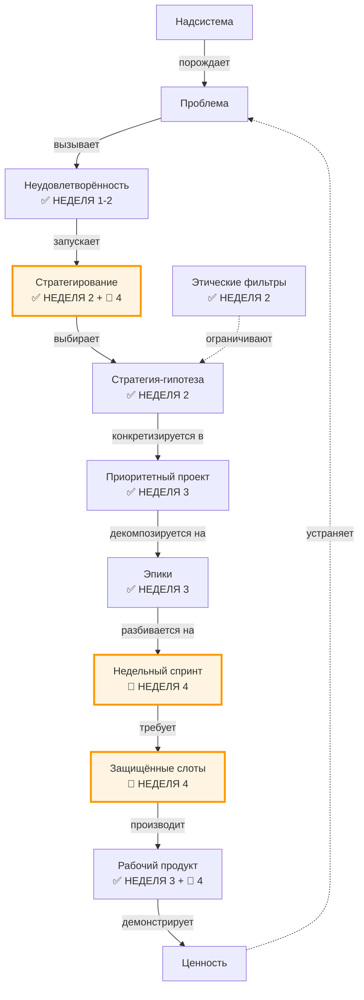
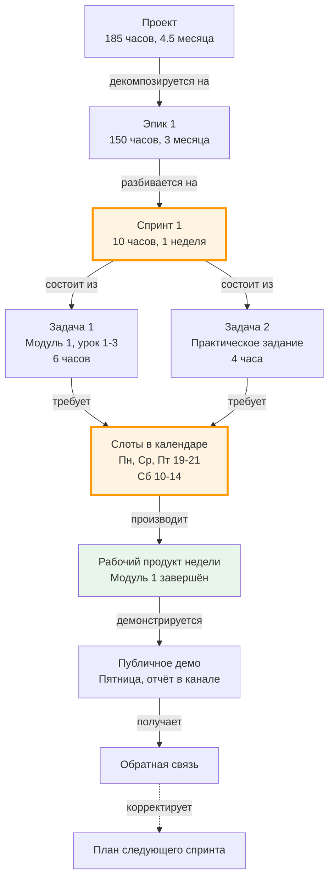
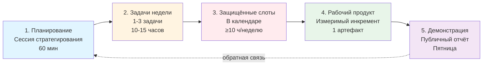

# Неделя 4: Ритм

**Карьерный концепт:** Недельный спринт как базовая единица прогресса  
**Практика саморазвития:** Инвестирование и учёт времени  
**Рабочий продукт недели:** Личный контракт v3.0 (Операционная модель)  
**Версия:** 1.0  
**Дата обновления:** 30.09.2025

---

## 📋 Оглавление

1. [Цели недели](#цели-недели)
2. [Два режима прохождения](#два-режима-прохождения)
3. [Связь с предыдущими неделями](#связь-с-предыдущими-неделями)
4. [Роли участников](#роли-участников)
5. [Карьерный концепт: Недельный спринт](#карьерный-концепт-недельный-спринт)
6. [Практика саморазвития: Инвестирование и учёт времени](#практика-саморазвития-инвестирование-и-учёт-времени)
7. [Работа с Личным контрактом](#работа-с-личным-контрактом)
8. [Временной бюджет](#временной-бюджет)
9. [Домашнее задание](#домашнее-задание)
10. [Критерии оценки](#критерии-оценки)
11. [Публичная демонстрация](#публичная-демонстрация)
12. [Часто задаваемые вопросы](#часто-задаваемые-вопросы)
13. [Шаблоны и чек-листы](#шаблоны-и-чек-листы)

---

## 🎯 Цели недели

### Образовательные результаты (Learning Outcomes)

По завершении недели 4 участник будет способен:

1. **Понимать недельный спринт как единицу прогресса:**
   - Объяснить, почему неделя — оптимальная единица планирования
   - Различать спринт, эпик, проект
   - Назвать 5 элементов недельного спринта

2. **Применять практику инвестирования времени:**
   - Различать "инвестированное" и "потраченное" время
   - Выделить защищённые слоты под приоритетный проект (≥10 ч/неделю)
   - Вести учёт времени (план/факт) минимум 1 неделю

3. **Декомпозировать эпик на задачи недели:**
   - Для первого эпика (неделя 3) сформулировать задачи на 1 неделю
   - Для каждой задачи: название, критерии приёмки, оценка часов
   - Забронировать слоты в реальном календаре

4. **Встроить сессию стратегирования в ритм:**
   - Провести первую полноценную сессию стратегирования (60 мин)
   - Заполнить чек-лист повестки: ретро → смыслы → стратегия → спринт
   - Назначить день и время для еженедельной сессии

5. **Создать Личный контракт v3.0:**
   - Заполнить таблицу 4.1 "Задачи на неделю" (1-3 задачи по приоритетному проекту)
   - Добавить раздел "Операционные обязательства"
   - Зафиксировать защищённые слоты в календаре (скриншот/ссылка)
   - Опубликовать контракт v3.0 для peer review

### Сквозная линия: связь с целью курса

Эта неделя **замыкает цикл** "от смыслов к календарю":
- **Недельный спринт** — операционный ритм, который переводит стратегии в действия
- **Защищённые слоты** — гарантия исполнения (не планы, а реальное время)
- **Операционные обязательства** — договор с самим собой, который делает контракт "живым"

---

## ⚙️ Два режима прохождения

**Выберите свой режим в зависимости от доступного времени:**

### Минимальный трек (6-8 часов на неделю)

Для тех, кто работает full-time и может выделить ~1 час в день.

**Упрощения:**
- Задачи на неделю: **1 задача** по приоритетному проекту (вместо 1-3)
- Защищённые слоты: **минимум 6 часов** в неделю (вместо 10)
- Сессия стратегирования: **30 минут** (упрощённая повестка)
- Учёт времени: **только факт** (без детального плана)

**Критерий "зачёт":** Контракт v3.0 создан, 1 слот забронирован в календаре, проведена упрощённая сессия.

### Полный трек (10-15 часов на неделю)

Для тех, кто может инвестировать 1.5-2 часа в день.

**Полные требования:** как описано ниже в разделе "Домашнее задание".

---

## 🔗 Связь с предыдущими неделями

### Навигационная карта: где мы сейчас?



**Легенда:**  
✅ Уже проработано (недели 1-3)  
🎯 Фокус этой недели (неделя 4)

---

### Что мы уже сделали (недели 1-3):

✅ **Неделя 1:** Провели аудит ролей → определили, в каких хотим расти  
✅ **Неделя 1:** Зафиксировали неудовлетворённости → источник энергии для движения  
✅ **Неделя 2:** Сформулировали стратегию-гипотезу → метод устранения неудовлетворённости  
✅ **Неделя 2:** Определили этические фильтры → защита от "ложных целей"  
✅ **Неделя 3:** Превратили стратегию в проект → с итоговым артефактом  
✅ **Неделя 3:** Декомпозировали проект на эпики → с "воротами" и бюджетом

### Что делаем на неделе 4:

🎯 **От эпиков к спринтам:**
- Неделя 3: "Эпик 1: Пройти онлайн-курс (150 часов, 3 месяца)"
- Неделя 4: "Спринт недели: Завершить модуль 1 курса (10 часов)"

🎯 **От проектов к календарю:**
- Неделя 3: "Проект с бюджетом 150 часов"
- Неделя 4: "Защищённые слоты: пн, ср, пт 19:00-21:00 + сб 10:00-14:00 = 10 ч/неделю"

🎯 **От идеи к ритму:**
- Недели 1-3: Создали стратегический план
- Неделя 4: Встроили план в еженедельный операционный ритм

---

### Практический пример связи (сквозной кейс):

**Неделя 1:** Роль "Системный аналитик" (хочу расти)  
**Неделя 2:** Стратегия: "Освою системный анализ через онлайн-курс + применение на рабочих задачах"  
**Неделя 3:** Проект "Освоение практики системного анализа до уровня создания ТЗ"  
→ Эпик 1: "Пройти онлайн-курс (модули 1-5)" — 150 часов, 3 месяца  
**Неделя 4:** Спринт недели № 1  
→ Задача: "Завершить модуль 1 курса (3 урока + 1 практическое задание)"  
→ Критерии приёмки: Все уроки просмотрены + задание загружено на платформу  
→ Оценка: 10 часов  
→ Слоты в календаре:
- Пн 19:00-21:00 (2 ч)
- Ср 19:00-21:00 (2 ч)
- Пт 19:00-21:00 (2 ч)
- Сб 10:00-14:00 (4 ч)
→ **Итого: 10 часов защищённого времени**

---

## 👥 Роли участников

### Роль участника (студента)

**Что делает:**
- Декомпозирует первый эпик на задачи недели
- Бронирует защищённые слоты в реальном календаре
- Проводит первую полноценную сессию стратегирования (60 мин)
- Ведёт учёт времени (план/факт) минимум 1 неделю
- Обновляет контракт до версии v3.0 (операционные обязательства)

**Что НЕ делает:**
- Не планирует "вообще" (без привязки к календарю)
- Не надеется на "найду время" (только защищённые слоты)
- Не берёт на неделю больше, чем реально может (перегруз = провал)

**Ключевая установка:** "Если задача не в календаре — её не существует. Мой контракт v3.0 превращает абстрактные намерения в конкретные часы в конкретные дни."

### Роль ведущего (фасилитатора)

**Что делает:**
- Объясняет различие спринт/эпик/проект на примерах
- Демонстрирует процесс декомпозиции эпика на задачи недели
- Задаёт проверочные вопросы: "Где в календаре слоты?"
- Помогает участникам реалистично оценить недельный бюджет
- Отлавливает "виртуальные планы" (без слотов в календаре)

**Инструменты ведущего:**
- Примеры недельных спринтов (3-4 персоны)
- Чек-лист повестки сессии стратегирования
- Шаблон "План работ на неделю" (Таблица 4.1)

---

## 📖 Карьерный концепт: Недельный спринт

### Визуализация концепта



**Ключевая идея диаграммы:** Спринт — это мост от долгосрочного плана (эпик) к конкретным часам в календаре. Без спринта проект остаётся абстракцией.

---

### Ключевое различение

| Понятие | Определение | Горизонт | Пример |
|---------|-------------|----------|--------|
| **Проект** | План создания итогового артефакта | 3-12 месяцев | "Освоение практики системного анализа до уровня создания ТЗ" (4.5 мес, 185 ч) |
| **Эпик** | Крупная часть проекта с промежуточным артефактом | 1-3 месяца | "Пройти онлайн-курс (модули 1-5)" (3 мес, 150 ч) |
| **Спринт** | Базовая единица прогресса с измеримым инкрементом | **1 неделя** | "Завершить модуль 1 курса" (1 нед, 10 ч) |
| **Задача** | Конкретное действие в рамках спринта | 2-8 часов | "Пройти уроки 1-3 модуля 1" (6 ч) |
| **Слот** | Защищённое окно времени в календаре | 1-4 часа | "Понедельник 19:00-21:00" (2 ч) |

---

### Почему неделя — базовая единица?

**Проблема с другими горизонтами:**

| Горизонт | Проблема |
|----------|----------|
| **День** | Слишком короткий: не видно прогресса, легко "потерять день" |
| **Месяц** | Слишком длинный: нет оперативной обратной связи, легко "потерять месяц" |
| **Квартал/Год** | Для стратегии, не для операций |

**Преимущества недели:**
1. **Достаточно времени** для создания проверяемого артефакта (10-15 ч → 1 модуль курса / 1 прототип / 1 статья)
2. **Достаточно короткая** для оперативной корректировки (заметил проблему → исправил на следующей неделе)
3. **Естественный ритм:** 5 рабочих дней + 2 выходных (удобно для планирования)
4. **Синхронизация с командой:** большинство команд работает спринтами по 1-2 недели

---

### 5 элементов недельного спринта



**Элемент 1: Планирование (сессия стратегирования)**
- Когда: начало недели (воскресенье вечер или понедельник утро)
- Длительность: 60 минут
- Результат: план недели (таблица 4.1) + слоты в календаре

**Элемент 2: Задачи недели**
- Количество: 1-3 задачи по приоритетному проекту
- Размер: 2-8 часов на задачу (week-sized tasks)
- Критерии: для каждой задачи — критерии приёмки

**Элемент 3: Защищённые слоты**
- Минимум: 10 часов в неделю (для полного трека)
- Формат: конкретные дни и время в календаре
- Защита: приоритет как у "встречи с CEO" (неотменяемые)

**Элемент 4: Рабочий продукт недели**
- Что: измеримый инкремент (1 модуль / 1 прототип / 1 статья)
- Критерий: можно показать, передать, измерить
- Связь: с первым эпиком приоритетного проекта
- Уровень: подтверждает уровень по шкале (Объяснение → Умение → Навык → Мастерство)
- Грейд (опционально): укажите соответствие Junior/Middle/Senior/Lead и обоснование через артефакты

**Элемент 5: Публичная демонстрация**
- Когда: конец недели (пятница вечер или воскресенье)
- Формат: пост в канале / обновление контракта / демо в команде
- Результат: обратная связь → корректировка следующего спринта

---

### Формула недельного прогресса

```
Прогресс = Σ (Рабочий продукт недели × Соответствие критериям приёмки)
```

**Антипаттерны (как НЕ надо):**

| Антипаттерн | Симптом | Почему не работает |
|-------------|---------|-------------------|
| "Найду время" | Задачи есть, слотов нет | Время не "находится", его выделяют заранее |
| "Сделаю много" | 5-7 задач на неделю | Перегруз → ничего не завершено → демотивация |
| "Буду гибким" | Нет фиксированных слотов | "Гибкость" = всё откладывается на потом |
| "Работаю, когда вдохновение" | Случайное распределение времени | Вдохновение не приходит само, его создаёт ритм |

---

### Практическое упражнение (на занятии, 40 мин)

**Задание:** Спланировать первый недельный спринт

**Шаг 1: Выбор эпика (5 мин)**

Откройте свой контракт v2.1 (неделя 3), раздел "Портфель проектов", первый эпик приоритетного проекта.

**Пример:**  
Эпик 1: "Пройти онлайн-курс (модули 1-5)" — 150 часов, 3 месяца

---

**Шаг 2: Декомпозиция на задачи (15 мин)**

Разбейте первый эпик на задачи размером 2-8 часов (week-sized).

**Принцип:** Задача недели — это **атомарный шаг**, который завершается проверяемым результатом.

**Вопросы для декомпозиции:**
- Что конкретно нужно сделать на этой неделе, чтобы двигаться к "воротам" эпика?
- Какой минимальный результат покажет прогресс?
- Что я смогу "показать" в конце недели?

**Пример декомпозиции:**

**Эпик 1:** "Пройти онлайн-курс (модули 1-5)" → 150 ч, 3 мес

**Спринт недели № 1 (первая неделя):**

| Задача | Описание | Критерии приёмки | Оценка (ч) |
|--------|----------|------------------|-----------|
| **Задача 1** | Завершить уроки 1-3 модуля 1 | Все видео просмотрены + конспект создан | 6 |
| **Задача 2** | Выполнить практическое задание модуля 1 | Задание загружено на платформу + получена оценка | 4 |

**Итого:** 10 часов

---

**Шаг 3: Определение критериев приёмки (10 мин)**

Для каждой задачи ответьте на вопрос: "Как я пойму, что задача завершена?"

**Формула критериев:**
- ✅ Конкретный результат (что создано?)
- ✅ Проверяемое условие (как проверить?)
- ✅ Минимальный стандарт качества (насколько хорошо?)

**Примеры:**

| Задача | ❌ Плохой критерий | ✅ Хороший критерий |
|--------|-------------------|---------------------|
| Завершить модуль 1 | "Модуль пройден" | "Все 3 урока просмотрены + конспект на 2+ страницы создан + тест пройден с результатом ≥80%" |
| Написать статью | "Статья написана" | "Черновик на 800+ слов + структура из 5 разделов + 2 примера кода + вычитан" |
| Создать прототип | "Прототип готов" | "5 ключевых экранов в Figma + навигация между экранами + получена обратная связь от 1 пользователя" |

---

**Шаг 4: Бронирование слотов (10 мин)**

Откройте свой календарь (Google Calendar / Outlook / бумажный ежедневник).

**Задание:** Забронируйте минимум 10 часов на этой неделе под задачи спринта.

**Правила бронирования:**
1. Слот = конкретный день + время (например: "Пн 19:00-21:00")
2. Слот защищён = приоритет "Встреча с CEO" (не отменять)
3. Слоты распределены по неделе (не все в субботу!)
4. Один слот = 1-4 часа (удобно для фокуса)

**Пример:**

| День | Время | Длительность | Задача | Примечание |
|------|-------|-------------|--------|------------|
| Понедельник | 19:00-21:00 | 2 ч | Задача 1 (уроки 1-2) | После работы |
| Среда | 19:00-21:00 | 2 ч | Задача 1 (урок 3 + конспект) | После работы |
| Пятница | 19:00-21:00 | 2 ч | Задача 2 (практика) | После работы |
| Суббота | 10:00-14:00 | 4 ч | Задача 2 (доработка + загрузка) | Утро |

**Итого:** 10 часов

---

⚠️ **Застряли? Не можете найти 10 часов в неделю?**

**→ Вариант А (минимальный трек):**  
Снизьте планку до 6 часов в неделю (1 час в день, 6 дней).  
Например: Пн-Пт 7:00-8:00 (утро до работы) + Сб 10:00-11:00.

**→ Вариант Б (аудит времени):**  
Проведите аудит: куда уходит время сейчас?  
Найдите "пожирателей времени" (соцсети, сериалы, бесцельный сёрфинг).  
Замените 1-2 часа "траты" на "инвестирование".

**→ Вариант В (пересмотр проекта):**  
Возможно, проект слишком амбициозный для текущей жизненной ситуации.  
Снизьте бюджет эпика (не 150 ч за 3 мес, а 75 ч за 3 мес).  
Или перенесите проект в "В ожидании" до изменения обстоятельств.

---

## 📝 Практика саморазвития: Инвестирование и учёт времени

### Что такое инвестирование времени?

**Инвестирование времени** — это практика осознанного выделения защищённых часов под проекты саморазвития, с разделением на:
- **Инвестированное время:** вложено в получение нового мастерства (обучение, эксперименты)
- **Потраченное время:** применение имеющегося мастерства (рабочие задачи, рутина)

**Ключевое различение:**
- **Трата времени** — использование ресурса без накопления капитала
- **Инвестирование времени** — использование ресурса с накоплением капитала (мастерство, репутация, артефакты)

---

### Почему инвестирование важно для системной карьеры?

**Проблема:** Люди тратят всё время на текучку, не оставляя ресурса на развитие:
- 100% времени на "потрачено" (рабочие задачи) → застой в мастерстве
- Нет накопления капитала → через год на том же уровне
- Зависимость от работодателя → нет портфолио, нет переносимых навыков

**Возможность:** Выделение 10-15% времени на инвестиции = экспоненциальный рост:
- Инвестированное время → новое мастерство → новые возможности → рост дохода
- Портфолио артефактов → репутация → независимость от одного работодателя
- Переносимые навыки → устойчивость карьеры

**Формула:** 
```
10 часов/неделю × 50 недель/год = 500 часов инвестиций/год
```

**Что это даёт:**
- Освоение 2-3 новых практик в год (по 150-200 ч каждая)
- Создание 20-30 публичных артефактов (по 15-25 ч каждый)
- Переход на следующий уровень мастерства в целевой роли

---

### Различение: Инвестированное vs Потраченное

| Критерий | Инвестированное время | Потраченное время |
|----------|----------------------|-------------------|
| **Цель** | Получить новое мастерство | Применить имеющееся мастерство |
| **Результат** | Рост способности (компетенция, артефакт) | Выполнение задачи (рутина) |
| **Накопление** | Создаётся капитал (портфолио, репутация) | Не создаётся капитал |
| **Переносимость** | Навык переносим (на другую работу) | Навык специфичен (для этой работы) |
| **Примеры** | Прохождение курса, создание статьи, эксперимент с новой технологией | Рабочие задачи "как обычно", совещания, текучка |

**Важно:** Граница условна. Иногда рабочая задача может быть инвестицией, если:
- Вы осознанно выбрали её для обучения (практико-ориентированное обучение)
- Результат останется в вашем портфолио (публичный артефакт)
- Вы применяете новый метод, а не привычный

---

### Правило 10/50/40

Рекомендуемое распределение времени в неделю:

```
Всего времени: 60-70 часов бодрствования (после сна)
- 40-50 ч: Работа (потраченное)
- 10 ч: Инвестиции (приоритетный проект)
- 10-20 ч: Жизнь (семья, отдых, быт)
```

**Для участников курса:**
- **Минимальный трек:** 6 часов инвестиций в неделю
- **Полный трек:** 10-15 часов инвестиций в неделю

**Проверка:** Если вы не можете выделить даже 6 часов — это сигнал о несбалансированности жизни (перегруз, выгорание, неэффективная работа).

---

### Учёт времени: План/Факт

**Зачем вести учёт?**
1. **Осознанность:** "Куда реально уходит время?" (часто не совпадает с ожиданиями)
2. **Мотивация:** Видеть прогресс (10 часов за неделю → 50 за месяц → 200 за квартал)
3. **Калибровка оценок:** Учиться реалистично оценивать задачи (планировал 4 ч, потратил 6 → в следующий раз оценю точнее)
4. **Защита приоритетов:** Если факт <<< план → искать причины и устранять

---

### Инструменты учёта времени

| Инструмент | Подходит для | Плюсы | Минусы |
|-----------|-------------|-------|--------|
| **Pomodoro-трекер** (Focus To-Do, Forest) | Простой учёт | Простота, встроенный таймер | Только факт, нет связи с проектами |
| **Toggl / Clockify** | Детальный учёт | Проекты, задачи, отчёты | Требует дисциплины старт/стоп |
| **Google Calendar** | Планирование + факт | Визуализация, доступность | Ручной подсчёт времени |
| **Таблица Excel/Notion** | Гибкий учёт | Полный контроль, кастомизация | Требует времени на заполнение |

**Рекомендация для недели 4:** Начните с простого — Google Calendar + ручной учёт в таблице.

---

### Шаблон учёта времени (Таблица 4.1)

```markdown
| Задача недели | Критерии приёмки | План (ч) | Факт (ч) | Разница | Статус |
|---------------|------------------|----------|----------|---------|--------|
| Завершить модуль 1 (уроки 1-3) | Все видео + конспект | 6 | 7 | +1 | ✅ Готово |
| Практическое задание | Загружено + оценка ≥80% | 4 | 5 | +1 | ✅ Готово |
| **Итого** | | **10** | **12** | **+2** | |
```

**Анализ:**
- План: 10 часов
- Факт: 12 часов
- Вывод: Недооценил на 20%. В следующий раз добавлю 20% буфера.

---

### Практическое упражнение (на занятии, 20 мин)

**Задание:** Настроить систему учёта времени на первую неделю

**Шаг 1: Выбор инструмента (5 мин)**

Выберите один инструмент для учёта времени на первую неделю:
- Google Calendar (рекомендуется для начала)
- Toggl / Clockify
- Таблица в Notion / Excel

**Шаг 2: Создание таблицы План/Факт (10 мин)**

Создайте таблицу для учёта (можно в том же документе, что и контракт):

```markdown
# Учёт времени — Неделя № [X]

**Дата:** [ДД.ММ - ДД.ММ.ГГГГ]

| Задача | Критерии приёмки | План (ч) | Факт (ч) | Разница | Статус |
|--------|------------------|----------|----------|---------|--------|
| [Задача 1] | [...] | X | | | |
| [Задача 2] | [...] | Y | | | |
| **Итого** | | **Z** | | | |
```

**Шаг 3: Настройка напоминаний (5 мин)**

Установите напоминания для фиксации факта:
- Конец каждого слота: "Записать факт времени"
- Конец недели (воскресенье): "Подвести итоги: план vs факт"

---

⚠️ **Застряли? Не хотите вести учёт времени?**

**→ Вариант А (минимум):**  
Учитывайте только **факт** времени на приоритетный проект (без плана).  
Цель: просто видеть, сколько реально инвестировали за неделю.

**→ Вариант Б (автоматизация):**  
Используйте Pomodoro-трекер (25 мин работы = 1 помодоро).  
Считайте помодоро за неделю: 20 помодоро = ~8 часов чистого времени.

**→ Вариант В (отложить):**  
Если учёт кажется слишком сложным, начните без него.  
Но **обязательно** вернитесь к учёту через 2-3 недели для калибровки.

---

## 📝 Работа с Личным контрактом

### Что создаём на неделе 4?

**Личный контракт v3.0: Операционная модель**

Структура обновлений v2.1 → v3.0:

```markdown
# Личный контракт развития v3.0

## 1. Манифест
[Без изменений]

## 2. Принципы
[Без изменений]

## 3. Аудит ролей
[Без изменений]

## 4. Анализ неудовлетворённостей
[Без изменений, возможна лёгкая актуализация]

## 5. Формулирование стратегии
[Без изменений]

## 6. Портфель проектов
[Без изменений, но можно обновить статус]

## 7. Этические фильтры
[Без изменений]

## 8. Операционные обязательства ⬅️ НОВОЕ
[Раздел 2 из Personal Contract v3.2]

## 9. Недельный спринт ⬅️ НОВОЕ
[Таблица 4.1 "Задачи на неделю"]

## 10. Защищённые слоты ⬅️ НОВОЕ
[Скриншот календаря или список слотов]
```

---

### Пошаговая инструкция: обновление контракта

#### **Шаг 1: Добавление раздела "Операционные обязательства" (20 мин)**

Скопируйте раздел 2 из `Personal Contract v3.2.md` и адаптируйте под себя.

**Ключевые пункты:**

```markdown
## 8. Операционные обязательства

Я, [Ваше имя], принимаю на себя следующие обязательства:

### 8.1. Еженедельная сессия стратегирования

**Обязательство:** Проводить неотменяемую сессию стратегирования каждую **[День недели] в [Время]**, длительностью **60 минут**.

**Приоритет:** Равный встрече с ключевым заказчиком / CEO.

**Повестка (обязательная):**
1. Ретроспектива: анализ выполнения плана за прошлую неделю
2. Синхронизация со смыслами: пересмотр неудовлетворённостей
3. Актуализация стратегии: письменное размышление о методах
4. Выбор приоритетных проектов: формальный выбор 1 проекта для фокусировки
5. Планирование спринта: декомпозиция на задачи + бронирование слотов

**Инструмент контроля:** Защищённый слот в календаре.

---

### 8.2. Время на приоритетные проекты

**Обязательство:** Выделять не менее **[X] часов в неделю** на приоритетный проект.

**Минимум:**
- Полный трек: 10 часов/неделю
- Минимальный трек: 6 часов/неделю

**Защита:** Слоты бронируются заранее и не отменяются (приоритет "Встреча с CEO").

**Инструмент контроля:** Календарь + таблица учёта времени (План/Факт).

---

### 8.3. Публичная демонстрация

**Обязательство:** Каждую неделю публиковать минимум **1 рабочий продукт** (инкремент приоритетного проекта).

**Формат:** 
- Пост в канале курса (краткий отчёт)
- Обновление контракта (статус задач)
- Ссылка на артефакт (если применимо)

**Дедлайн:** Конец недели (пятница 23:59 или воскресенье 23:59).

**Инструмент контроля:** Публичный канал / блог / репозиторий.

---

### 8.4. Ежедневное саморазвитие (опционально)

**Обязательство:** Выделять не менее **[Y] минут/день** на практики саморазвития.

**Минимум:** 30 минут/день (систематическое медленное чтение, мышление письмом, фиксация заметок).

**Инструмент контроля:** Лог чтения / экзокортекс (заметки).
```

**Важно:** Замените [X], [Y], [День недели], [Время], [Ваше имя] на ваши значения.

---

#### **Шаг 2: Заполнение таблицы "Задачи на неделю" (30 мин — основная работа)**

Создайте таблицу 4.1 для первого недельного спринта.

**Таблица 4.1: Задачи по приоритетному проекту на неделю**

| Приоритетный проект | Задача на неделю | Критерии приёмки | Проверяющий/Формат ревью | Публичная демонстрация | План/Факт (ч) |
|---------------------|------------------|------------------|--------------------------|------------------------|---------------|
| [Название проекта] | [Задача 1] | [Критерии] | [Кто/как проверит] | [Где и когда покажу] | X / ? |
| | [Задача 2] | [Критерии] | [Кто/как проверит] | [Где и когда покажу] | Y / ? |
| | **Итого** | | | | **Z / ?** |

**Как заполнять:**

**Столбец 1: Приоритетный проект**  
Название вашего приоритетного проекта из Таблицы 3.1 (неделя 3).

**Пример:**  
"Освоение практики системного анализа до уровня создания ТЗ"

---

**Столбец 2: Задача на неделю**  
Конкретная задача из декомпозиции первого эпика (2-8 часов).

**Пример:**  
1. "Завершить уроки 1-3 модуля 1 курса"
2. "Выполнить практическое задание модуля 1"

---

**Столбец 3: Критерии приёмки**  
Как пойму, что задача завершена? (конкретные, проверяемые условия)

**Пример:**  
1. "Все 3 видеоурока просмотрены + конспект создан (2+ страницы)"
2. "Задание загружено на платформу + получена оценка ≥80%"

---

**Столбец 4: Проверяющий/Формат ревью**  
Кто даст обратную связь? (peer review, наставник, сообщество)

**Пример:**  
1. "Самопроверка + пост в канале курса"
2. "Куратор курса через платформу"

---

**Столбец 5: Публичная демонстрация**  
Где и когда покажу результат?

**Пример:**  
1. "Пост в канале курса, пятница 18:00"
2. "Ссылка на выполненное задание в посте, воскресенье 20:00"

---

**Столбец 6: План/Факт (ч)**  
Оценка времени (план) и фактически потраченное (факт — заполняется в конце недели).

**Пример:**  
1. "6 / ?" (планирую 6 часов, факт заполню позже)
2. "4 / ?" (планирую 4 часа)

**Итого:** "10 / ?" (общий бюджет недели)

---

#### **Шаг 3: Фиксация защищённых слотов (15 мин)**

Откройте свой календарь и забронируйте слоты под задачи недели.

**Два варианта:**

**Вариант А: Скриншот календаря**  
Сделайте скриншот недели с забронированными слотами и вставьте в контракт.

```markdown
## 10. Защищённые слоты (неделя № [X])


**Итого:** [X] часов забронировано.
```

**Вариант Б: Список слотов**  
Перечислите слоты текстом:

```markdown
## 10. Защищённые слоты (неделя № [X])

| День | Время | Длительность | Задача |
|------|-------|-------------|--------|
| Понедельник | 19:00-21:00 | 2 ч | Задача 1 (уроки 1-2) |
| Среда | 19:00-21:00 | 2 ч | Задача 1 (урок 3 + конспект) |
| Пятница | 19:00-21:00 | 2 ч | Задача 2 (практика) |
| Суббота | 10:00-14:00 | 4 ч | Задача 2 (доработка) |

**Итого:** 10 часов
```

---

#### **Шаг 4: Самопроверка (10 мин)**

**Чек-лист перед публикацией v3.0:**

```markdown
[ ] Раздел "Операционные обязательства" добавлен и адаптирован
[ ] Указан день и время еженедельной сессии стратегирования
[ ] Указан минимальный бюджет времени на приоритетный проект (6-10 ч)
[ ] Таблица 4.1 "Задачи на неделю" заполнена (1-3 задачи)
[ ] Для каждой задачи: критерии приёмки, оценка часов, формат демонстрации
[ ] Защищённые слоты забронированы в календаре (скриншот или список)
[ ] Общий бюджет слотов ≥ минимальному обязательству (6-10 ч)
[ ] В отчёте по артефакту недели указан уровень (Объяснение/Умение/Навык/Мастерство) и (опц.) грейд (Junior/Middle/Senior/Lead)
[ ] Контракт сохранён как v3.0
```

---

## ⏱️ Временной бюджет

### Синхронная работа (вебинар/занятие): 2.5-3 часа

| Блок | Время | Формат | Содержание |
|------|-------|--------|------------|
| **Введение: от проектов к ритму** | 15 мин | Лекция | Связь с неделями 1-3, зачем нужен недельный ритм |
| **Концепт: Недельный спринт** | 30 мин | Лекция + примеры | 5 элементов спринта, различение спринт/эпик/проект |
| **Упражнение: Декомпозиция эпика на задачи** | 25 мин | Практика | Разбить первый эпик на задачи недели (week-sized) |
| **Перерыв** | 10 мин | — | — |
| **Практика: Инвестирование времени** | 35 мин | Лекция + практика | Лекция (15 мин) + бронирование слотов (20 мин) |
| **Концепт: Защищённые слоты** | 20 мин | Демо + обсуждение | Демо календаря ведущего, правила защиты слотов |
| **Упражнение: Первая сессия стратегирования** | 30 мин | Практика | Мини-сессия по чек-листу повестки |
| **Работа с контрактом v3.0** | 20 мин | Инструкция + Q&A | Как обновить контракт: операционные обязательства |
| **Домашнее задание и итоги** | 10 мин | Инструкция | Что сделать на первой неделе спринта |

---

### Асинхронная работа (самостоятельно): 6-8 часов

| Задача | Время | Когда | Результат |
|--------|-------|-------|-----------|
| Провести полную сессию стратегирования | 1 час | День 1 (начало недели) | План недели + таблица 4.1 |
| Декомпозировать эпик на задачи недели | 45 мин | День 1 | 1-3 задачи с критериями приёмки |
| Забронировать слоты в календаре | 30 мин | День 1 | 6-10 часов защищённого времени |
| Добавить раздел "Операционные обязательства" | 30 мин | День 1-2 | Адаптированный раздел в контракте |
| Заполнить таблицу 4.1 "Задачи на неделю" | 45 мин | День 1-2 | Таблица с планом недели |
| Обновить контракт до v3.0 | 1 час | День 2 | Чистовая версия v3.0 |
| Опубликовать контракт v3.0 | 30 мин | День 2 | Ссылка в канале + пост |
| **Работать по спринту** | **6-10 ч** | **Дни 3-7** | **Рабочий продукт недели** |
| Дать peer review 2 участникам | 1 час | День 6-7 | Комментарии по шаблону |
| Публичная демонстрация рабочего продукта | 30 мин | День 7 (конец недели) | Пост с результатами недели |

**Итого:** 13-18 часов (включая работу по спринту)

---

### Сводный недельный бюджет (рекомендация)

| Блок | Полный трек | Минимальный трек | Примечание |
|---|---|---|---|
| Проект (приоритетный) | 10 ч | 6 ч | Слоты обязательны; ядро недели |
| Окружение/каналы (неделя 5) | 2–3 ч | 1–2 ч | Может частично совмещаться с демо |
| SSR/обучение (неделя 6) | 2–3 ч | 1–2 ч | Можно встроить в проект при совпадении цели |
| Коммуникация (неделя 7) | 1–2 ч | 0.5–1 ч | Питч, диалоги, one‑pager; может входить в проектные слоты |
| Восстановление (неделя 8) | по регламенту | по регламенту | Не урезать; см. регламент восстановления |

Примечание:
- Эти блоки планируются в одном календаре слотов (см. «Защищённые слоты» и `weeks/Week_08_Resilience.md`).
- «Коммуникация» и часть «SSR» могут входить в проектные слоты, если напрямую поддерживают артефакт недели.
- Детали по окружению/каналам — `weeks/Week_05_Context.md`; по SSR — `weeks/Week_06_Mastery.md`; по коммуникации — `weeks/Week_07_Communication.md`.

---

## 🎯 Домашнее задание

### Обязательный минимум (для получения зачёта)

1. **Провести первую полноценную сессию стратегирования**
   - ✅ Проведена по чек-листу повестки (60 мин или 30 мин для минимального трека)
   - ✅ Создан план недели: 1-3 задачи по приоритетному проекту
   - ✅ Для каждой задачи: критерии приёмки, оценка часов

2. **Забронировать защищённые слоты в календаре**
   - ✅ Минимум 6 часов (минимальный трек) или 10 часов (полный трек)
   - ✅ Слоты распределены по неделе (не все в один день)
   - ✅ Скриншот календаря или список слотов добавлен в контракт

3. **Обновить Личный контракт до v3.0**
   - ✅ Добавлен раздел "Операционные обязательства" (адаптирован под себя)
   - ✅ Заполнена таблица 4.1 "Задачи на неделю"
   - ✅ Указан день и время еженедельной сессии стратегирования

4. **Опубликовать контракт v3.0**
   - ✅ Ссылка размещена в канале курса
   - ✅ Доступ на чтение открыт

5. **Отработать первый недельный спринт**
   - ✅ Работал в защищённых слотах
   - ✅ Вёл учёт времени (план/факт)
   - ✅ Создал рабочий продукт недели (инкремент)

6. **Публично продемонстрировать результат**
   - ✅ Пост в конце недели с результатами
   - ✅ Обновлена таблица 4.1 (заполнен столбец "Факт")
   - ✅ Даны комментарии 2 участникам

---

### Дополнительно (для углубления)

- Провести 2 полноценные сессии стратегирования (в начале и конце недели)
- Настроить автоматический трекер времени (Toggl, Clockify)
- Написать заготовку: "Что я узнал о себе из первого недельного спринта?"
- Создать шаблон повестки сессии стратегирования (для повторного использования)

---

## ✅ Критерии оценки

### Критерии качества недельного спринта

| Критерий | Проверка | Примеры "Да" / "Нет" |
|----------|----------|----------------------|
| **1. Задачи week-sized** | Каждая задача 2-8 часов? | ✅ "Завершить модуль (6 ч)" / ❌ "Пройти весь курс (150 ч)" |
| **2. Критерии приёмки конкретны** | Можно проверить готовность? | ✅ "Все уроки + конспект + тест ≥80%" / ❌ "Модуль пройден" |
| **3. Слоты забронированы** | Есть конкретные дни и время? | ✅ "Пн 19-21, Ср 19-21, Сб 10-14" / ❌ "Найду время" |
| **4. Реалистичный бюджет** | План соответствует доступному времени? | ✅ 10 ч плана = 10 ч слотов / ❌ 20 ч плана при 10 ч слотов |
| **5. Публичная демонстрация запланирована** | Где и когда покажу результат? | ✅ "Пост в канале, пятница 18:00" / ❌ Не указано |

---

### Шкала качества спринта (0-10 баллов)

| Баллы | Уровень | Описание | Что присутствует |
|-------|---------|----------|------------------|
| **9-10** | Отлично | Спринт детально спланирован, реалистичен, встроен в календарь | • 2-3 задачи week-sized<br>• Критерии приёмки измеримы<br>• Слоты забронированы (скриншот)<br>• Бюджет реалистичен<br>• Публичная демонстрация запланирована |
| **7-8** | Хорошо | Спринт спланирован, есть задачи и слоты | • 1-2 задачи<br>• Критерии есть, но не все измеримы<br>• Слоты указаны (список)<br>• Бюджет указан |
| **5-6** | Удовлетворительно | Спринт описан, но планирование поверхностное | • 1 задача<br>• Критерии абстрактны<br>• Слоты не конкретны ("вечером")<br>• Бюджет завышен/занижен |
| **3-4** | Слабо | Спринт больше похож на список желаний | • Только идеи, нет задач<br>• Нет критериев<br>• Нет слотов<br>• Нет оценки времени |
| **0-2** | Очень слабо | Спринт не спланирован | • Только общая идея<br>• Путаница: спринт/эпик/проект |

---

### Чек-лист самопроверки после первого спринта

```markdown
## Спринт недели № 1 — Ретроспектива

### Планирование
[ ] Провёл сессию стратегирования (60 мин или 30 мин)
[ ] Создал план недели (таблица 4.1)
[ ] Забронировал слоты в календаре

### Исполнение
[ ] Работал в защищённых слотах
[ ] Вёл учёт времени (план/факт)
[ ] Выполнил минимум 1 задачу

### Результат
[ ] Создал рабочий продукт недели (инкремент)
[ ] Опубликовал результат (пост в канале)
[ ] Обновил таблицу 4.1 (столбец "Факт")

### Обратная связь
[ ] Дал peer review 2 участникам
[ ] Получил обратную связь на свой результат

### Выводы
[ ] Проанализировал план vs факт
[ ] Зафиксировал, что сработало, что нет
[ ] Скорректировал план на следующую неделю
```

---

### Шаблон peer review для недели 4

```markdown
## Peer review для [Имя участника] — Контракт v3.0 + Спринт недели

**Два сильных места в спринте:**
1. [Что сильно: задачи week-sized, критерии конкретны, слоты забронированы?]
2. [Что сильно: публичная демонстрация, учёт времени?]

**Одно улучшение:**
- [Что можно усилить: конкретнее критерии, реалистичнее бюджет, защита слотов?]

**Вопрос для следующего спринта:**
- [Вопрос для размышления]
- Например: "План vs факт: в чём разница? Что это говорит об оценке времени?"
```

---

## 📢 Публичная демонстрация

### Шаблон публичного поста (недельный отчёт после спринта)

```markdown
# Неделя 4: Первый недельный спринт

## Что сделал:
- ✅ Провёл первую сессию стратегирования (60 мин)
- ✅ Обновил контракт до v3.0: [ссылка]
- ✅ Забронировал защищённые слоты: [X] часов
- ✅ Отработал первый спринт
- ✅ Создал рабочий продукт недели: [Название]

## Рабочий продукт недели:
**Что создано:** [Конкретный артефакт]  
**Ссылка:** [Если применимо]  
**Критерии приёмки:** [Что выполнено]

## План vs Факт:
**План:** [X] часов  
**Факт:** [Y] часов  
**Разница:** [±Z] часов  
**Вывод:** [Что это означает? Недооценил/переоценил? Почему?]

## Ключевой инсайт про ритм:
[Один конкретный инсайт: что понял про недельный ритм? 
Например: "Главное открытие — защищённые слоты работают! Когда время забронировано, 
я действительно сажусь и работаю. Без слотов всё откладывается."]

## Планы на следующую неделю:
- [Задачи спринта недели № 2]
- [Что скорректирую в подходе]
```

---

## ❓ Часто задаваемые вопросы

### О недельном спринте

**Q: Можно ли менять план недели в процессе?**

A: **Да, но осознанно.** Спринт — это не жёсткий контракт. Если появились новые обстоятельства (срочная задача, болезнь), план можно скорректировать. **Но:** 1) Зафиксируйте причину изменения, 2) Скорректируйте слоты, 3) Проанализируйте на ретро, можно ли было этого избежать.

**Q: Что делать, если не успел выполнить задачи недели?**

A: **Анализ:** Почему не успел? Три типичные причины:  
1) **Недооценка времени** → В следующий раз добавь 30% буфера  
2) **Внешние срочности** → Слоты не защищены, нужно усилить защиту  
3) **Прокрастинация** → Задачи слишком крупные или непонятные, декомпозируй мельче

**Q: Обязательно ли планировать каждую неделю?**

A: **Да.** Еженедельная сессия стратегирования — это **ядро** системной карьеры. Без неё контракт превращается в "красивый документ", который не связан с реальной жизнью. Если не можете 60 мин — начните с 30 мин (минимальный трек).

---

### О защищённых слотах

**Q: Как защитить слоты от срочных задач на работе?**

A: Три тактики:  
1) **Обозначить границы:** "После 19:00 я не на работе" (если позволяет культура)  
2) **Альтернативные слоты:** Если вечером срочности, используйте утро (6:00-8:00 до работы)  
3) **Выходные:** Суббота/воскресенье часто более защищены от рабочих срочностей

**Q: Можно ли работать не в забронированные слоты?**

A: **Можно, но не вместо.** Слоты — это **минимум**. Если нашли дополнительное время — отлично, работайте. Но слоты должны быть отработаны в любом случае.

**Q: Что делать, если постоянно нарушаю свои слоты?**

A: **Сигнал о проблеме.** Возможные причины:  
1) Слоты выбраны нереалистично (слишком поздно вечером, когда устал)  
2) Нет реальной мотивации (проект не связан с глубокой неудовлетворённостью)  
3) Перегруз в жизни (работа, семья) — нужно пересмотреть бюджет времени

---

### Об учёте времени

**Q: Обязательно ли вести учёт времени?**

A: **Для недели 4 — да** (хотя бы упрощённый). Это эксперимент для калибровки: "Сколько реально уходит времени?" После 2-3 недель можете упростить (учитывать только факт, без детального плана). Но полностью отказываться не рекомендуется — без учёта нет осознанности.

**Q: Что делать, если факт сильно отличается от плана?**

A: **Анализируй и калибруй.** Это нормально для первых спринтов.  
- Факт > План на 50%+ → Недооценил сложность, в следующий раз добавь буфер  
- Факт < План на 50%+ → Переоценил или отвлекался, анализируй причины

**Q: Нужно ли учитывать время, потраченное на рабочие задачи?**

A: **Для курса — нет.** Учитывайте только время на **приоритетный проект** (инвестиции). Но для себя можете вести полный учёт (работа + проект + личное) — это даст картину, куда уходит вся жизнь.

---

## 📋 Шаблоны и чек-листы

### Чек-лист: Повестка сессии стратегирования (60 мин)

```markdown
## Сессия стратегирования — Неделя № [X]

**Дата:** _________  
**Время:** _________ - _________  
**Длительность:** 60 мин (или 30 мин для минимального трека)

---

### Блок 1: Ретроспектива прошлой недели (15 мин)

[ ] Что сделал за прошлую неделю по приоритетному проекту?
[ ] План/факт часов: _____ / _____
[ ] Какие задачи завершены? Какие нет? Почему?
[ ] Какие гипотезы проверял? Результат?
[ ] Что узнал нового о себе/своём подходе к работе?

**Рабочий продукт:** 5-7 тезисов в заметке

---

### Блок 2: Синхронизация со смыслами (10 мин)

[ ] Перечитал таблицу 1.1 "Анализ неудовлетворённостей"
[ ] Что изменилось? Появились новые? Старые ослабли?
[ ] Какие неудовлетворённости "горят" сильнее всего (эмоция ≥7)?
[ ] Актуализировал таблицу (если нужно)

**Зачем:** Пропитать мозг актуальными неудовлетворённостями для генерации идей

---

### Блок 3: Актуализация стратегии (опционально, 10 мин)

_Этот блок НЕ обязателен каждую неделю. Используйте при необходимости._

[ ] Стратегия из таблицы 2.1 всё ещё актуальна?
[ ] Появились новые варианты решения?
[ ] Нужно ли скорректировать стратегию-гипотезу?

---

### Блок 4: Планирование спринта (20 мин) — ЯДРО СЕССИИ

**4.1. Выбор задач на неделю:**
[ ] Какой эпик сейчас в работе?
[ ] Какие задачи из эпика сделать на этой неделе?
[ ] Декомпозировал эпик на 1-3 задачи (2-8 ч каждая)

**4.2. Критерии приёмки:**
[ ] Для каждой задачи: что считается "готово"?
[ ] Критерии конкретны и проверяемы?

**4.3. Оценка времени:**
[ ] Для каждой задачи: оценка часов
[ ] Итого по неделе: _____ часов
[ ] Реалистично ли? (не перегруз?)

**4.4. Бронирование слотов:**
[ ] Открыл календарь
[ ] Забронировал слоты (день + время) на _____ часов
[ ] Слоты распределены по неделе (не все в один день)

**Рабочий продукт:** Таблица 4.1 заполнена + слоты в календаре

---

### Блок 5: Разбор заметок (5 мин)

[ ] Пересмотрел исчезающие заметки за неделю
[ ] Интегрировал идеи в стратегию/проект/задачи

---

**Итого время:** _____ мин (цель: 60 мин или 30 мин)  
**Рабочий продукт сессии:** План недели + слоты в календаре
```

---

### Шаблон: Таблица учёта времени (детальная)

```markdown
# Учёт времени — Неделя № [X]

**Дата:** [ДД.ММ - ДД.ММ.ГГГГ]  
**Приоритетный проект:** [Название]

---

## План недели

| Задача | Критерии приёмки | План (ч) |
|--------|------------------|----------|
| [Задача 1] | [...] | X |
| [Задача 2] | [...] | Y |
| **Итого** | | **Z** |

---

## Факт (заполняется в конце недели)

| День | Слот | Задача | Факт (ч) | Комментарий |
|------|------|--------|----------|-------------|
| Пн | 19:00-21:00 | Задача 1 | 2 | Прошло хорошо |
| Ср | 19:00-21:00 | Задача 1 | 1.5 | Устал, прервался раньше |
| Пт | 19:00-21:00 | Задача 2 | 2 | Сложнее, чем ожидал |
| Сб | 10:00-14:00 | Задача 2 | 4 | Полностью завершил |
| **Итого** | | | **9.5** | |

---

## Итоговый анализ

**План:** [Z] часов  
**Факт:** [Сумма факта] часов  
**Разница:** [±X] часов

**Выводы:**
- [Что сработало хорошо?]
- [Что не сработало? Почему?]
- [Что изменить на следующей неделе?]

**Корректировки для следующего спринта:**
- [Конкретные изменения в подходе]
```

---

### Шаблон: Публичная демонстрация рабочего продукта

```markdown
# Рабочий продукт недели № [X]

**Дата:** [ДД.ММ.ГГГГ]  
**Проект:** [Название приоритетного проекта]  
**Эпик:** [Название текущего эпика]

---

## Что создано

**Рабочий продукт:** [Конкретный артефакт]

**Ссылка:** [Если применимо — ссылка на файл/статью/код/и т.д.]

**Описание:** [2-3 предложения: что это, зачем, как использовать]

**Уровень мастерства:** [Объяснение/Умение/Навык/Мастерство] (обоснуйте через артефакт)
**Грейд (опционально):** [Junior/Middle/Senior/Lead]

---

## Критерии приёмки (проверка)

- [✅] Критерий 1
- [✅] Критерий 2
- [✅] Критерий 3

**Статус:** ✅ Все критерии выполнены / ⚠️ Частично выполнены / ❌ Не выполнены

---

## Что узнал в процессе

[2-3 тезиса: какие инсайты, трудности, открытия]

---

## Следующий шаг

**Задача на следующую неделю:** [Что делаю дальше по эпику]
```

---

## 🔗 Связь с другими неделями

**Недели 1-3:** Создали стратегический план (роли → стратегии → проекты → эпики)

**Неделя 4:** Замкнули цикл — превратили план в **операционный ритм** (эпики → спринты → слоты → артефакты)

**Недели 5-8:** Будем совершенствовать ритм, добавляя:
- Неделя 5 (Контекст): Окружение, которое поддерживает ритм
- Неделя 6 (Мастерство): Глубокое обучение в рамках спринтов
- Неделя 7 (Коммуникация): Артикуляция ценности через артефакты
- Неделя 8 (Устойчивость): Баланс продуктивности и восстановления

---

## 📚 Дополнительные материалы

### Для чтения (опционально)

1. **Концепт "Недельный спринт":**
   - Файл: `systemic_career_v2.3 - concepts.csv`, концепт C_51
   - Связанные понятия: C_8 (Инкремент), C_50 (Слоты), C_27 (Недельное стратегирование)

2. **Практика "Инвестирование и учёт времени":**
   - Файл: `systemic_career_v2.3 - concepts.csv`, концепт C_10
   - Связанные понятия: C_37 (Приоритетный проект), C_44 (Рабочий продукт)

3. **Концепт "Операционные обязательства":**
   - Файл: `Personal Contract v3.2.md`, раздел 2
   - Связанные понятия: C_22 (Личный контракт), C_53 (Стратегирование)

---

### Примеры (для вдохновения)

- **Пример 1:** [Заполненный контракт v3.0 — Анна (Начинающий аналитик)](../examples/persona_1_analyst_contract_v3.md)
  - Операционные обязательства (сессия: воскресенье 18:00)
  - Таблица 4.1 с 2 задачами недели
  - Скриншот календаря с защищёнными слотами (10 часов)
  - Отчёт после первого спринта (план vs факт)
  
- **Пример 2:** [Заполненный контракт v3.0 — Сергей (Опытный разработчик)](../examples/persona_2_dev_contract_v3.md) *(скоро)*

**Как использовать примеры:**
1. Прочитайте раздел "Операционные обязательства" в контракте Анны
2. Посмотрите, как заполнена таблица 4.1 (задачи, критерии, оценка)
3. Обратите внимание на скриншот календаря (как выглядят защищённые слоты)
4. Используйте как образец, но адаптируйте под свой график

---

**Версия документа:** 1.0  
**Дата последнего обновления:** 30.09.2025  
**Автор:** AI-методолог + команда курса "Системная карьера"  
**Обратная связь:** [ссылка на форму обратной связи]

---

*Этот документ — живой артефакт, который обновляется на основе feedback участников и результатов пилотных запусков.*
