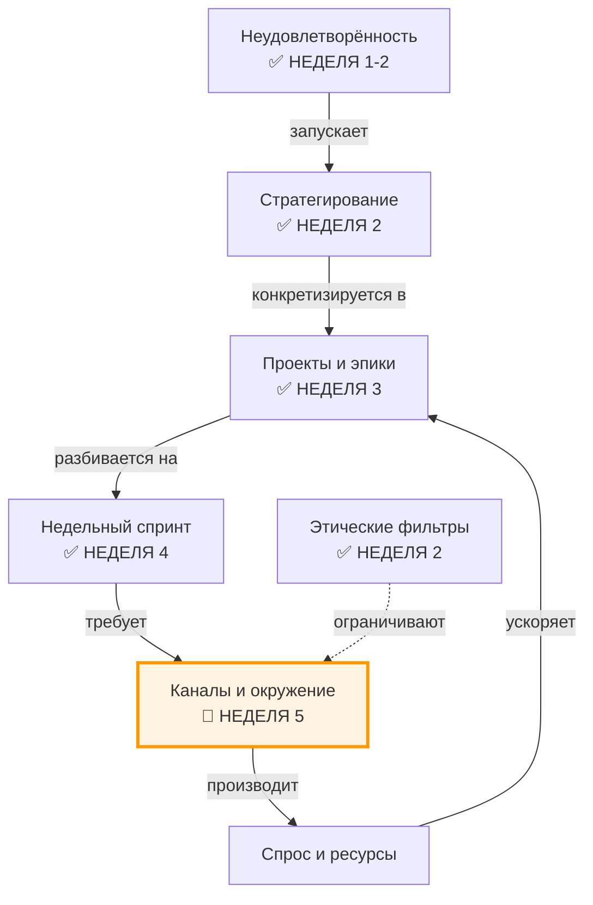
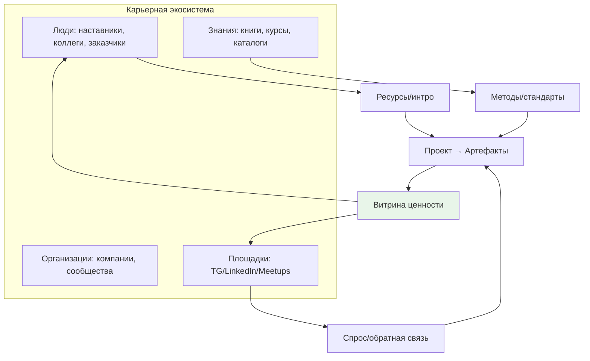

# Неделя 5: Контекст

**Карьерный концепт:** Карьерная экосистема (люди, организации, площадки, знания)  
**Практика саморазвития:** Формирование окружения (дизайн каналов входа/выхода)  
**Рабочий продукт недели:** Личный контракт v3.1 (Карта окружения и план контактов)  
**Версия:** 1.0  
**Дата обновления:** 30.09.2025

---

## 📋 Оглавление

1. [Цели недели](#цели-недели)
2. [Два режима прохождения](#два-режима-прохождения)
3. [Связь с предыдущими неделями](#связь-с-предыдущими-неделями)
4. [Роли участников](#роли-участников)
5. [Карьерный концепт: Карьерная экосистема](#карьерный-концепт-карьерная-экосистема)
6. [Практика саморазвития: Формирование окружения](#практика-саморазвития-формирование-окружения)
7. [Работа с Личным контрактом](#работа-с-личным-контрактом)
8. [Временной бюджет](#временной-бюджет)
9. [Домашнее задание](#домашнее-задание)
10. [Критерии оценки](#критерии-оценки)
11. [Публичная демонстрация](#публичная-демонстрация)
12. [Часто задаваемые вопросы](#часто-задаваемые-вопросы)
13. [Шаблоны и чек-листы](#шаблоны-и-чек-листы)

---

## 🎯 Цели недели

### Образовательные результаты (Learning Outcomes)

По завершении недели 5 участник будет способен:

1. **Мыслить карьерой как экосистемой:**
   - Понимать элементы: люди, организации, площадки, знания, формальные/неформальные правила
   - Различать окружение, сеть контактов, площадки и каналы
   - Определять «каналы ценности» (кому и как становится лучше от моей работы)

2. **Собирать и картировать окружение:**
   - Выполнить аудит текущих связей и источников информации
   - Построить «Карту окружения 3×3» (роли × контуры экосистемы)
   - Идентифицировать пробелы и риски (токсичные контуры, шоки, узкие горлышки)

3. **Проектировать «каналы входа/выхода»:**
   - Настроить медиадиету и список площадок (вход)
   - Сформировать план контактов и витрину ценности (выход)
   - Запустить минимальный цикл «интро → беседа → последующий шаг»

4. **Интегрировать окружение в ритм недели:**
   - Забронировать слоты «работа с окружением» (≥2-3 часа/неделю)
   - Встроить outreach и демонстрации в недельные спринты
   - Завести CRM-учёт контактов и площадок (простая таблица)

5. **Создать Личный контракт v3.1:**
   - Добавить раздел «Карта окружения и план его развития»
   - Заполнить Таблицы 5.1–5.3 (см. ниже)
   - Опубликовать артефакт недели и получить 1+ рецензию

### Сквозная линия: связь с целью курса

Эта неделя добавляет внешнюю «системную опору» к вашему проекту и ритму:
- **Экосистема** даёт ресурсы (люди, знания, площадки) и спрос на ваши артефакты
- **Каналы** делают ценность видимой и воспроизводимой (не «надеюсь, заметят», а запланированная витрина)
- **Окружение** повышает вероятность доведения проектов до артефактов и ускоряет обучение

---

## ⚙️ Два режима прохождения

Выберите свой режим в зависимости от времени и текущей плотности контактов.

### Минимальный трек (6–8 часов на неделю)

Упрощения:
- Карта окружения: **12 записей** (3 категории × 4 записи)
- План контактов: **5 тепловых касаний** (тёплые интро/сообщения) + **1 холодное**
- Площадки и медиадиета: **3 площадки** + **правила потребления** (до 5 пунктов)
- Публичность: **1 публикация/демо** (one-pager или пост)

Критерий «зачёт»: Контракт v3.1 создан, карта и план контактов заполнены, 1 демо опубликовано.

### Полный трек (10–15 часов на неделю)

Полные требования:
- Карта окружения: **25+ записей** (баланс людей/организаций/площадок)
- План контактов: **10 тёплых касаний** + **3 холодных** (с последующими шагами)
- Площадки и медиадиета: **5+ площадок** + политика инфо-диеты (с чёрным списком)
- Публичность: **2 публикации/демо** + 1 мини-встреча/звонок по ценности

---

## 🔗 Связь с предыдущими неделями

### Навигационная карта: где мы сейчас?

Легенда:  
✅ Уже проработано (недели 1–4)  
🎯 Фокус этой недели (неделя 5)

### Что делаем на неделе 5

- От «календаря» к **экосистеме поддержки** проектов
- От «надеюсь, меня заметят» к **регламенту публикаций и контактов**
- От «случайной ленты» к **медиадиете и площадкам по целям**

---

## 👥 Роли участников

### Роль участника (студента)

Что делает:
- Проводит аудит окружения и источников информации
- Заполняет карту окружения, формирует план контактов (CRM-таблица)
- Настраивает каналы: медиадиета (вход) и витрина ценности (выход)
- Встраивает слоты для работы с окружением в недельный ритм
- Обновляет контракт до v3.1 и публикует артефакт недели

Что НЕ делает:
- Не «нетворкинг ради нетворкинга» (без ценности и последующих шагов)
- Не расширяет потребление информации без политики инфо-диеты
- Не смешивает личную приватность и публичную витрину без рамок

Ключевая установка: «Окружение — это система, которую я проектирую. Оно должно помогать моим проектам каждую неделю, а не отвлекать».

### Роль ведущего (фасилитатора)

Что делает:
- Объясняет различия «окружение vs сеть контактов vs площадки vs каналы»
- Демонстрирует заполнение карты окружения и план контактов
- Помогает участникам сформулировать ценностные касания (письма/сообщения)
- Отлавливает токсичные контуры и информационный шум

Инструменты ведущего:
- Примеры карт окружения для 3–4 персон
- Чек-лист «Хорошего касания» (структура ценностного письма)
- Шаблон CRM-таблицы контактов с этапами и метриками

---

## 📖 Карьерный концепт: Карьерная экосистема

### Визуализация концепта

Ключевая идея: экосистема — не «фон», а управляемая система каналов. Вы проектируете вход (что и от кого потребляете) и выход (как и кому показываете ценность).

### Ключевые различения

| Понятие | Определение | Пример | Риск при путанице |
|---------|-------------|--------|-------------------|
| **Окружение** | Набор контуров, влияющих на ваши проекты (люди, организации, площадки, знания) | Ментор, сообщество DevOps, GitHub, 2 книги | Размывание фокуса, «всё и сразу» |
| **Сеть контактов** | Граф реальных связей с состоянием и последним касанием | 25 контактов с CRM-этапами | «Визитницы» без движения |
| **Площадка** | Место коммуникации/публикации | TG-канал, LinkedIn, митап | Поглощение без публикаций |
| **Канал** | Регламентированная последовательность «входа» и «выхода» | «Пост → демо → разговор → следующий шаг» | Случайность, отсутствие конверсий |

---

## 🧪 Практика саморазвития: Формирование окружения

### Пошаговая инструкция (минимальный скелет)

1) **Аудит окружения (1–2 ч)**
- Выпишите людей/организации/площадки/источники знаний, с которыми реально взаимодействуете
- Отметьте, что усиливает ваши приоритетные проекты, а что создаёт шум

2) **Карта окружения 3×3 (1–2 ч)**
- Оси: роли (1–2 ключевых из Недели 1) × контуры (люди, организации, площадки)
- Заполните по 3–5 записей в каждую ячейку, отметьте пробелы/риски

3) **Каналы входа/выхода (1–2 ч)**
- Вход: медиадиета (список авторов/каналов + периодичность + чёрный список)
- Выход: витрина ценности (формат демо/постов + расписание)

4) **План контактов (2–3 ч)**
- CRM-таблица: имя, роль, контекст, ценность для него/для вас, статус, след. шаг
- Подготовьте 3–5 ценностных писем/сообщений (не «привет, давай познакомимся», а «вот артефакт/вопрос/помощь»)

5) **Интеграция в ритм (30–60 мин)**
- Забронируйте еженедельные слоты на работу с окружением (2–3 ч)
- Встройте «публикацию/демо» в конец недели (пт/сб)

### Антипаттерны

- Бесцельное увеличение числа подписок и «контактов в старте»
- Касания без ценности и без последующих шагов
- Отсутствие витрины: «делаю много, но никто не видит»
- Игнорирование этических фильтров (неделя 2) и приватности

### Метрики практики (leading)

- ≥1 публикация/демо в неделю
- ≥5 касаний/неделю (тёплые/холодные в сумме) — с фиксацией в CRM
- ≥2–3 часа в слотах «окружение»
- ≥1 новая площадка/месяц с релевантной аудиторией

---

## 🗂️ Работа с Личным контрактом

Добавьте раздел «Карта окружения и план его развития» и заполните таблицы.

### Таблица 5.1. Карта окружения (срез v1.0)

| Категория | Имя/Организация/Площадка | Роль/Тип связки | Ценность для меня | Ценность от меня | Статус | Риск/Комментарий |
|---|---|---|---|---|---|---|
| Человек | [ФИО] | Ментор/Peer/Заказчик | [чему учусь/что получаю] | [что отдаю] | [активен/неактивен] | [барьеры] |
| Организация | [Компания/Комьюнити] | Работодатель/Сообщество | [возможности] | [вклад] | [участник/кандидат] | [условия] |
| Площадка | [TG/LinkedIn/Meetup] | Канал/Формат | [сигналы/обратная связь] | [публикации] | [частота] | [модерация] |

Минимум: 12 записей (минимальный трек) / 25+ (полный трек).

### Таблица 5.2. План контактов (CRM)

| Контакт | Контекст/Интерес | Ценность касания | Формат | Статус | Дата последнего касания | Следующий шаг | Дедлайн |
|---|---|---|---|---|---|---|---|
| [Имя] | [проект/роль/рынок] | [артефакт/вопрос/предложение] | email/TG/call | создано/отправлено/в диалоге/закрыто | 2025-09-29 | [что конкретно] | [дата] |

Цель недели: 5 касаний (мин) / 13 касаний (full), с хотя бы 1 последующим шагом.

### Таблица 5.3. Площадки и медиадиета

| Площадка/Источник | Цель | Правила потребления | Частота | Чёрный список | Формат выхода |
|---|---|---|---|---|---|
| [Название] | [зачем там] | [что/как/сколько] | [ежедн./еженед.] | [stop-словари] | [пост/демо/коммент] |

---

## ⏱️ Временной бюджет

Ориентир по неделе: 8–12 часов.

Синхронизация: учитывайте эти часы в «Сводном недельном бюджете» недели 4 (`weeks/Week_04_Rhythm.md`). Публикации и касания сверяйте по чек‑листам: `checklists/Check_Public_Demo.md` и `checklists/Check_Good_Touch.md`. 

- 2–3 ч — аудит и карта окружения
- 2–3 ч — подготовка витрины ценности и писем/сообщений
- 2–3 ч — касания (созвоны/переписка) и последующие шаги
- 1–2 ч — публикация/демо и фиксация метрик

Минимальный трек: 6–8 часов (урезайте объём записей и касаний, но сохраняйте структуру).

---

## 🏁 Домашнее задание

Создать и опубликовать **Личный контракт v3.1** с заполненным разделом «Карта окружения и план его развития».

Состав артефакта недели:
- Таблица 5.1 заполнена (12/25+ записей)
- Таблица 5.2 — план контактов (5/13 касаний) с датами и следующими шагами
- Таблица 5.3 — площадки и медиадиета с правилами
- 1–2 публикации/демо (витрина ценности) с ссылками

Экспорт: PDF/MD-версия раздела + ссылка на публичную публикацию.

---

## ✅ Критерии оценки

Базовый зачёт:
- Карта окружения содержит минимум (12 записей) и видимые пробелы/риски
- План контактов выполнен (5 касаний) и зафиксированы следующие шаги
- Настроены ≥2 площадки и правила медиадиеты
- Есть 1 публикация/демо, получена 1 рецензия (peer review)

Отлично:
- 25+ записей с балансом категорий и приоритетов
- 13 касаний с конверсиями: ≥2 созвона/встречи/пилота
- Политика инфо-диеты с чёрным списком и триггерами отписки
- Витрина ценности: one-pager + demo-пост + ссылка на репозиторий/портфолио

Ворота (готов к неделе 6):
- Указаны 1–2 ключевых «носителя метода» (наставники/школы/сообщества)
- Назначены регулярные слоты «окружение» в календаре
- Выполнен минимум 1 следующий шаг (после первичного касания)

---

## 📣 Публичная демонстрация

- «Карта окружения (редактированная)» — обезличенная версия с акцентом на принципы
- One-pager «Кому и как я полезен» (карта ценности на 1 страницу)
- Пост/демо: результат недели + планы на 2–3 недели по окружению

Формы площадок: личный блог, TG-канал, LinkedIn, GitHub/Notion страницы.

---

## ❓ Часто задаваемые вопросы

1) Я интроверт. Как делать касания?
- Начинайте с «внешних артефактов» (посты/кейсы). Касание = ссылка на ценность + конкретный вопрос/предложение.

2) Что писать в холодном письме?
- Структура: контекст → ценность (артефакт/инсайт) → конкретное предложение → 1 маленький следующий шаг.

3) Как отделить работу и приватность?
- Введите публичные и приватные каналы. Публичность — только артефакты/идеи. Личные детали — вне публикаций.

4) Сколько площадок достаточно?
- 2–3 на старте: одна «домашняя» (блог/Notion), одна социальная (TG/LinkedIn), одна профессиональная (GitHub/Meetup).

5) Нет «нужных людей» вокруг. Что делать?
- Используйте площадки с фильтрами (по ролям/темам), участвуйте в обсуждениях с ценностью, инициируйте микро-демо.

6) Боюсь отказов.
- Считайте отказ валидной обратной связью. Улучшайте артефакт/формулировку и повторяйте.

7) Как не утонуть в ленте?
- Правила медиадиеты: списки авторов, лимиты, чёрные списки, периодический «разгрузочный» день.

8) Что с этикой?
- Проверяйте касания по фильтрам недели 2. Не вовлекайте других в сомнительные практики/проекты.

---

## 🧰 Шаблоны и чек-листы

- Шаблон «Карта окружения (Табл. 5.1)» — MD/Google Sheets/Notion
- Шаблон «План контактов (Табл. 5.2)» — CRM-таблица с этапами
- Шаблон «Площадки и медиадиета (Табл. 5.3)» — политика потребления
- Чек-лист «Хорошего касания»: `checklists/Check_Good_Touch.md` — контекст → ценность → предложение → шаг
- Чек-лист «Публичной демонстрации»: `checklists/Check_Public_Demo.md` — формат, тайминг, ссылка, проверяющий

Примечание: привязка к теории «Career Ecosystems» и «Career Crafting/Proactivity» (см. System_Career_Materials_06092025.md) — для углублённого чтения.

