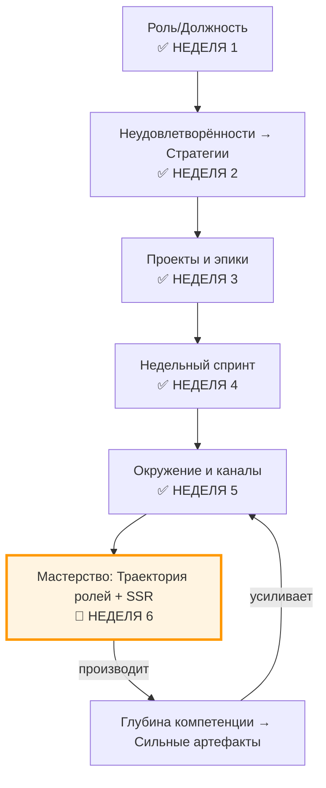

# Неделя 6: Мастерство

**Карьерный концепт:** Траектория ролей (Ученик → Интеллектуал → Профессионал → Исследователь → Просветитель)  
**Практика саморазвития:** Систематическое медленное чтение (SSR)  
**Рабочий продукт недели:** Личный контракт v3.2 (План развития компетенции + Читательский лог + артефакт освоения)  
**Версия:** 1.0  
**Дата обновления:** 30.09.2025

---

## 📋 Оглавление

1. [Цели недели](#цели-недели)
2. [Два режима прохождения](#два-режима-прохождения)
3. [Связь с предыдущими неделями](#связь-с-предыдущими-неделями)
4. [Роли участников](#роли-участников)
5. [Карьерный концепт: Траектория ролей](#карьерный-концепт-траектория-ролей)
6. [Практика саморазвития: Систематическое медленное чтение](#практика-саморазвития-систематическое-медленное-чтение)
7. [Работа с Личным контрактом](#работа-с-личным-контрактом)
8. [Временной бюджет](#временной-бюджет)
9. [Домашнее задание](#домашнее-задание)
10. [Критерии оценки](#критерии-оценки)
11. [Публичная демонстрация](#публичная-демонстрация)
12. [Часто задаваемые вопросы](#часто-задаваемые-вопросы)
13. [Шаблоны и чек-листы](#шаблоны-и-чек-листы)

---

## 🎯 Цели недели

### Образовательные результаты (Learning Outcomes)

По завершении недели 6 участник будет способен:

1. **Мыслить развитием через «траекторию ролей»:**
   - Различать уровни: Ученик → Интеллектуал → Профессионал → Исследователь → Просветитель
   - Определить свой текущий уровень по выбранной роли и признаки «ворот» на следующий
   - Связать уровни с проверяемыми артефактами

2. **Разработать план развития одной ключевой компетенции:**
   - Выбрать компетенцию, критичную для следующего шага роли
   - Определить целевой уровень и критерии «готово» (артефакты, демонстрации)
   - Составить план источников и практик

3. **Применять систематическое медленное чтение (SSR):**
   - Составить корпус первичных источников (3–7)
   - Провести 1–2 цикла SSR (обзор → извлечение → переформулирование → воспроизведение)
   - Вести читательский лог и выпускать объясняющий артефакт

4. **Интегрировать развитие мастерства в недельный ритм:**
   - Забронировать слоты SSR (≥2–3 ч/неделю) в календаре (неделя 4)
   - Связать чтение с проектом и публичной демонстрацией (неделя 5)

5. **Создать Личный контракт v3.2:**
   - Обновить Табл. 2.1 (стратегии) с фокусом на целевую роль и компетенции
   - Заполнить Табл. 6.1–6.3 (см. ниже)
   - Опубликовать артефакт недели и получить 1+ рецензию

### Сквозная линия: связь с целью курса

- **Траектория ролей** даёт ориентиры «куда расти» и «по каким меркам судить прогресс»
- **SSR** обеспечивает глубину понимания и перенос в практику через артефакты
- **Контракт v3.2** фиксирует конкретный план роста компетенции в операционном ритме

---

## ⚙️ Два режима прохождения

### Минимальный трек (6–8 часов на неделю)

Упрощения:
- Одна компетенция, один цикл SSR
- Корпус: **3 источника** (1 первоисточник, 1 обзор/стандарт, 1 учебник/гайд)
- Артефакт: **конспект-объяснение** (600–900 слов) или «разбор первоисточника»
- Читательский лог: **3 записи**

Критерий «зачёт»: Контракт v3.2 создан, Табл. 6.1–6.3 заполнены, 1 артефакт опубликован.

### Полный трек (10–15 часов на неделю)

Полные требования:
- Одна компетенция, два цикла SSR
- Корпус: **5–7 источников** (≥2 первичных, ≥1 стандарт/репорт)
- Артефакты: **разбор первоисточника + репликация примера/кейса**
- Читательский лог: **5–7 записей** + самопроверка (вопросы/ответы)

---

## 🔗 Связь с предыдущими неделями

### Навигационная карта: где мы сейчас?

### Что делаем на неделе 6

- От «делаю» к **«объясняю и воспроизвожу стандарт»**
- От «читаю ленту» к **первичным источникам и аккуратным конспектам**
- От «знаю в теории» к **проверяемому артефакту освоения**

---

## 👥 Роли участников

### Роль участника (студента)

Что делает:
- Выбирает одну ключевую компетенцию для роста в выбранной роли
- Составляет корпус источников, проводит 1–2 цикла SSR, ведёт лог
- Создаёт объясняющий артефакт (конспект/репликация/мини-гайд)
- Обновляет контракт до v3.2 и публикует артефакт недели

Что НЕ делает:
- Не «поглощает» без вопроса и цели (каждое чтение привязано к роли/компетенции)
- Не копирует чужие выводы без переформулирования и воспроизведения
- Не прячет результат (артефакт недели обязателен)

Ключевая установка: «Мастерство = способность объяснить, воспроизвести и применить метод в контексте надсистемы».

### Роль ведущего (фасилитатора)

Что делает:
- Поясняет уровни траектории ролей и типовые «ворота» между ними
- Даёт примеры корпусов источников (3–4 персоны/домена)
- Показывает цикл SSR на первоисточнике (10–15 мин)
- Модерирует peer review артефактов освоения

Инструменты ведущего:
- Примеры «разборов первоисточника» и «репликации примера»
- Чек-лист «Хорошего чтения» и шаблон читательского лога
- Рубрика для оценки уровня артефактов (см. критерии)

---

## 📖 Карьерный концепт: Траектория ролей

### Лестница уровней и артефакты

| Уровень | Определение (поведение) | Типичные артефакты | «Ворота» на следующий уровень |
|---|---|---|---|
| **Ученик** | Понимает ключевые термины и шаги метода | Конспект, карточки понятий, словарь | Объясняет своими словами и отвечает на 5–7 вопросов по теме |
| **Интеллектуал** | Структурирует материал, видит связи | Обзор источников, карта идей, сравнительная таблица | Применяет метод на учебном кейсе с разбором ошибок |
| **Профессионал** | Применяет метод к реальным задачам с предсказуемым качеством | Репликация примера, прототип, отчёт с критериями | Демонстрирует стабильные результаты в 2–3 кейсах |
| **Исследователь** | Тестирует границы метода, формулирует гипотезы улучшений | Эксперимент, отчёт об изменении параметров, пост-мортем | Публикация с данными/кодом, обратная связь сообщества |
| **Просветитель** | Обучает других и стандартизирует практику | Мини-курс/гайд, чек-листы, стандарты | Ученик воспроизводит результат по материалам автора |

Ключевая идея: уровень = не «титул», а **набор воспроизводимых артефактов и поведения**, заметных надсистеме.

---

## 🧪 Практика саморазвития: Систематическое медленное чтение

### Зачем «медленно»

- Глубина > скорость: цель — **перенос в практику**, а не «кол-во страниц»
- Доказательство — **артефакт**: объяснение, репликация, применение

### Цикл SSR (1–2 раза за неделю)

1) **Вопрос и корпус (30–45 мин)**  
- Вопрос: «Какой элемент компетенции меня «спотыкает»?»  
- Корпус: 3–7 источников (первоисточники, стандарты, учебник, обзор, репозиторий)

2) **Обзор (30–60 мин)**  
- Скан структуры: оглавление, словарь терминов, ключевые утверждения  
- Карта вопросов: что непонятно, что проверить экспериментом

3) **Извлечение (60–90 мин)**  
- Выписываем определения, алгоритмы, допущения, границы применимости  
- Конспект в своих словах (правило Фейнмана)

4) **Воспроизведение (60–120 мин)**  
- Мини-эксперимент/репликация примера/решение задачи  
- Сравнение с эталоном, фиксация расхождений

5) **Интеграция (30–45 мин)**  
- Обновляем контракт/проект: что изменится в задачах, критериях, рисках  
- Планируем публичную демонстрацию

### Антипаттерны

- «Читаю без вопроса» → нет фокуса и переноса
- «Конспект = копипаст» → нет понимания, нет своей речи
- «Без репликации» → метод не «в руках», только в голове

### Метрики практики (leading)

- ≥2–3 часа SSR в календаре  
- ≥1 объясняющий артефакт (конспект/разбор/репликация)  
- ≥1 ответ на заранее сформулированный вопрос (Q/A)

---

## 🗂️ Работа с Личным контрактом

Сфокусируйтесь на одной ключевой компетенции, которая продвинет вас по траектории выбранной роли.

### Обновление Таблицы 2.1 (из контракта)

- Уточните **целевую роль** и **ключевые компетенции (2–3)**  
- Добавьте **источники и стандарты** как носителей метода  
- Зафиксируйте **пользу для надсистемы** (для кого и что улучшится)

### Таблица 6.1. План развития компетенции

| Компетенция | Текущий уровень | Целевой уровень | Доказательства (артефакты) | Источники (3–7) | Практики/Задачи | Дедлайн |
|---|---|---|---|---|---|---|
| [Что развиваю] | Ученик/Интеллектуал/… | [целевой] | [конспект, разбор, репликация, кейс] | [перечень] | [что сделаю] | [дата] |

### Таблица 6.2. Читательский лог (SSR)

| Источник | Цель чтения/вопрос | Ключевые идеи (в своих словах) | Что воспроизвёл | Q/A (балл 0–5) | Следующий шаг |
|---|---|---|---|---|---|
| [Название, ссылка] | [зачем] | [3–5 тезисов] | [пример/задача] | [оценка] | [действие] |

### Таблица 6.3. План демонстрации освоения

| Артефакт | Формат | Критерии приёмки | Площадка | Проверяющий | Дедлайн |
|---|---|---|---|---|---|
| [Разбор/репликация/гайд] | пост/видео/репо | [условия «готово»] | [где] | [peer/наставник] | [дата] |

---

## ⏱️ Временной бюджет

Ориентир по неделе: 8–12 часов.

- 1–1.5 ч — вопрос и корпус источников
- 2–3 ч — обзор и извлечение (SSR)
- 2–3 ч — воспроизведение примера/мини-эксперимент
- 1–2 ч — оформление артефакта (конспект/разбор/репо)
- 1–2 ч — обновление контракта и публикация, peer review

Минимальный трек: 6–8 часов (1 цикл SSR, 1 артефакт).

---

## 🏁 Домашнее задание

Создать и опубликовать **Личный контракт v3.2** с разделом «План развития компетенции» и материалами SSR.

Состав артефакта недели:
- Таблица 6.1 — план (заполнена)
- Таблица 6.2 — читательский лог (3/5–7 записей)
- Таблица 6.3 — план демонстрации (минимум 1 артефакт)
- Публикация артефакта освоения (конспект/разбор/репликация)

Экспорт: PDF/MD-версия раздела + ссылки на публикации/репозиторий.

---

## ✅ Критерии оценки

Базовый зачёт:
- Выбрана компетенция и указан целевой уровень по траектории ролей
- План развития оформлен (Табл. 6.1), читательский лог ≥3 записи
- 1 артефакт освоения опубликован, получена 1 рецензия

Отлично:
- Два цикла SSR, корпус 5–7 источников c не менее 2 первичных
- Репликация примера/мини-эксперимент с данными/кодом
- Артефакт объясняет «границы применимости» метода и ошибки

Ворота (готов к неделе 7):
- Определён «носитель метода» (наставник/школа/сообщество) для дальнейшей коммуникации
- Назначены регулярные слоты SSR в календаре
- Показан перенос в проект (обновлены задачи/критерии приёмки)

---

## 📣 Публичная демонстрация

- «Разбор первоисточника» — объяснение 3–5 ключевых идей в своих словах
- «Репликация примера» — воспроизведение результата из источника (код/расчёт/макет)
- «Мини‑гайд» — пошаговая инструкция для новичка по узкому элементу компетенции

Формы площадок: личный блог, TG-канал, GitHub/Colab/Figma, Notion страницы.

---

## ❓ Часто задаваемые вопросы

1) Как выбрать компетенцию?
- Берите ту, которая «открывает ворота» к следующему уровню роли и усиливает текущий проект.

2) Английский слабый. Что делать?
- Используйте параллельные тексты, переводчики, начните с учебников/обзоров, затем переходите к первоисточникам.

3) Где искать «первоисточники»?
- Стандарты/репорты (RFC/ISO/ACM), оригинальные статьи/доклады, книги авторов метода, официальные репозитории/гайдлайны.

4) Как понять, что «понял», а не просто прочитал?
- Пройдите правило Фейнмана: объяснил просто → воспроизвёл пример → применил на своём кейсе.

5) Что делать с критикой в peer review?
- Считать её «данными». Исправить артефакт, обновить критерии приёмки и контракт.

---

## 🧰 Шаблоны и чек-листы

- Шаблон «План развития компетенции (Табл. 6.1)» — можно копировать из этого файла
- Шаблон «Читательский лог (Табл. 6.2)» — MD/Google Sheets/Notion
- Шаблон «План демонстрации (Табл. 6.3)» — формализуйте критерии приёмки
- Чек-лист «Хорошего чтения»: вопрос → корпус → обзор → извлечение → переформулирование → репликация → публикация

Примечание: на углубление — см. материалы в `System_Career_Materials_06092025.md` (разделы про мастерство/компетенции) и «Productive State Framework» (режимы чтения/фокуса).

