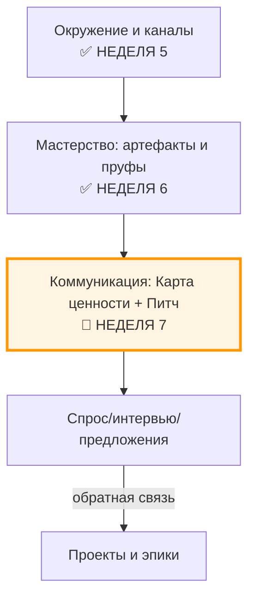

# Неделя 7: Коммуникация

**Карьерный концепт:** Карта ценности (кому и как становится лучше от моей работы)  
**Практика саморазвития:** Мышление проговариванием (структурированная устная артикуляция)  
**Рабочий продукт недели:** Личный контракт v3.3 (Карта ценности + сценарии коммуникации + журнал разговоров)  
**Версия:** 1.0  
**Дата обновления:** 30.09.2025

---

## 📋 Оглавление

1. [Цели недели](#цели-недели)
2. [Два режима прохождения](#два-режима-прохождения)
3. [Связь с предыдущими неделями](#связь-с-предыдущими-неделями)
4. [Роли участников](#роли-участников)
5. [Карьерный концепт: Карта ценности](#карьерный-концепт-карта-ценности)
6. [Практика саморазвития: Мышление проговариванием](#практика-саморазвития-мышление-проговариванием)
7. [Работа с Личным контрактом](#работа-с-личным-контрактом)
8. [Временной бюджет](#временной-бюджет)
9. [Домашнее задание](#домашнее-задание)
10. [Критерии оценки](#критерии-оценки)
11. [Публичная демонстрация](#публичная-демонстрация)
12. [Часто задаваемые вопросы](#часто-задаваемые-вопросы)
13. [Шаблоны и чек-листы](#шаблоны-и-чек-листы)

---

## 🎯 Цели недели

### Образовательные результаты (Learning Outcomes)

По завершении недели 7 участник будет способен:

1. **Артикулировать ценность для конкретных ролей аудитории:**
   - Построить «Карту ценности» для 2–3 персоны/роли
   - Различать пользу, артефакты‑доказательства и следующие шаги
   - Соединять ценность с каналами и контекстами экосистемы (неделя 5)

2. **Сконструировать и отточить «речь ценности»:**
   - Сформулировать 60‑секундный питч (паттерн 5 предложений)
   - Провести 3–10 тренировочных диалогов «проговариванием»
   - Зафиксировать выводы и правки в сценариях

3. **Интегрировать коммуникацию в недельный ритм:**
   - Завести журнал разговоров с метриками (конверсии/след. шаги)
   - Подготовить витрину ценности (one‑pager/пост/мини‑видео)
   - Обновить Личный контракт до v3.3 (таблицы 7.1–7.4)

### Сквозная линия: связь с целью курса

- **Карта ценности** соединяет ваши артефакты (неделя 3, 6) с нуждами аудитории (неделя 5)
- **Мышление проговариванием** ускоряет проверку формулировок и перенос в действия (неделя 4)
- **Контракт v3.3** закрепляет сценарии, каналы и метрики коммуникации

---

## ⚙️ Два режима прохождения

### Минимальный трек (6–8 часов на неделю)

Упрощения:
- Карта ценности: **2 персоны** (ключевые аудитории)
- Питч: **1 версия 60 сек** (аудио/видео) + 3 диалога
- Витрина: **one‑pager** или пост с «пруфами» (артефакты/кейсы)
- Журнал: **минимум 3 записи**

Критерий «зачёт»: Контракт v3.3 создан, таблицы 7.1–7.4 заполнены, 1 публикация/видео + 3 диалога зафиксированы.

### Полный трек (10–15 часов на неделю)

Полные требования:
- Карта ценности: **3–5 персон** (разные роли/контексты)
- Питч: **2 версии** (для разных каналов) + **7–10 диалогов**
- Витрина: **one‑pager + мини‑видео (60 сек)** + 2 публикации
- Журнал: **7–10 записей**, учёт конверсий и следующих шагов

---

## 🔗 Связь с предыдущими неделями

### Навигационная карта: где мы сейчас?

### Что делаем на неделе 7

- От «артефактов самих по себе» к **ценности для конкретных ролей**
- От «общих фраз» к **структурированному питчу (5 предложений)**
- От «надеюсь, поймут» к **цикл: проговорил → зафиксировал обратную связь → поправил**

---

## 👥 Роли участников

### Роль участника (студента)

Что делает:
- Строит карты ценности для 2–5 персон и связывает их с артефактами‑доказательствами
- Пишет 60‑секундный питч (2 версии при полном треке) и тренируется в диалогах
- Ведёт журнал разговоров и публикует витрину ценности
- Обновляет контракт до v3.3 и назначает слоты коммуникации

Что НЕ делает:
- Не «рекламирует себя вообще» — только **конкретная польза** и **следующий шаг**
- Не скрывает слабые места — **честно ограничивает область применимости**
- Не смешивает приватные детали с публичной витриной

Ключевая установка: «Коммуникация — это инженерная дисциплина: гипотезы формулировок проверяются через диалоги и метрики».

### Роль ведущего (фасилитатора)

Что делает:
- Разъясняет структуру карты ценности и паттерн 5 предложений
- Проводит разбор 2–3 примеров (персоны/домены) и лайв‑проговаривание
- Модерирует peer review витрин и питчей по чек‑листам

Инструменты ведущего:
- Примеры one‑pager «Кому и как я полезен»
- Чек‑лист «Хорошего касания» и «Публичной демонстрации» (см. чек‑листы)
- Рубрика для оценки ясности/пользы/доказательств

---

## 📖 Карьерный концепт: Карта ценности

### Определение

Карта ценности — структурированное описание: **для кого** я работаю, **какую проблему/задачу** решаю, **каким способом**, **какими артефактами это доказуемо**, **через какие каналы** и **какой следующий шаг** предлагаю.

### Таблица 7.1. Карта ценности (v1.0)

| Персона/Роль | Контекст/Ситуация | Проблема/Job‑to‑be‑done | Предложение ценности (как становится лучше) | Артефакты‑доказательства | Канал/Формат | Следующий шаг (CTA) | Риски/Ограничения |
|---|---|---|---|---|---|---|---|
| [кто] | [где и когда] | [что болит/что нужно сделать] | [что именно улучшаю и как измерить] | [ссылка на кейсы/код/статьи/демо] | [почта/TG/митап/репо] | [созвон/пилот/отправить ТЗ] | [границы применимости] |

Принцип: «1 персона → 1–2 конкретных результата → 1–2 пруфа → 1 CTA».

### Витрина ценности (one‑pager)

Структура one‑pager «Кому и как я полезен» (на 1 страницу):
- Кто я по ролям и в каком контексте работаю
- Для кого я полезен (2–3 персоны)
- Чем именно улучшаю ситуацию (3–5 конкретных исходов)
- Доказательства (артефакты/цифры/кейсы/ссылки)
- Как связаться и что предложено как следующий шаг

---

## 🧪 Практика саморазвития: Мышление проговариванием

### Зачем «проговаривать»

- Убирает «шум в голове»: формулировки становятся короче и яснее
- Быстро показывает, что непонятно собеседнику → где доработать карту
- Переносит артефакты и мастерство в **воспроизводимую речь**

### Паттерн «5 предложений» (ядро питча)

1) Контекст: «Я работаю с [персона/ситуация]»  
2) Проблема/задача: «Обычно там [боль/JTBD]»  
3) Подход/ценность: «Я помогаю через [метод/артефакт] так, что [измеримый исход]»  
4) Доказательства: «Вот 1–2 пруфа [ссылки/цифры]»  
5) Следующий шаг: «Предлагаю [CTA] — займёт [времени/условия]»

### Скрипты и упражнения

- «60 секунд» (мини‑видео/аудио): 3 дубля → выбрать лучший → получить 1–2 рецензии
- «Диалог 10×10»: 10 минут, до 10 уточняющих вопросов собеседника → фиксировать непонимания
- «A/B формулировок»: меняем 1 блок (проблема или CTA), сравниваем реакцию

### Метрики практики (leading)

- ≥3/7–10 диалогов в зависимости от трека  
- ≥1 мини‑видео (60 сек) и ≥1 one‑pager  
- ≥1 подтверждённый следующий шаг (созвон/пилот)

Антипаттерны: «Я обо всём сразу», «Без пруфов», «CTA не ясен», «Долгие вводные».

---

## 🗂️ Работа с Личным контрактом

### Обновление Таблицы 2.1 (из контракта)

- Добавьте **персоны/роли аудитории** и их ключевые JTBD/боли
- Привяжите **артефакты‑доказательства** (из недель 3 и 6)
- Зафиксируйте **каналы** (из недели 5) и **CTA**

### Таблица 7.2. Сценарии проговаривания (версии)

| Ситуация/Канал | Паттерн 5 предложений (черновик) | Пруфы/Ссылки | CTA | Версия | Примечания |
|---|---|---|---|---|---|
| [интро в TG / созвон / митап] | [текст ≤700 знаков] | [1–2 ссылки] | [след. шаг] | v1/v2 | [что улучшить] |

### Таблица 7.3. Журнал разговоров

| Дата | С кем (роль) | Персона/сценарий | Ключевые вопросы/возражения | Результат | Следующий шаг | Дедлайн |
|---|---|---|---|---|---|---|
| 2025‑09‑30 | [Имя] | [сценарий v1] | [что спросили/что непонятно] | [созвон/отказ/ожидание] | [действие] | [дата] |

### Таблица 7.4. Витрина ценности (план публикаций)

| Площадка | Формат | Тема/угол | Пруфы | Дата | Проверяющий |
|---|---|---|---|---|---|
| [TG/LinkedIn/Repo/Meetup] | пост/видео/демо | [конкретная ценность] | [ссылки] | [когда] | [кто] |

---

## ⏱️ Временной бюджет

Ориентир по неделе: 8–12 часов.

- 2–3 ч — построение карт ценности и one‑pager
- 2–3 ч — подготовка и запись питча (60 сек) + A/B формулировок
- 2–4 ч — диалоги/интро/созвоны и фиксация в журнале
- 1–2 ч — публикации и обновление контракта

Минимальный трек: 6–8 часов (2 персоны, 3 диалога, 1 публикация).

---

## 🏁 Домашнее задание

Создать и опубликовать **Личный контракт v3.3** с разделами «Карта ценности», «Сценарии проговаривания», «Журнал разговоров» и «Витрина ценности».

Состав артефакта недели:
- Таблица 7.1 — карта ценности (2/3–5 персон)
- Таблица 7.2 — сценарии (минимум 1 версия; при полном треке — 2)
- Таблица 7.3 — журнал (3/7–10 записей)
- Таблица 7.4 — план публикаций (минимум 1 реализована)
- Питч (мини‑видео 60 сек) + one‑pager с пруфами

Экспорт: PDF/MD‑версия раздела + ссылки на публикации/видео/репозиторий.

---

## ✅ Критерии оценки

Базовый зачёт:
- Карта ценности заполнена на 2 персоны с явными JTBD/болью и CTA
- Питч 60 сек записан; 3 диалога проведены; 1 публикация/one‑pager
- Журнал разговоров ведётся; есть 1 следующий шаг в календаре

Отлично:
- 3–5 персон; 2 версии питча для разных каналов
- 7–10 диалогов; ≥2 последующих шага (созвон/пилот/бриф)
- Публикации/видео содержат пруфы и честно указывают ограничения

Ворота (готов к неделе 8):
- Определены 1–2 **канала с конверсией** (по журналу)
- В календаре забронированы регулярные **слоты коммуникации**
- Обновлены задачи/критерии проектов с учётом обратной связи

---

## 📣 Публичная демонстрация

- One‑pager «Кому и как я полезен» (обезличенная версия с пруфами)
- «Питч 60 сек» — видео/аудио (субтитры/тезисы в описании)
- Пост‑нить: 3 микрокейса «до/после» или «ошибка → исправление»

Формы площадок: личный блог, TG‑канал, LinkedIn, GitHub/Notion/репозиторий, митап/встреча.

Сверка: используйте чек‑лист публичной демонстрации (см. ниже).

---

## ❓ Часто задаваемые вопросы

1) «Не люблю «продавать себя». Что делать?»  
— Не продавайте «себя». Показывайте **пользу и пруфы**. Вы предлагаете следующий шаг, а не навязываетесь.

2) Мало артефактов. Как быть?  
— Поднимите артефакты из нед. 3 и 6; сделайте **микро‑репликацию** или **мини‑гайд**. Главное — проверяемость.

3) Боюсь отказов.  
— Отказ = данные. Фиксируйте причину, обновляйте карту/питч, тестируйте A/B.

4) Где граница приватности?  
— Публикуйте только **рабочие продукты и принципы**. Личные детали — в приватных каналах.

5) Сколько разговоров «достаточно»?  
— Минимум 3 (зачёт) / 7–10 (полный трек). Дальше — по конверсии и целям.

6) Как связать с наймом/заказами?  
— Добавьте в CTA «бриф/тестовое/мини‑пилот», укажите сроки и условия.

---

## 🧰 Шаблоны и чек-листы

- Шаблон «Карта ценности» — см. Табл. 7.1 (копируйте и заполняйте)
- Шаблон «Питч 5 предложений» — см. раздел практики
- Чек‑лист «Хорошего касания»: `checklists/Check_Good_Touch.md`
- Чек‑лист «Публичной демонстрации»: `checklists/Check_Public_Demo.md`

---

Примечание: на углубление — см. `Systemic_Career_Framework_v2.md` (разделы о «Рабочем продукте», «Канальном подходе», «Киберличности») и `System_Career_Materials_06092025.md`.
