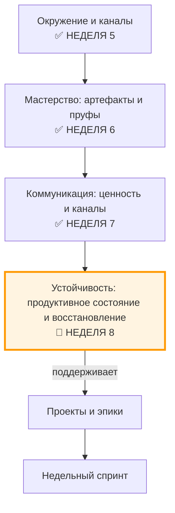

# Неделя 8: Устойчивость

**Карьерный концепт:** Устойчивая карьера (баланс продуктивности, здоровья и благополучия)
**Практика саморазвития:** Организация досуга (регламент восстановления)
**Рабочий продукт недели:** Личный контракт v4.0 — Устойчивая система (продуктивное состояние + регламент восстановления + слоты в календаре)
**Версия:** 1.0
**Дата обновления:** 30.09.2025

---

## 📋 Оглавление

1. [Цели недели](#цели-недели)
2. [Два режима прохождения](#два-режима-прохождения)
3. [Связь с предыдущими неделями](#связь-с-предыдущими-неделями)
4. [Роли участников](#роли-участников)
5. [Карьерный концепт: Устойчивая карьера](#карьерный-концепт-устойчивая-карьера)
6. [Практика саморазвития: Организация досуга](#практика-саморазвития-организация-досуга)
7. [Работа с Личным контрактом](#работа-с-личным-контрактом)
8. [Временной бюджет](#временной-бюджет)
9. [Домашнее задание](#домашнее-задание)
10. [Критерии оценки](#критерии-оценки)
11. [Публичная демонстрация](#публичная-демонстрация)
12. [Часто задаваемые вопросы](#часто-задаваемые-вопросы)
13. [Шаблоны и чек-листы](#шаблоны-и-чек-листы)

---

## 🎯 Цели недели

### Образовательные результаты (Learning Outcomes)

По завершении недели 8 участник будет способен:

1. **Проектировать устойчивый ритм жизни и работы:**
   - Развести «скорость» и «дистанцию»: планировать энергию, а не только задачи
   - Задать рамки нагрузок и восстановления на неделю/месяц
   - Распознавать ранние маркеры перегруза и выгорания

2. **Сконструировать персональный регламент восстановления:**
   - Сформировать базовые протоколы: сон, движение, тишина, социальность, цифровая гигиена
   - Встроить «shutdown‑ритуал» рабочего дня и «саббат‑слоты» недели

3. **Интегрировать восстановление в недельный спринт:**
   - Забронировать защищённые слоты восстановления в календаре
   - Подобрать 1–2 эксперимента досуга с метриками эффекта (A/B)

4. **Собрать Личный контракт v4.0:**
   - Объединить ключевые разделы v3.x в целостную систему
   - Добавить продуктивное состояние и регламент восстановления как обязательные разделы

Сквозная линия: **работоспособность на длинной дистанции > достигаторство «здесь и сейчас».**

---

## ⚙️ Два режима прохождения

### Минимальный трек (6–8 часов на неделю)

Упрощения:
- Продуктивное состояние: 5–7 ключевых блоков времени
- Регламент восстановления: 3 базовых протокола (сон, движение, shutdown)
- Слоты: 2 «саббат‑слота» по 2 часа + 1 вечер без экранов
- Журнал состояния: 4 записи (через день)

Критерий «зачёт»: Контракт v4.0 собран, продуктивное состояние и регламент заполнены, слоты забронированы, журнал ведётся (≥4 записи).

### Полный трек (10–12 часов на неделю)

Полные требования:
- Продуктивное состояние: детально по блокам (сон, работа, проекты, обучение, спорт, досуг, социальное)
- Регламент восстановления: 5 протоколов + триггеры и действия при перегрузе
- Слоты: ≥3 «саббат‑слота» (смешанный формат: активный/пассивный/социальный)
- Журнал состояния: 7 записей + короткий разбор эксперимента (A/B)

---

## 🔗 Связь с предыдущими неделями

### Навигационная карта: где мы сейчас?

### Что делаем на неделе 8

- От «планирую задачи» к **«планирую энергию и восстановление»**
- От «героизма» к **системному минимуму и устойчивым ритуалам**
- От «случайного отдыха» к **регламенту восстановления и измерению эффекта**

---

## 👥 Роли участников

### Роль участника (студента)

Что делает:
- Строит продуктивное состояние недели и регламент восстановления
- Бронирует слоты и ведёт журнал состояния
- Собирает Личный контракт v4.0 и готовит публичную демонстрацию

Что НЕ делает:
- Не «догоняет задачами» ценой сна и базовых протоколов
- Не подменяет восстановление бесконтрольным потреблением контента
- Не игнорирует симптомы перегруза

Ключевая установка: **«Я проектирую систему, в которой у меня получается работать долго и предсказуемо».**

### Роль ведущего (фасилитатора)

Что делает:
- Объясняет модель продуктивное состояниеа и регламента восстановления
- Помогает адаптировать протоколы под ограничения участника
- Модерирует peer‑review контрактов v4.0 и планов восстановления

Оговорка: материалы недели — **не медицинские рекомендации**. При устойчивых симптомах перегруза/выгорания — обратиться к профильным специалистам.

---

## 📖 Карьерный концепт: Устойчивая карьера

### Определение

Устойчивая карьера — это способность поддерживать **стабильное качество работы и жизни** на длинной дистанции за счёт управления нагрузкой, восстановлением и рисками.

Ключевые различения:
- **Продуктивность ≠ Устойчивость:** высокие пики без восстановления ухудшают среднюю мощность
- **Скорость ≠ Дистанция:** выигрывает не тот, кто быстрее в моменте, а тот, кто дольше сохраняет качество
- **Система ≠ Поведение:** проектируем структуру (слоты/правила), чтобы поведение было устойчивым

Модель: \(Нагрузка\) ↔ \(Восстановление\) → \(Мощность на дистанции\). Цель недели — отрегулировать баланс.

---

## 🧪 Практика саморазвития: Организация досуга

### Зачем это профессионалу

- Досуг — это **протокол восстановления**, а не «наградной пирог» после выгорания
- Системный досуг снижает вариативность состояния и делает результаты воспроизводимыми

### Пошаговая инструкция (минимальный скелет)

1) **Аудит текущего состояния (30–45 мин)**
- Краткий ретро‑замер за последнюю неделю: сон (часы), движение (мин), экраны (мин), энергия 0–5
- Выявите 1–2 главных стрессора и 1–2 лучших восстановителя

2) **Проектирование регламента восстановления (45–60 мин)**
- Определите «скелет» недели: сон‑окно, спорт, тишина/без экранов, социальность, хобби
- Задайте **минимальные стандарты** (пример: сон ≥7 ч, шаги ≥7к, 1 вечер без экранов)

3) **Интеграция в календарь (30–45 мин)**
- Забронируйте «саббат‑слоты» (2–3 блока по 2 часа)
- Добавьте ежедневный **shutdown‑ритуал** (10–15 мин) и микро‑перерывы (50/10 или 90/15)

4) **Эксперименты A/B (30–60 мин суммарно в течение недели)**
- Сравните 2 формата отдыха (активный vs пассивный; социальный vs одиночный)
- Измерьте эффект по энергии/фокусу на следующий день

### Метрики практики (leading)

- ≥2 «саббат‑слота» в календаре (3 — для полного трека)
- Сон‑окно соблюдено ≥5/7 дней
- ≥4/7 записей в журнале состояния
- Выполнен 1 A/B‑эксперимент и сделаны выводы

Антипаттерны: «заслужить отдых», «бесконечная лента», «ещё часок поработаю — а там восстановлюсь».

---

## 🗂️ Работа с Личным контрактом

Соберите финальную версию **Личного контракта v4.0** (временное имя, см. задачу T003) с добавлением разделов этой недели.

### Обновление Таблицы 2.1 (из контракта)

- Уточните **операционные обязательства** с учётом восстановления (сон, слоты, публичность без ущерба здоровью)
- Добавьте **ограничения/«красные зоны»**: чего вы не делаете ради краткосрочной выгоды

### Таблица 8.1. Энергетический бюджет недели

| Блок времени | План (ч) | Минимум (ч) | Факт (ч) | Комментарий |
|---|---:|---:|---:|---|
| Сон | [ ] | [ ] | [ ] | окно сна: [hh:mm–hh:mm] |
| Работа (основная) | [ ] | [ ] | [ ] | |
| Проекты/Артефакты | [ ] | [ ] | [ ] | |
| Обучение/SSR | [ ] | [ ] | [ ] | |
| Движение/спорт | [ ] | [ ] | [ ] | |
| Досуг/тишина | [ ] | [ ] | [ ] | вечер без экранов: [день] |
| Социальность | [ ] | [ ] | [ ] | |
| Другое | [ ] | [ ] | [ ] | |

### Таблица 8.2. Регламент восстановления (протоколы)

| Протокол | Правило | Частота/Слот | Инструменты | Триггеры/Риски |
|---|---|---|---|---|
| Сон | [окно, ограничения кофеина/алкоголя] | [ежедневно, время] | [таймер, режим телефона] | [сбои/командировки] |
| Shutdown‑ритуал | [шаги закрытия дня] | [ежедневно, 10–15 мин] | [шаблон, календарь] | [переработки] |
| Движение | [тип активности, минимум] | [×/неделю] | [трекер/зал] | [травмы/погода] |
| Тишина/без экранов | [вечер/утро] | [×/неделю] | [режим «без уведомлений»] | [FOMO] |
| Социальность/хобби | [формат] | [×/неделю] | [люди/площадка] | [отмена] |

### Таблица 8.3. Журнал состояния (ежедневный, краткий)

| Дата | Сон (ч) | Энергия 0–5 | Фокус 0–5 | Стрессор | Восстановитель | Замечания |
|---|---:|---:|---:|---|---|---|
| 2025‑09‑30 | [ ] | [ ] | [ ] | [ ] | [ ] | [ ] |

### Таблица 8.4. Ранние маркеры и действия

| Симптом | Порог | Действие 15мин | Действие 24ч | Кто поможет |
|---|---|---|---|---|
| Сон <6 ч/2 дня | 2 дня подряд | сон 20 мин, отменить экраны | перенос тяжёлых задач | [имя] |
| 0 публикаций/7 дней | 1 неделя | оформить черновик 200 слов | запланировать демо | [проверяющий] |

---

## ⏱️ Временной бюджет

Ориентир по неделе: 6–10 часов.

- 1–1.5 ч — аудит и продуктивное состояние
- 1–2 ч — проектирование регламента восстановления
- 1–2 ч — бронирование слотов + настройка инструментов
- 1–2 ч — A/B‑эксперименты и журнал
- 1–2 ч — сборка контракта v4.0 и публичная публикация

Минимальный трек: 6–8 часов.

---

## 🏁 Домашнее задание

Собрать и опубликовать **Личный контракт v4.0** с разделами «Продуктивное состояние», «Регламент восстановления», «Журнал состояния» и «Риски/маркеры».

Состав артефакта недели:
- Таблица 8.1 — продуктивное состояние (план/минимум/факт)
- Таблица 8.2 — регламент восстановления (5 протоколов)
- Таблица 8.3 — журнал (≥4/7 записей)
- Таблица 8.4 — маркеры и действия
- Календарь: слоты забронированы (скриншот или ссылка)

Экспорт: PDF/MD‑версия раздела + ссылки на публикацию/скрин календаря.

---

## ✅ Критерии оценки

Базовый зачёт:
- Контракт v4.0 собран; разделы 8.1–8.4 заполнены
- Забронированы ≥2 «саббат‑слота» и 1 вечер без экранов
- Журнал состояния: ≥4 записи; определены 3 маркера и действия

Отлично:
- Полный продуктивное состояние; соблюдение сон‑окна ≥5/7
- 3 «саббат‑слота», выполнен A/B‑эксперимент с выводами
- Публичная публикация содержит честные ограничения и данные

Ворота (после курса):
- В календаре забронированы восстановительные слоты на **следующие 4 недели**
- Обновлён план проектов с учётом устойчивого ритма (нагрузка ≤80% от потолка)
- Назначен проверяющий/peer для еженедельной сверки правил

---

## 📣 Публичная демонстрация

Выберите формат (1 или 2):
- «Как я проектирую устойчивую неделю»: one‑pager/пост с продуктивное состояниеом и регламентом (обезличенно)
- «Shutdown‑ритуал и 2 эксперимента досуга»: мини‑видео (≤90 сек) + тезисы

Сверка: используйте чек‑лист публичной демонстрации.

---

## ❓ Часто задаваемые вопросы

1) «Нет времени на отдых, всё горит»  
— Делайте **минимальный скелет**: сон‑окно, 2 слота, shutdown. Нагрузка >80% от потолка → перенос задач.

2) «У меня маленькие дети/сменный график»  
— Ставьте **гибкие окна** и **микро‑ритуалы** (5–10 мин), не идеал. Важно регулярность.

3) «Я уже на грани выгорания — что делать?»  
— Снизить нагрузку, увеличить восстановление, обратиться к специалисту. Материалы недели — не медсовет.

4) «Спорт vs сон — что важнее?»  
— Сон — базовый протокол. При дефиците сна спорт делайте лёгким и кратким.

5) «Как не сорваться после курса?»  
— Забронируйте слоты на 4 недели и найдите peer‑партнёра на еженедельную сверку.

6) «Досуг — это просто сериалы?»  
— Нет. Это протоколы восстановления: тишина, движение, хобби, социальность, природа.

---

## 🧰 Шаблоны и чек-листы

- Шаблон: `templates/Week_08_Energy_Budget.md`
- Шаблон: `templates/Week_08_Recovery_Reglament.md`
- Чек‑лист: `checklists/Check_Public_Demo.md`

---
